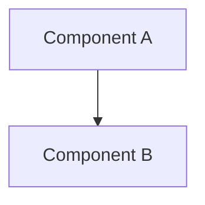

# Design - {title}

## Overview
Design for {component/system}.

## Goals
- Goal 1
- Goal 2

## Architecture

### Components
- **Component 1**: Responsibility
- **Component 2**: Responsibility

## Design Decisions
- **Decision 1**: Rationale...
- **Decision 2**: Rationale...

## Implementation
- [ ] Requirement 1
- [ ] Requirement 2
