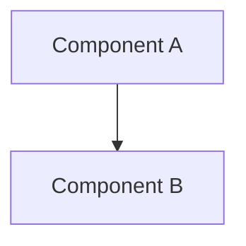

# Archived: Hardcoded Artifact Templates

**Archive Date:** 2026-01-10
**Phase:** Phase 4 - Session 6
**Reason:** Consolidation to plugin-based system

## Overview

This document preserves the legacy hardcoded artifact templates that were removed
from `artifact_templates.py` during Phase 4 of the artifact template system consolidation.

All hardcoded templates have been migrated to plugins in:
`AgentQMS/.agentqms/plugins/artifact_types/`

## Archived Template Dictionary

The following hardcoded template dictionary was removed from `ArtifactTemplates.__init__()`:

```python
self.templates = {
    "implementation_plan": {
        "filename_pattern": "YYYY-MM-DD_HHMM_implementation_plan_{name}.md",
        "directory": "implementation_plans/",
        "frontmatter": {
            "ads_version": "1.0",
            "type": "implementation_plan",
            "category": "development",
            "status": "active",
            "version": "1.0",
            "tags": ["implementation", "plan", "development"],
        },
        "content_template": """# Implementation Plan - {title}

## Goal
{description}

## Proposed Changes

### Configuration
- [ ] Change 1

### Code
- [ ] Change 1

## Verification Plan

### Automated Tests
- [ ] `pytest ...`

### Manual Verification
- [ ] Verify ...""",
    },
    "walkthrough": {
        "filename_pattern": "YYYY-MM-DD_HHMM_walkthrough_{name}.md",
        "directory": "walkthroughs/",
        "frontmatter": {
            "ads_version": "1.0",
            "type": "walkthrough",
            "category": "documentation",
            "status": "active",
            "version": "1.0",
            "tags": ["walkthrough", "documentation", "guide"],
        },
        "content_template": """# Walkthrough - {title}

## Goal
{description}

## Steps
1. Step 1
2. Step 2

## Verification
- [ ] Verify result
""",
    },
    "assessment": {
        "filename_pattern": "YYYY-MM-DD_HHMM_assessment_{name}.md",
        "directory": "assessments/",
        "frontmatter": {
            "ads_version": "1.0",
            "type": "assessment",
            "category": "evaluation",
            "status": "active",
            "version": "1.0",
            "tags": ["assessment", "evaluation", "analysis"],
        },
        "content_template": """# Assessment - {title}

## Purpose
Evaluate {subject} and provide recommendations.

## Findings

### Key Observations
1. Observation 1
2. Observation 2

## Analysis
- **Area 1**: Status/Issues
- **Area 2**: Status/Issues

## Recommendations
1. **Action Item** (Priority: High)
2. **Action Item** (Priority: Medium)

## Implementation Plan
- [ ] Immediate Action
- [ ] Long-term Action
""",
    },
    "design": {
        "filename_pattern": "YYYY-MM-DD_HHMM_design_{name}.md",
        "directory": "design_documents/",
        "frontmatter": {
            "ads_version": "1.0",
            "type": "design",
            "category": "architecture",
            "status": "active",
            "version": "1.0",
            "tags": ["design", "architecture", "specification"],
        },
        "content_template": """# Design - {title}

## Overview
Design for {component/system}.

## Goals
- Goal 1
- Goal 2

## Architecture


### Components
- **Component 1**: Responsibility
- **Component 2**: Responsibility

## Design Decisions
- **Decision 1**: Rationale...
- **Decision 2**: Rationale...

## Implementation
- [ ] Requirement 1
- [ ] Requirement 2
""",
    },
    "research": {
        "filename_pattern": "YYYY-MM-DD_HHMM_research_{name}.md",
        "directory": "research/",
        "frontmatter": {
            "ads_version": "1.0",
            "type": "research",
            "category": "research",
            "status": "active",
            "version": "1.0",
            "tags": ["research", "investigation", "analysis"],
        },
        "content_template": """# Research - {title}

## Objective
Answer: {title}?

## Findings
- Finding 1
- Finding 2

## Analysis
Details of the investigation.

## Conclusion
Summary of the answer.

## References
- [Link]
""",
    },
    "template": {
        "filename_pattern": "YYYY-MM-DD_HHMM_template-{name}.md",
        "directory": "templates/",
        "frontmatter": {
            "ads_version": "1.0",
            "type": "template",
            "category": "reference",
            "status": "active",
            "version": "1.0",
            "tags": ["template", "reference", "guidelines"],
        },
        "content_template": """# Template - {title}

## Purpose
Standard format for {purpose}.

## Structure
```markdown
# Title
## Section 1
```

## Guidelines
1. Guideline 1
2. Guideline 2
""",
    },
    "bug_report": {
        "filename_pattern": "YYYY-MM-DD_HHMM_BUG_NNN_{name}.md",
        "directory": "bug_reports/",
        "frontmatter": {
            "ads_version": "1.0",
            "type": "bug_report",
            "category": "troubleshooting",
            "status": "active",
            "severity": "medium",
            "version": "1.0",
            "tags": ["bug", "issue", "troubleshooting"],
        },
        "content_template": """# Bug Report - {title}
Bug ID: BUG-{bug_id}

## Summary
{summary}

## Environment
- **OS/Env**: {os_info}
- **Dependencies**: {dependencies}

## Reproduction
{reproduction_steps}

## Comparison
**Expected**: {expected_behavior}
**Actual**: {actual_behavior}

## Logs
```
{error_messages}
```

## Impact
{impact}
""",
    },
    "vlm_report": {
        "filename_pattern": "YYYY-MM-DD_HHMM_vlm_report_{name}.md",
        "directory": "../vlm_reports/",
        "frontmatter": {
            "ads_version": "1.0",
            "type": "vlm_report",
            "category": "evaluation",
            "status": "active",
            "version": "1.0",
            "tags": ["vlm", "report", "analysis"],
        },
        "content_template": """# {title}

## Overview
Brief description of the VLM analysis.

## Analysis Result
<!-- Paste analysis results here -->

## Findings
- Finding 1
- Finding 2

## Conclusion
Summary of the analysis.

---

*This VLM report follows the project's standardized format for VLM analysis.*""",
    },
}
```

## Migration to Plugins

All 8 hardcoded types have been migrated to plugins:

| Legacy Type | Plugin File | Status |
|-------------|-------------|--------|
| implementation_plan | implementation_plan.yaml | ✅ Active |
| walkthrough | walkthrough.yaml | ✅ Active |
| assessment | assessment.yaml | ✅ Active |
| design | design_document.yaml | ✅ Renamed (canonical) |
| research | assessment.yaml | ✅ Deprecated (use assessment) |
| template | N/A | ❌ Prohibited (use docs/_templates/) |
| bug_report | bug_report.yaml | ✅ Active |
| vlm_report | vlm_report.yaml | ✅ Active |

## Restoration (If Needed)

If you need to restore hardcoded templates temporarily:

1. Copy this template dictionary back into `ArtifactTemplates.__init__()`
2. Restore the original load order comment
3. Revert plugin loading to non-critical fallback mode

**Warning:** Restoration would reintroduce the technical debt that Phase 4 resolved.

## References

- **Roadmap:** project_compass/roadmap/00_agentqms_artifact_consolidation.yaml
- **Phase 3 Resolution:** project_compass/active_context/session_5_naming_conflicts_resolution.md
- **Plugin Directory:** AgentQMS/.agentqms/plugins/artifact_types/
- **Validation Schema:** .agentqms/schemas/artifact_type_validation.yaml
- **Migration Guide:** docs/artifacts/implementation_plans/phase4_hardcoded_removal_migration.md
