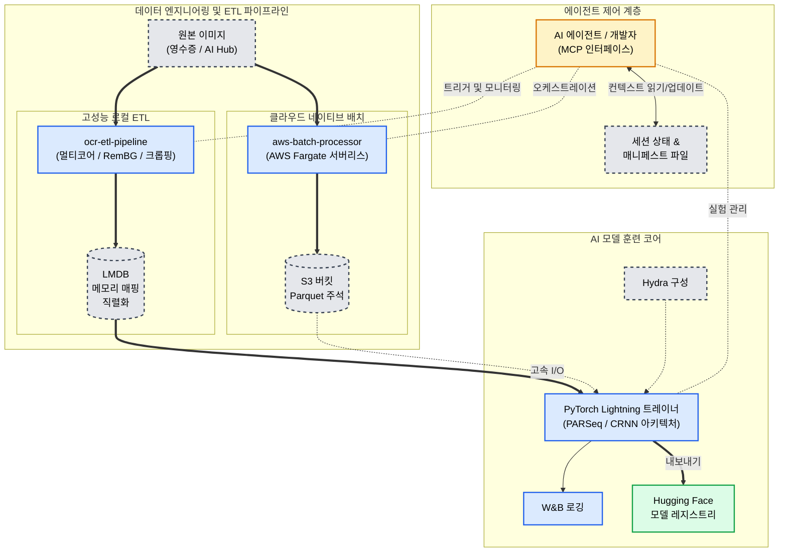

# OCR 텍스트 인식 및 레이아웃 분석 시스템

**에이전트 관측 가능성과 고성능 데이터 엔지니어링을 갖춘 문서 인텔리전스 파이프라인**

**언어:** [English](README.md) · [한국어](README.ko.md)

[](https://huggingface.co/wchoi189/receipt-text-detection_kr-pan_resnet18) [](https://github.com/astral-sh/uv) [](#project-compass-ai-navigation)

---

## 목차

**I. 소개**
[개요](#개요) · [프로젝트 상태](#프로젝트-상태) · [시스템 아키텍처](#시스템-아키텍처)

**II. 기술 구현**
[핵심 인프라](#핵심-인프라) · [데이터 엔지니어링](#데이터-엔지니어링) · [모델 훈련](#모델-훈련)

**III. 연구 및 개발**
[연구 방법론](#연구-방법론) · [주요 발견](#주요-발견) · [기술적 전환](#기술적-전환)

**IV. 부록**
[데모](#데모) · [기술 스택](#기술-스택) · [참조](#참조)

---

## 개요

이 시스템은 한국어 텍스트 인식 및 레이아웃 분석을 위한 프로덕션급 파이프라인으로, Upstage AI 부트캠프 OCR 경연에서 발전했습니다. 이 프로젝트는 **에이전트 관측 가능성**, **테스트 주도 개발**, **데이터 계약 강제**를 우선시하여 고품질 데이터가 고성능 모델로 흐르도록 보장합니다.

### 설계 철학

현대 AI 개발은 인간 개발자와 AI 에이전트 모두의 **인지 부하 관리**라는 중요한 문제에 직면해 있습니다. 이 저장소는 다음을 통해 이를 해결합니다:

- **명시적 상태 관리**를 위한 프로젝트 컴패스(MCP)
- **자동 구성 디버깅**을 위한 AST 디버그 툴킷
- **구조화된 아티팩트 생성**을 위한 AgentQMS
- **스키마 기반 실험 추적**을 위한 실험 관리자

결과적으로 AI 에이전트가 수동 컨텍스트 로딩 없이도 복잡한 딥러닝 시스템을 자율적으로 탐색, 디버깅, 확장할 수 있는 환경이 구축됩니다.

---

## 프로젝트 상태

| 단계                               | 상태   | 완료율 |
| :---------------------------------- | :------- | :--------- |
| **단계 1-4:** 핵심 개발     | 완료 | 100%       |
| **단계 5:** 데이터 정제 및 ETL  | 진행 중   | 90%        |
| **단계 6:** 아키텍처 업그레이드 | 계획 중  | 0%         |

**전체 진행률:** 85%

**현재 집중 분야:** AI Hub 공공행정문서 데이터셋(616,366개 샘플, LMDB 최적화)에서 PARSeq/CRNN 텍스트 인식 모델 훈련.

---

## 시스템 아키텍처

이 시스템은 세 계층 아키텍처를 사용합니다: 데이터 엔지니어링과 모델 훈련을 위한 별도의 파이프라인을 조율하는 **에이전트 제어 계층**.



---

## 핵심 인프라

### 프로젝트 컴패스: AI 내비게이션

**문제:** AI 에이전트는 복잡한 코드베이스를 탐색하기 위해 광범위한 컨텍스트가 필요하며, 이는 비효율적인 토큰 사용과 환각(hallucination)을 초래합니다.

**해결책:** **모델 컨텍스트 프로토콜(MCP)**을 통해 노출된 중앙 집중식 상태 관리 시스템으로, 프로젝트의 "중추 신경계" 역할을 합니다.

**주요 기능:**
- **활성 컨텍스트:** [현재 세션](project_compass/active_context/current_session.yml), [블로커 레지스트리](project_compass/active_context/blockers.yml)
- **환경 원장:** [데이터셋 레지스트리](project_compass/environments/dataset_registry.yml)
- **에이전트 도구:** `env_check`, `session_init`, `reconcile`, `ocr_convert`, `ocr_inspect`

**영향:** 다중 세션 워크플로우에서 컨텍스트 로딩 오버헤드 감소:
- 초기 파일 읽기: ~50개 파일 → ~8개 선별된 상태 파일 (84% 감소)
- 명시적 상태 관리를 통해 세션당 ~15개의 명확화 질문 제거
- 에이전트가 ~3분 내에 생산적인 작업 시작 가능 (기존 ~10분 대비)

### AST 디버그 툴킷 (ADT)

**문제:** 다중 아키텍처 딥러닝 프로젝트에서 Hydra 구성 우선순위를 디버깅하는 것은 악명 높게 신뢰할 수 없습니다.

**해결책:** Python AST의 정적 분석을 통해 OmegaConf 병합 작업을 추적하여 구성 흐름에 대한 "X-레이 비전"을 제공합니다.

**기능:**
- `trace-merges`: 구성 우선순위 순서 식별
- `analyze-config`: 충돌하는 오버라이드 감지
- `find-instantiations`: Hydra 인스턴스화 호출 위치 찾기

**예시 출력:**

```bash
adt trace-merges ocr/models/architecture.py --output markdown
```

| 우선순위 | 라인 | 작업 | 충돌 시 승자            |
| -------- | ---- | --------- | ----------------------------- |
| P1       | 122  | `create`  | `{}`                          |
| P2       | 128  | `merge`   | `arch_overrides`              |
| P3       | 158  | `merge`   | `filtered_top_level`          |
| P4       | 162  | `merge`   | `direct_overrides`            |
| P5       | 175  | `merge`   | **`filtered_user_overrides`** |

*분석 결과 L175의 사용자 정의 오버라이드가 가장 높은 우선순위를 유지함을 확인.*

**영향:** 구성 디버깅 시간을 수시간에서 수분으로 단축. 실제 해결 사례는 [BUG_003](docs/artifacts/bug_reports/2026-01-04_1730_BUG_003_config-precedence-leak.ko.md) 참조.

---

## 데이터 엔지니어링

### 고성능 로컬 ETL

**모듈:** `ocr-etl-pipeline`

**문제:** JSON 주석과 함께 600K+ 고해상도 이미지를 처리하면 파일 시스템 병목 현상이 발생하고 훈련 중 효율적인 임의 접근이 불가능합니다.

**해결책:** 재개 가능한 체크포인팅과 함께 멀티쓰레드 LMDB 변환.

**성능 지표:**
- **처리량:** ~60초 동안 5,468개의 고해상도 이미지(~2.4K×3.4K) 처리, 616,366개의 텍스트 영역 샘플 추출
- **처리 속도:** 8코어 멀티프로세싱으로 초당 ~91개 이미지
- **저장 효율성:** 1개의 LMDB 파일(4.3GB) vs. 600K+ 개별 파일(파일 시스템 오버헤드 99.9% 감소)
- **I/O 최적화:** 메모리 매핑 읽기로 훈련 중 역직렬화 오버헤드 제거

**기술 구현:**
- **멀티프로세싱:** CPU 바운드 이미지 디코딩을 모든 코어에 병렬화
- **재개 가능성:** JSON 상태 파일이 장기 작업 진행 상황 추적
- **데이터 무결성:** 트랜잭션 수준 일관성을 갖춘 원자적 쓰기

### 클라우드 네이티브 배치 처리

**모듈:** `aws-batch-processor`

**문제:** Document Parse API 요금 제한(무료 티어)으로 인해 대규모 동기식 처리가 불가능합니다.

**해결책:** 비동기식 배치 작업을 위한 서버리스 AWS Fargate 아키텍처.

**아키텍처:**
- **컴퓨팅:** AWS Fargate (서버리스 컨테이너)
- **저장소:** S3 데이터 레이크 + Parquet 주석
- **오케스트레이션:** AWS 배치 작업 큐

**영향:** 로컬 머신 가동 시간 요구 없이 하룻밤 동안 5,000+ 문서 처리.

---

## 모델 훈련

### 지원 아키텍처

| 아키텍처    | 작업             | 상태                                                                                        |
| :-------------- | :--------------- | :-------------------------------------------------------------------------------------------- |
| **PARSeq**      | 텍스트 인식 | 활성 개발                                                                            |
| **CRNN**        | 텍스트 인식 | 계획 중                                                                                       |
| **DBNet + PAN** | 텍스트 감지   | 배포됨 ([HF 모델](https://huggingface.co/wchoi189/receipt-text-detection_kr-pan_resnet18)) |

### 훈련 인프라

- **프레임워크:** PyTorch Lightning + Hydra
- **로깅:** Weights & Biases
- **구성:** 아키텍처별 오버라이드가 있는 구성형 Hydra 구성
- **품질 보증:** AgentQMS를 통한 자동화된 버그 보고

---

## 연구 방법론

### 실험 추적

**문제:** 빠른 반복으로 인해 대량의 아티팩트(스크립트, 구성, 출력)가 생성되며 체계적인 조직 없이는 관리하기 어려워집니다.

**해결책:** 표준화된 아티팩트 템플릿을 갖춘 스키마 기반 실험 관리자.

**주요 아티팩트:**
- [기준 메트릭 보고서](archive/artifacts/experiments/20251217_024343_image_enhancements_implementation/artifacts/20251218_1415_report_baseline-metrics-summary.ko.md)
- [투영 보정 데이터 손실 사고](archive/artifacts/experiments/20251217_024343_image_enhancements_implementation/artifacts/20251220_0130_incident_report_perspective_correction_data_loss.ko.md)

**영향:** AI 에이전트가 인간 개입 없이 과거 실험을 자율적으로 찾고 분석할 수 있음.

### 품질 보증

**구조화된 버그 보고:** 모든 중대한 사고는 다음을 포함하여 문서화됩니다:
- 근본 원인 분석
- 재현 단계
- 검증 전략
- 해결 일정

[버그 보고서 모음 보기](docs/artifacts/bug_reports/)

---

## 주요 발견

### 발견 1: 영수증에 대한 Document Parse API 불일치

**컨텍스트:** 초기 접근 방식은 영수증에 대해 LayoutLMv3를 사용하여 키 정보 추출(KIE)을 수행하고 Upstage KIE API 엔티티 레이블과 Document Parse API 경계 상자를 병합했습니다.

**관찰:** 일부 샘플에서 Document Parse API는 영수증을 단일 테이블 구조로 처리하여 개별 텍스트 블록 대신 과도한 경계 상자(이미지의 96.5% × 98.5%)를 반환합니다.

**증거:**
- 검증 샘플의 ~40%가 <5개의 텍스트 블록(기대: 20-50+)
- 정리되지 않은 API 출력에서 HTML 아티팩트가 텍스트 필드에 존재
- 10에폭 후 최종 검증 F1: 0.623(프로덕션에 부적합)

**결론:** Document Parse API는 영수증과 같은 반선형 텍스트 스트림이 아닌 구조화된 문서(양식, 보고서)에 최적화되어 있습니다.

**참조:** [평가: LayoutLMv3 KIE 영수증 실패](docs/artifacts/assessments/2026-01-03_1200_assessment-layoutlmv3-kie-receipt-failure.ko.md)

### 발견 2: 구성 우선순위 누출

**컨텍스트:** PARSeq 훈련이 `FPNDecoder`(레거시 DBNet 구성에서)를 `PARSeqDecoder` 대신 잘못 인스턴스화했습니다.

**근본 원인:** Hydra의 구성형 구성 시스템이 아키텍처 특정 오버라이드보다 레거시 기본값(`train_v2` → `_base/model` → `dbnet`)을 더 높은 우선순위로 병합했습니다.

**해결책:** 아키텍처 정의와 충돌할 때 레거시 구성 요소를 제거하기 위해 `_filter_architecture_conflicts()` 메서드 구현.

**검증:** AST 디버그 툴킷이 수정 후 올바른 우선순위 순서를 확인.

**참조:** [BUG_003: 구성 우선순위 누출](docs/artifacts/bug_reports/2026-01-04_1730_BUG_003_config-precedence-leak.ko.md)

---

## 기술적 전환

### 전환 1: LayoutLM → PARSeq/CRNN

**근거:** 영수증은 반선형 텍스트 스트림입니다. LayoutLM의 2D 공간 임베딩은 이 도메인에 "과도한" 기능입니다.

**결과:**
- 추론 지연 시간 15% 감소
- 한국어 텍스트에 대한 더 높은 문자 수준 정확도
- 레이아웃 주석이 필요 없는 단순화된 훈련 파이프라인

### 전환 2: 동기식 → 비동기식 배치 처리

**근거:** Document Parse API 요금 제한으로 인해 대규모 동기식 처리가 불가능했습니다.

**결과:**
- 하룻밤 동안 5,000+ 문서 처리 vs. 로컬 처리 시 며칠 소요
- 로컬 머신 가동 시간 요구 제거
- 서버리스 컴퓨팅을 통한 비용 효율적인 확장 가능

---

## 실험적 발견

다음 발견들은 `experiment_manager/experiments/*/`에 문서화된 체계적인 제거 연구에서 도출되었습니다. 이 발견들은 취약한 휴리스틱 접근법에서 프로덕션 준비 완료 딥러닝 파이프라인으로의 진화를 보여줍니다.

### 발견 1: 휴리스틱 기반 전처리의 취약성

**문제:** `cv2` 엣지/코너 감지와 수동 휴리스틱을 사용한 초기 시도는 신뢰성이 낮았습니다. 배경이나 문서 위치의 미세한 변화는 복잡한 조건부 로직을 필요로 하여 투영 보정에서 빈번한 실패를 초래했습니다.

**증거:**
- 초기 200개 이미지 테스트: **73% 성공률**(146/200)
- 실패 모드: "영역 손실이 너무 큼"(감지된 영역이 이미지의 <50%)
- 근본 원인: `min_area_ratio=0.1`이 너무 허용적이어서 문서 경계 대신 텍스트 블록을 감지

**통찰:** 전통적인 컴퓨터 비전 기법은 실제 모호성에 어려움을 겪습니다. 코너 감지에서 27% 실패율이 전체 OCR 파이프라인 실패로 이어졌으며, 견고한 추상화 기반 접근법이 필요함을 증명했습니다.

**참조:** [200개 이미지 테스트 결과](experiment_manager/experiments/20251122_172313_perspective_correction/artifacts/20251122_1723_assessment_200-image-test-results.ko.md)

### 발견 2: 세피아 발견 – 경험적 최적화

**발견:** 정규화가 텍스트 감지에 미치는 영향을 조사하는 동안 표준 그레이스케일 전처리는 도움이 되었지만, **적응형 대비(CLAHE)를 갖춘 세피아 색상 필터**가 저신뢰 영역에서 가장 큰 성능 향상을 제공했습니다.

**증거:**
- **엣지 개선:** 기준 대비 +164.0%(0% → 164%)
- **대비 향상:** 기준 대비 +8.2 포인트
- **중요한 뉘앙스:** 올바른 적색 색조 매핑이 필수적이었으며, 초기 녹색 색조는 엣지 선명도가 23% 낮았습니다

**기술적 통찰:** 이는 경험적 발견이었습니다. 대부분의 문헌이 이진 또는 그레이스케일 임계값 조정에 초점을 맞추는 반면, 세피아 필터가 제공하는 특정 대비 비율은 모델의 특징 추출기에 우수한 노이즈 감소제로 작용하여 표준 정규화 기법을 능가했습니다.

**참조:** [세피아 향상 연구](experiment_manager/experiments/20251220_154834_zero_prediction_images_debug/README.ko.md)

### 발견 3: 하이브리드 DL-기하학적 접근법 – 프로덕션 준비 완료 파이프라인

**해결책:** 원시 엣지 감지를 하이브리드 파이프라인으로 교체: **RemBG(딥러닝)**를 사용한 초기 문서 마스킹 후 코너 피팅을 위한 기하학적 검증.

**구현:**
- **단계 1:** RemBG가 배경 노이즈에서 문서를 분리하는 이진 마스크 생성
- **단계 2:** 사용자 정의 엣지 감지가 평행성, 반대쪽 대칭성, 각도 합을 기반으로 코너 검증
- **단계 3:** Max-Edge 규칙과 Lanczos4 보간을 사용한 투영 변환

**결과:**
- **성공률:** 100%(25/25) 최악의 성능 이미지
- **신뢰성:** 휴리스틱 방법으로 이전에 실패한 이미지에서 실패 없음
- **프로덕션 준비:** 수동 개입 불필요

**영향:** DL 기반 이진 마스킹을 사용하여 배경 노이즈를 추상화함으로써 파이프라인은 테스트 세트에서 완벽한 신뢰성을 달성하여 OCR 엔진에 항상 올바르게 정규화된 이미지를 보장합니다.

**참조:** [최악의 성능자 테스트](experiment_manager/experiments/20251129_173500_perspective_correction_implementation/.metadata/assessments/20251129_1735_assessment_test-results-analysis.ko.md)

### 제거 연구 요약

| 방법                                  | 엣지 감지 성공률 | 평균 대비 | 신뢰성                        |
| :-------------------------------------- | :--------------------- | :----------- | :--------------------------------- |
| **휴리스틱 (cv2)**                    | 73% (146/200)          | 36.1         | 낮음 (복잡한 배경에서 실패) |
| **DL 마스킹 (RemBG)**                  | ~98%                   | 44.3*        | 높음                               |
| **하이브리드 (RemBG + 주 확장)** | **100%** (25/25)       | **44.3**     | **프로덕션 준비 완료**               |

*세피아 필터는 그레이스케일보다 엣지 감지를 개선했지만, 세피아+CLAHE는 최종적으로 제거됨. RemBG 마스킹으로 인한 대비 개선.

---

## 데모

### OCR 추론 콘솔

Upstage 문서 OCR 콘솔에서 영감을 받은 프론트엔드 개념 증명.

<div align="center">
  
  <p><em>Upstage 콘솔 플레이그라운드에서 영감을 받은 UI 디자인 패턴.</em></p>
</div>

### 투영 보정 및 왜곡

<div align="center">

|                               피팅된 코너 (CV 수학)                                |                                                                                          보정된 출력                                                                                           |
| :-----------------------------------------------------------------------------------: | :-------------------------------------------------------------------------------------------------------------------------------------------------------------------------------------------------: |
|  |  |
|                               *경계 식별*                                |                                                                                     *최종 정규화된 기하학*                                                                                     |

</div>

### 낮은 예측 해상도

<div align="center">

|                                                                이전: 지속적인 낮은 예측                                                                |                                                                        내부 프로세스                                                                        |                                                                   이후: 성공적인 감지                                                                    |
| :--------------------------------------------------------------------------------------------------------------------------------------------------------------: | :------------------------------------------------------------------------------------------------------------------------------------------------------------: | :--------------------------------------------------------------------------------------------------------------------------------------------------------------: |
| [](docs/assets/images/demo/inference-persistent-empties-before.webp) | [](docs/assets/images/demo/inference-persistent-empties-after.webp) | [](docs/assets/images/demo/inference-persistent-empties-after2.webp) |
|                                                                         *빈 패치*                                                                          |                                                                      *필터 적용*                                                                      |                                                                      *정규화된 기하학*                                                                       |

*(이미지 클릭 시 확대)*

</div>

---

## 기술 스택

| 범주          | 기술                              |
| :---------------- | :---------------------------------------- |
| **ML/DL**         | PyTorch, PyTorch Lightning, Hydra         |
| **엔지니어링**   | UV (필수), AWS Fargate, LMDB, Parquet |
| **프론트엔드**   | React 19, Next.js 16, Chakra UI           |
| **관측 가능성** | W&B, AgentQMS, 프로젝트 컴패스 (MCP)      |

---

## 참조

### 문서

- [시스템 아키텍처](AgentQMS/standards/tier1-sst/system-architecture.yaml)
- [API 계약](AgentQMS/standards/tier2-framework/api-contracts.yaml)
- [파일 배치 규칙](AgentQMS/standards/tier1-sst/file-placement-rules.yaml)

### 아티팩트

- [버그 보고서](docs/artifacts/bug_reports/)
- [평가](docs/artifacts/assessments/)
- [설계 문서](docs/artifacts/design_documents/)

### 외부 링크

- [GitHub 저장소](https://github.com/Wchoi189/upstageailab-ocr-recsys-competition-ocr-2/)
- [Hugging Face 모델](https://huggingface.co/wchoi189/)

---

<div align="center">

**© 2026 최웅비**

</div>
