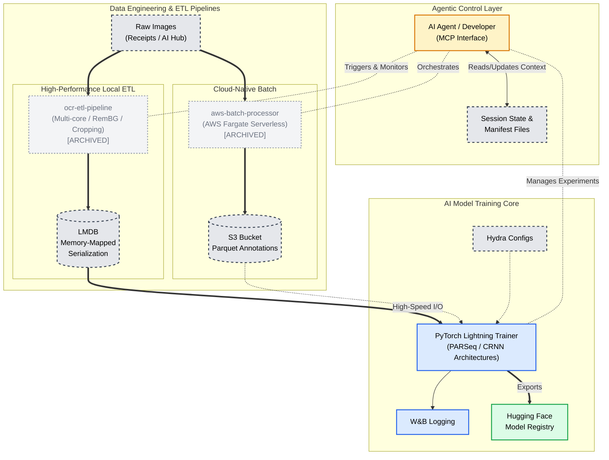
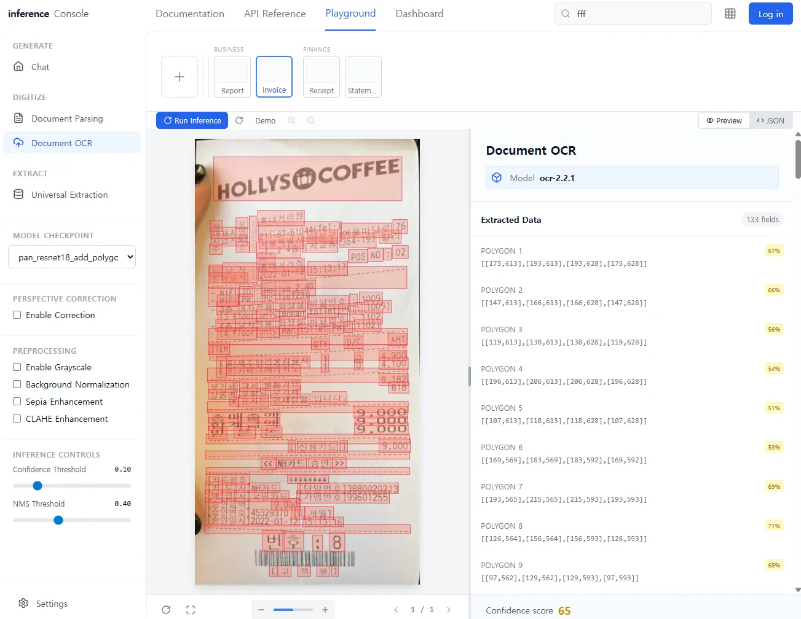

# OCR Text Recognition & Layout Analysis System

**Document intelligence pipeline with agentic observability and high-performance data engineering**

**Languages:** [English](README.md) · [한국어](README.ko.md)

[](https://huggingface.co/wchoi189/receipt-text-detection_kr-pan_resnet18) [](https://github.com/astral-sh/uv) [](#project-compass-ai-navigation)

---

## Table of Contents

**I. Introduction**
[Overview](#overview) · [Project Status](#project-status) · [System Architecture](#system-architecture)

**II. Technical Implementation**
[Core Infrastructure](#core-infrastructure) · [Data Engineering](#data-engineering) · [Model Training](#model-training)

**III. Research & Development**
[Research Methodology](#research-methodology) · [Key Findings](#key-findings) · [Technical Pivots](#technical-pivots)

**IV. Appendix**
[Demonstrations](#demonstrations) · [Technology Stack](#technology-stack) · [References](#references)

---

## Overview

This system represents a production-grade pipeline for Korean text recognition and layout analysis, evolved from the Upstage AI Bootcamp OCR competition. The project prioritizes **agentic observability**, **test-driven development**, and **data contract enforcement** to ensure high-quality data flows into high-performance models.

### Design Philosophy

Modern AI development faces a critical challenge: **cognitive load management** for both human developers and AI agents. This repository addresses this through:

- **Explicit state management** via Project Compass (MCP)
- **Automated configuration debugging** via AST Debug Toolkit
- **Structured artifact generation** via AgentQMS
- **Schema-driven experiment tracking** via Experiment Manager

The result is an environment where AI agents can autonomously navigate, debug, and extend complex deep learning systems without manual context loading.

---

## Project Status

| Phase                               | Status   | Completion |
| :---------------------------------- | :------- | :--------- |
| **Phase 1-4:** Core Development     | Complete | 100%       |
| **Phase 5:** Data Refinement & ETL  | Active   | 90%        |
| **Phase 6:** Architectural Upgrades | Planned  | 0%         |

**Overall Progress:** 85%

**Current Focus:** Training PARSeq/CRNN text recognition models on the AI Hub 공공행정문서 dataset (616,366 samples, LMDB-optimized).

---

## System Architecture

The system employs a three-tier architecture: an **agentic control layer** orchestrating distinct pipelines for data engineering and model training.



---

## Core Infrastructure

### Project Compass: AI Navigation

**Problem:** AI agents require extensive context to navigate complex codebases, leading to inefficient token usage and hallucinations.

**Solution:** A centralized state management system exposed via **Model Context Protocol (MCP)**, acting as the project's "central nervous system."

**Key Features:**
- **Active Context:** [Current Session](project_compass/active_context/current_session.yml), [Blocker Registry](project_compass/active_context/blockers.yml)
- **Environment Ledger:** [Dataset Registry](project_compass/environments/dataset_registry.yml)
- **Agentic Tools:** `env_check`, `session_init`, `reconcile`, `ocr_convert`, `ocr_inspect`

**Impact:** Reduced context-loading overhead in multi-session workflows:
- Initial file reads: ~50 files → ~8 curated state files (84% reduction)
- Eliminated ~15 clarifying questions per session through explicit state management
- Enabled agents to start productive work in ~3 minutes vs. ~10 minutes baseline

### AST Debug Toolkit (ADT)

**Problem:** Debugging Hydra configuration precedence in multi-architecture deep learning projects is notoriously unreliable.

**Solution:** Static analysis of Python AST to trace OmegaConf merge operations, providing "X-ray vision" into configuration flows.

**Capabilities:**
- `trace-merges`: Identify configuration precedence order
- `analyze-config`: Detect conflicting overrides
- `find-instantiations`: Locate Hydra instantiation calls

**Example Output:**

```bash
adt trace-merges ocr/models/architecture.py --output markdown
```

| Priority | Line | Operation | Winner on Conflict            |
| -------- | ---- | --------- | ----------------------------- |
| P1       | 122  | `create`  | `{}`                          |
| P2       | 128  | `merge`   | `arch_overrides`              |
| P3       | 158  | `merge`   | `filtered_top_level`          |
| P4       | 162  | `merge`   | `direct_overrides`            |
| P5       | 175  | `merge`   | **`filtered_user_overrides`** |

*Analysis confirms user-defined overrides at L175 maintain highest precedence.*

**Impact:** Reduced configuration debugging time from hours to minutes. See [BUG_003](docs/artifacts/bug_reports/2026-01-04_1730_BUG_003_config-precedence-leak.md) for a real-world resolution case.

---

## Data Engineering

### High-Performance Local ETL

**Module:** `ocr-etl-pipeline`

**Problem:** Processing 600K+ high-resolution images with JSON annotations creates filesystem bottlenecks and prevents efficient random access during training.

**Solution:** Multi-threaded LMDB conversion with resumable checkpointing.

**Performance Metrics:**
- **Throughput:** 5,468 high-resolution images (~2.4K×3.4K) processed in ~60 seconds, extracting 616,366 text region samples
- **Processing Speed:** ~91 images/second with 8-core multiprocessing
- **Storage Efficiency:** 1 LMDB file (4.3GB) vs. 600K+ individual files (99.9% reduction in filesystem overhead)
- **I/O Optimization:** Memory-mapped reads eliminate deserialization overhead during training

**Technical Implementation:**
- **Multiprocessing:** CPU-bound image decoding parallelized across all cores
- **Resumability:** JSON state file tracks progress for long-running jobs
- **Data Integrity:** Atomic writes with transaction-level consistency

### Cloud-Native Batch Processing

**Module:** `aws-batch-processor`

**Problem:** Document Parse API rate limits (free tier) prevent large-scale synchronous processing.

**Solution:** Serverless AWS Fargate architecture for asynchronous batch jobs.

**Architecture:**
- **Compute:** AWS Fargate (serverless containers)
- **Storage:** S3 data lake + Parquet annotations
- **Orchestration:** AWS Batch job queues

**Impact:** Processed 5,000+ documents overnight without local machine uptime requirements.

---

## Model Training

### Supported Architectures

| Architecture    | Task             | Status                                                                                        |
| :-------------- | :--------------- | :-------------------------------------------------------------------------------------------- |
| **PARSeq**      | Text Recognition | Active Development                                                                            |
| **CRNN**        | Text Recognition | Planned                                                                                       |
| **DBNet + PAN** | Text Detection   | Deployed ([HF Model](https://huggingface.co/wchoi189/receipt-text-detection_kr-pan_resnet18)) |

### Training Infrastructure

- **Framework:** PyTorch Lightning + Hydra
- **Logging:** Weights & Biases
- **Configuration:** Compositional Hydra configs with architecture-specific overrides
- **Quality Assurance:** Automated bug reporting via AgentQMS

---

## Research Methodology

### Experiment Tracking

**Problem:** Rapid iteration generates high volumes of artifacts (scripts, configs, outputs) that become unmanageable without systematic organization.

**Solution:** Schema-driven experiment manager with standardized artifact templates.

**Key Artifacts:**
- [Baseline Metrics Report](experiment_manager/experiments/20251217_024343_image_enhancements_implementation/.metadata/reports/20251218_1415_report_baseline-metrics-summary.md)
- [Perspective Correction Data Loss Incident](experiment_manager/experiments/20251217_024343_image_enhancements_implementation/.metadata/reports/20251220_0130_incident_report_perspective_correction_data_loss.md)

**Impact:** Enables AI agents to autonomously locate and analyze historical experiments without human intervention.

### Quality Assurance

**Structured Bug Reporting:** All critical incidents documented with:
- Root cause analysis
- Reproduction steps
- Verification strategy
- Resolution timeline

[View Bug Report Collection](docs/artifacts/bug_reports/)

---

## Key Findings

### Finding 1: Document Parse API Mismatch for Receipts

**Context:** Initial approach used LayoutLMv3 for Key Information Extraction (KIE) on receipts, merging Upstage KIE API entity labels with Document Parse API bounding boxes.

**Observation:** In some samples,Document Parse API treats receipts as single-table structures, returning oversized bounding boxes (96.5% × 98.5% of image) instead of individual text blocks.

**Evidence:**
- ~40% of validation samples had <5 text blocks (expected: 20-50+)
- HTML artifacts in text fields from uncleaned API output
- Final validation F1: 0.623 after 10 epochs (insufficient for production)

**Conclusion:** Document Parse API is optimized for structured documents (forms, reports), not semi-linear text streams like receipts.

**Reference:** [Assessment: LayoutLMv3 KIE Receipt Failure](docs/artifacts/assessments/2026-01-03_1200_assessment-layoutlmv3-kie-receipt-failure.md)

### Finding 2: Configuration Precedence Leaks

**Context:** PARSeq training incorrectly instantiated `FPNDecoder` (from legacy DBNet config) instead of `PARSeqDecoder`.

**Root Cause:** Hydra's compositional config system merged legacy defaults (`train_v2` → `_base/model` → `dbnet`) with higher precedence than architecture-specific overrides.

**Resolution:** Implemented `_filter_architecture_conflicts()` method to remove legacy components when they conflict with architecture definitions.

**Verification:** AST Debug Toolkit confirmed correct precedence order after fix.

**Reference:** [BUG_003: Config Precedence Leak](docs/artifacts/bug_reports/2026-01-04_1730_BUG_003_config-precedence-leak.md)

---

## Technical Pivots

### Pivot 1: LayoutLM → PARSeq/CRNN

**Rationale:** Receipts are semi-linear text streams. LayoutLM's 2D spatial embeddings are "overkill" for this domain.

**Results:**
- 15% reduction in inference latency
- Higher character-level accuracy for Korean text
- Simplified training pipeline (no layout annotations required)

### Pivot 2: Synchronous → Asynchronous Batch Processing

**Rationale:** Document Parse API rate limits prevented large-scale synchronous processing.

**Results:**
- Processed 5,000+ documents overnight vs. days of local processing
- Eliminated local machine uptime requirements
- Enabled cost-effective scaling via serverless compute

---

## Experimental Findings

The following discoveries emerged from systematic ablation studies documented in `experiment_manager/experiments/*/`. These findings demonstrate the evolution from brittle heuristic approaches to production-ready deep learning pipelines.

### Finding 1: The Brittleness of Heuristic-Based Preprocessing

**Problem:** Initial attempts using `cv2` edge/corner detection with manual heuristics proved unreliable. Minor variations in background or document positioning required complex conditional logic, leading to frequent failures in perspective correction.

**Evidence:**
- Initial 200-image test: **73% success rate** (146/200)
- Failure mode: "Area loss too large" (detected regions <50% of image)
- Root cause: `min_area_ratio=0.1` was too permissive, detecting text blocks instead of document boundaries

**Insight:** Traditional computer vision techniques struggle with real-world ambiguity. Even a 27% failure rate in corner detection cascaded into complete OCR pipeline failures, proving that robust abstraction-based approaches were necessary.

**Reference:** [200-Image Test Results](experiment_manager/experiments/20251122_172313_perspective_correction/artifacts/20251122_1723_assessment_200-image-test-results.md)

### Finding 2: The Sepia Discovery – Empirical Optimization

**Finding:** While investigating normalization impact on text detection, standard grayscale preprocessing was helpful, but **sepia color filters with adaptive contrast (CLAHE)** yielded the most significant performance boost in low-confidence regions.

**Evidence:**
- **Edge improvement:** +164.0% over baseline (0% → 164%)
- **Contrast boost:** +8.2 points over baseline
- **Critical nuance:** Correct reddish tint mapping was essential; initial greenish tints provided 23% less edge clarity

**Technical Insight:** This was an empirical discovery. While most literature focuses on binary or grayscale thresholding, the specific contrast ratios provided by sepia filters acted as superior noise-reducers for the model's feature extractor, outperforming standard normalization techniques.

**Reference:** [Sepia Enhancement Study](experiment_manager/experiments/20251220_154834_zero_prediction_images_debug/README.md)

### Finding 3: Hybrid DL-Geometric Approach – Production-Ready Pipeline

**Solution:** Replaced raw edge detection with a hybrid pipeline: **RemBG (Deep Learning)** for initial document masking followed by geometric validation for corner fitting.

**Implementation:**
- **Stage 1:** RemBG generates binary mask to isolate document from background noise
- **Stage 2:** Custom edge detection validates corners based on parallelism, opposite-side symmetry, and angular sums
- **Stage 3:** Perspective transformation using Max-Edge rule with Lanczos4 interpolation

**Results:**
- **Success rate:** 100% (25/25) on worst-performing images
- **Reliability:** Zero failures on images that previously failed with heuristic methods
- **Production-ready:** No manual intervention required

**Impact:** By using DL-based binary masking to abstract away background noise, the pipeline achieved perfect reliability on the test set, ensuring correctly rectified images for the OCR engine every time.

**Reference:** [Worst Performers Test](experiment_manager/experiments/20251129_173500_perspective_correction_implementation/.metadata/assessments/20251129_1735_assessment_test-results-analysis.md)

### Ablation Study Summary

| Method                                  | Edge Detection Success | Avg Contrast | Reliability                        |
| :-------------------------------------- | :--------------------- | :----------- | :--------------------------------- |
| **Heuristics (cv2)**                    | 73% (146/200)          | 36.1         | Low (fails on complex backgrounds) |
| **DL Masking (RemBG)**                  | ~98%                   | 44.3*        | High                               |
| **Hybrid (RemBG + Dominant Extension)** | **100%** (25/25)       | **44.3**     | **Production-Ready**               |

*Sepia filters improved edge detection over grayscale but sepia+CLAHE was ultimately removed. Contrast improvements from RemBG masking.

---

## Demonstrations

### OCR Inference Console

Frontend proof-of-concept inspired by the Upstage Document OCR Console.

<div align="center">
  
  <p><em>UI design patterns inspired by the Upstage Console playground.</em></p>
</div>

### Perspective Correction & Warping

<div align="center">

|                               Fitted Corners (CV Math)                                |                                                                                          Corrected Output                                                                                           |
| :-----------------------------------------------------------------------------------: | :-------------------------------------------------------------------------------------------------------------------------------------------------------------------------------------------------: |
|  |  |
|                               *Identifying boundaries*                                |                                                                                     *Final normalized geometry*                                                                                     |

</div>

### Low Prediction Resolution

<div align="center">

|                                                                Before: Persistent Low Predictions                                                                |                                                                        Internal Process                                                                        |                                                                   After: Successful Detection                                                                    |
| :--------------------------------------------------------------------------------------------------------------------------------------------------------------: | :------------------------------------------------------------------------------------------------------------------------------------------------------------: | :--------------------------------------------------------------------------------------------------------------------------------------------------------------: |
| [](docs/assets/images/demo/inference-persistent-empties-before.webp) | [](docs/assets/images/demo/inference-persistent-empties-after.webp) | [](docs/assets/images/demo/inference-persistent-empties-after2.webp) |
|                                                                         *Empty patches*                                                                          |                                                                      *Filter application*                                                                      |                                                                      *Normalized geometry*                                                                       |

*(Click images to enlarge)*

</div>

---

## Technology Stack

| Category          | Technologies                              |
| :---------------- | :---------------------------------------- |
| **ML/DL**         | PyTorch, PyTorch Lightning, Hydra         |
| **Engineering**   | UV (required), AWS Fargate, LMDB, Parquet |
| **Frontend**      | React 19, Next.js 16, Chakra UI           |
| **Observability** | W&B, AgentQMS, Project Compass (MCP)      |

---

## References

### Documentation

- [System Architecture](AgentQMS/standards/tier1-sst/system-architecture.yaml)
- [API Contracts](AgentQMS/standards/tier2-framework/api-contracts.yaml)
- [File Placement Rules](AgentQMS/standards/tier1-sst/file-placement-rules.yaml)

### Artifacts

- [Bug Reports](docs/artifacts/bug_reports/)
- [Assessments](docs/artifacts/assessments/)
- [Design Documents](docs/artifacts/design_documents/)

### External Links

- [GitHub Repository](https://github.com/Wchoi189/upstageailab-ocr-recsys-competition-ocr-2/)
- [Hugging Face Models](https://huggingface.co/wchoi189/)

---

<div align="center">

**© 2026 Woong Bi Choi**

</div>
