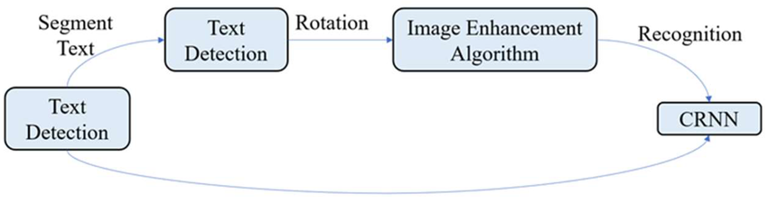
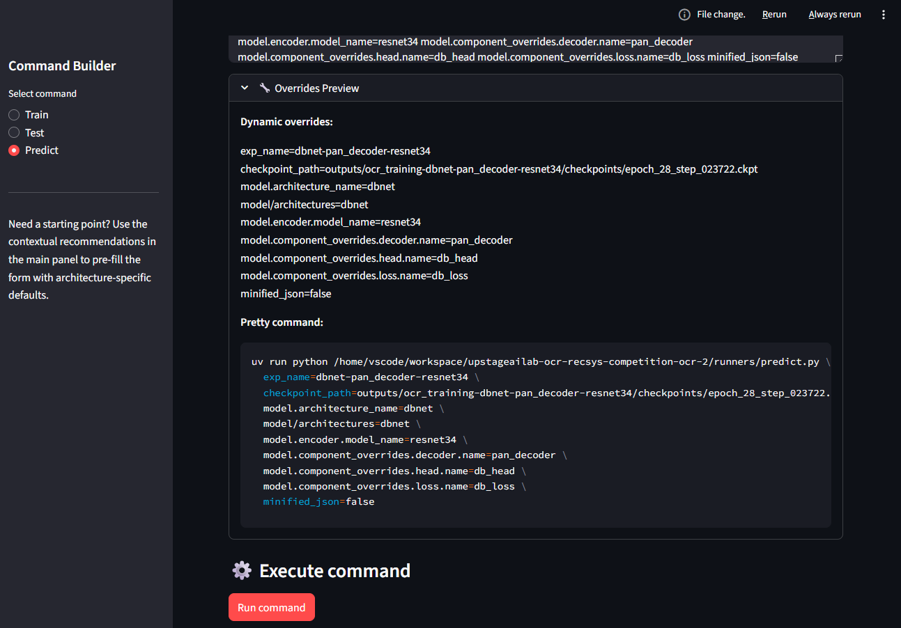
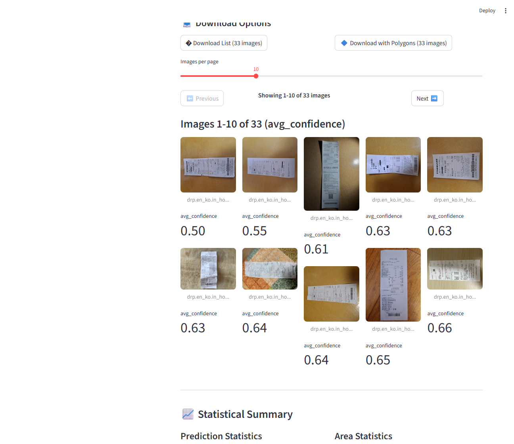

<!-- Badges -->
<div align="center">

<!-- TODO: Update CI badge URL when repository is migrated -->
[](https://github.com/AIBootcamp13/upstageailab-ocr-recsys-competition-ocr-2/actions)
[](https://python.org)
[](https://pytorch.org)
[](https://github.com/astral-sh/uv)
[](https://hydra.cc)
[](https://lightning.ai)
[](LICENSE)
[](https://github.com/AIBootcamp13/upstageailab-ocr-recsys-competition-ocr-2)
[](https://github.com/AIBootcamp13/upstageailab-ocr-recsys-competition-ocr-2)

</div>

<div align="center">

<!-- TODO: Add project logo/banner image here -->
<!--

-->

# OCR Text Detection & Recognition System

**A modular, production-ready OCR system for receipt text detection and recognition**

[Features](#-features) • [Quick Start](#-quick-start) • [Documentation](#-documentation) • [Roadmap](#-roadmap) • [Contributing](#-contributing)

</div>

---

## 📖 Overview

This project is a comprehensive OCR (Optical Character Recognition) system designed for detecting and recognizing text in receipt images. Built with a modular architecture using PyTorch Lightning and Hydra, it provides a flexible framework for text detection with plans to extend to text recognition and layout analysis.

### Key Capabilities

- **Text Detection**: Accurate polygon-based text region detection using DBNet architecture
- **Modular Architecture**: Plug-and-play components (encoders, decoders, heads, loss functions)
- **Production-Ready**: Offline preprocessing pipeline for 5-8x faster training/validation
- **Interactive UI**: Streamlit-based tools for model testing, preprocessing demos, and evaluation
- **Comprehensive Tooling**: Command builder, evaluation viewer, and real-time inference interface

### Project Structure

- `apps/frontend`: Main React/Vite SPA frontend
- `apps/playground-console`: Developer console application
- `apps/backend`: Backend services
- `agent_qms`: Quality Management System and Agent Tools
- `ocr`: Core OCR Python package
- `packages`: Shared Node.js packages

---

## 🚀 Quick Links

**Getting Started**
- [Installation Guide](#-quick-start)
- [First Steps Tutorial](#-getting-started-tutorial)
- [Configuration Guide](docs/architecture-overview.md)

**Development**
- [Contributing Guidelines](CONTRIBUTING.md)
- [Development Setup](#-development)
- [Code Standards](docs/development/coding-standards.md)

**Resources**
- [API Reference](docs/api-reference.md)
- [Changelog](docs/CHANGELOG.md)
- [Troubleshooting](#-troubleshooting)
- [FAQ](#-faq)

---

## 📊 Project Status

<div align="center">

| Phase | Status | Progress |
|-------|--------|----------|
| **Phase 1: Performance & Maintainability** | ✅ Complete | 100% |
| **Phase 2: Preprocessing Enhancement** | ✅ Complete | 100% |
| **Phase 3: API Client & Infrastructure** | ✅ Complete | 100% |
| **Phase 4: Testing & Quality Assurance** | 🟡 In Progress | 40% |
| **Phase 5: Next.js Console Migration** | 🟡 In Progress | 75% |
| **Phase 6: Feature Completeness** | ⚪ Planned | 0% |
| **Phase 7: Polish & Optimization** | ⚪ Planned | 0% |

**Overall Progress: 55%**

</div>

### 🔥 Current Work

**Active Development Focus:**
- ✅ **Frontend Functionality (Phases 1-3 Complete)**
  - Real inference API with model integration
  - Client-side background removal with ONNX.js (rembg)
  - Server-side pipeline API with job tracking
  - Image validation, loading states, and error handling
  - API client enhancements with retry logic
- 🟡 **Testing & Quality Assurance (Phase 4)**
  - E2E test coverage for frontend features
  - Component unit testing
  - Worker pipeline integration tests
- 🟡 **Next.js Console Migration (Phase 4)**
  - Command Builder and Extract pages migrated
  - API proxy routes implementation (in progress)
  - Analytics & compliance integration (pending)

**Recent Accomplishments:**
- ✅ Client-side background removal working with ONNX.js runtime
- ✅ FastAPI backend with CORS support and job status tracking
- ✅ Image preprocessing pipeline with multiple transform options
- ✅ Chakra UI theme and console shell for Next.js app

**Next Steps:**
- Complete E2E test suite for frontend features
- Implement Next.js API proxy routes
- Add analytics integration with consent management
- Enhance code quality (TypeScript types, documentation)

See implementation plans:
- [Frontend Functionality Completion](artifacts/implementation_plans/2025-11-19_1514_frontend-functionality-completion.md)
- [Next.js Console Migration](artifacts/implementation_plans/2025-11-19_1957_next.js-console-migration-and-chakra-adoption-plan.md)
- [Autonomous Overnight Tasks](artifacts/implementation_plans/2025-11-20_0130_autonomous-tasks-overnight.md)

---

## ✨ Features

### Current Features

- ✅ **DBNet-based Text Detection**: Real-time scene text detection with differentiable binarization
- ✅ **Modular Component System**: Registry-based architecture for easy experimentation
- ✅ **Offline Preprocessing**: Pre-computed probability and threshold maps for faster training
- ✅ **Streamlit UI Tools**: Command builder, evaluation viewer, and inference interface
- ✅ **Hydra Configuration**: Centralized configuration management
- ✅ **W&B Integration**: Experiment tracking and monitoring
- ✅ **Performance Profiling**: Advanced performance analysis tools

### Current Features (Completed)

✅ **Core OCR System**
- DBNet-based text detection with polygon outputs
- Offline preprocessing for 5-8x faster training
- Modular component architecture with registry pattern
- W&B integration for experiment tracking

✅ **Frontend Application (Vite SPA)**
- Real-time inference interface with checkpoint selection
- Image preprocessing studio with web worker pipeline
- Client-side background removal (ONNX.js)
- Command builder with schema-driven forms
- Error handling and toast notifications

✅ **Backend API (FastAPI)**
- Inference preview endpoint with model integration
- Pipeline API with job status tracking
- Gallery image management
- CORS support for frontend integration

✅ **Next.js Console (In Progress)**
- Chakra UI theme and console shell
- Command Builder migrated to Next.js
- Universal and Prebuilt Extraction pages
- Shared component library (`packages/console-shared`)

### Planned Improvements

1. **🧪 Testing & Quality Assurance** (Current)
   - E2E test coverage for frontend features
   - Component unit tests with Vitest
   - Worker pipeline integration tests
   - TypeScript type improvements and JSDoc documentation

2. **🎨 Next.js Console Migration** (Current)
   - API proxy routes for backend communication
   - Session management and authentication
   - Analytics integration with GTM
   - Performance optimization

3. **📝 Text Recognition Capabilities** (Future)
   - Integration of text recognition models
   - End-to-end OCR pipeline (detection + recognition)
   - Support for multiple languages

4. **📐 Layout Recognition Capabilities** (Future)
   - Document structure analysis
   - Region classification (header, body, footer, etc.)
   - Table and form detection

5. **🔄 CI/CD Integration** (Future)
   - Automated testing pipelines
   - Continuous integration workflows
   - Automated deployment processes
   - Code quality checks

---

## 🛠️ Tech Stack

<div align="center">

| Category | Technology |
|----------|-----------|
| **Deep Learning** | PyTorch, PyTorch Lightning |
| **Configuration** | Hydra |
| **Package Manager** | UV (Python), npm (JavaScript) |
| **Backend API** | FastAPI |
| **Frontend (SPA)** | React 19, TypeScript, Vite |
| **Frontend (Console)** | Next.js 16, Chakra UI, React Query |
| **UI Framework (Legacy)** | Streamlit |
| **Web Workers** | ONNX.js (onnxruntime-web) |
| **Experiment Tracking** | Weights & Biases |
| **Testing** | pytest, Playwright, Vitest |
| **Documentation** | Markdown |

</div>

---

## 🚀 Quick Start

### Prerequisites

- Python 3.10+
- UV package manager
- CUDA-compatible GPU (recommended for training)

### Installation

```bash
# Clone the repository
git clone <your-repo-url>
cd upstageailab-ocr-recsys-competition-ocr-2

# Setup environment (automated)
./scripts/setup/00_setup-environment.sh
```

### Basic Usage

```bash
# Run unit tests
uv run pytest tests/ -v

# Train model
uv run python runners/train.py preset=example trainer.max_epochs=10

# Test model
uv run python runners/test.py \
    preset=example \
    checkpoint_path="outputs/experiments/train/ocr/ocr_training_b/YOUR_RUN_ID/checkpoints/best.ckpt"

# Generate predictions
uv run python runners/predict.py \
    preset=example \
    checkpoint_path="outputs/experiments/train/ocr/ocr_training_b/YOUR_RUN_ID/checkpoints/best.ckpt"
```

### UI Tools

**Streamlit Applications (Legacy):**
```bash
# Command Builder - Build and execute training commands
python run_ui.py command_builder
# Or directly: uv run streamlit run ui/apps/command_builder/app.py

# Real-time Inference - Test models interactively
python run_ui.py inference
# Or directly: uv run streamlit run ui/apps/inference/app.py

# Evaluation Viewer - Visualize and analyze results
python run_ui.py evaluation_viewer
# Or directly: uv run streamlit run ui/evaluation/app.py
```

**Modern Frontend Application (React + Vite):**
```bash
# Start FastAPI backend + Vite frontend
make fs
# Or separately:
# Backend: uv run uvicorn services.playground_api.app:app --reload
# Frontend: cd frontend && npm run dev

# Access:
# Frontend: http://localhost:5173
# API Docs: http://127.0.0.1:8000/docs
```

**Next.js Console (In Development):**
```bash
# Start Next.js console
cd apps/playground-console
npm run dev

# Access: http://localhost:3000
```

---

## 📚 Getting Started Tutorial

### Step 1: Environment Setup

```bash
# Install UV if not already installed
curl -LsSf https://astral.sh/uv/install.sh | sh

# Clone and setup
git clone <your-repo-url>
cd upstageailab-ocr-recsys-competition-ocr-2
./scripts/setup/00_setup-environment.sh
```

### Step 2: Verify Installation

```bash
# Run tests to verify everything works
uv run pytest tests/ -v

# Check if GPU is available
uv run python -c "import torch; print(f'CUDA available: {torch.cuda.is_available()}')"
```

### Step 3: Prepare Data

```bash
# Place your dataset in the data/datasets/ directory
# Structure should be:
# data/datasets/
#   ├── images/
#   │   ├── train/
#   │   ├── val/
#   │   └── test/
#   └── jsons/
#       ├── train.json
#       ├── val.json
#       └── test.json
```

### Step 4: Preprocess Data (Optional but Recommended)

```bash
# Preprocess maps for faster training
uv run python scripts/preprocess_maps.py
```

### Step 5: Train Your First Model

```bash
# Start with a small experiment
uv run python runners/train.py \
    preset=example \
    trainer.max_epochs=5 \
    data.train_num_samples=100 \
    data.val_num_samples=20
```

### Step 6: Test and Evaluate

```bash
# Test the trained model
uv run python runners/test.py \
    preset=example \
    checkpoint_path="outputs/experiments/train/ocr/ocr_training_b/YOUR_RUN_ID/checkpoints/latest.ckpt"

# Generate predictions
uv run python runners/predict.py \
    preset=example \
    checkpoint_path="outputs/experiments/train/ocr/ocr_training_b/YOUR_RUN_ID/checkpoints/latest.ckpt"
```

### Step 7: Explore with UI

```bash
# Launch the inference UI to test interactively
python run_ui.py inference
# Or directly: uv run streamlit run ui/apps/inference/app.py
```

**Next Steps**: Check out the [Documentation](#-documentation) section for more advanced usage.

---

## 📁 Project Structure

```
├── configs/              # Hydra configuration files
│   ├── train.yaml
│   ├── test.yaml
│   ├── predict.yaml
│   └── preset/          # Model and dataset presets
├── data/                # Dataset directory
│   ├── datasets/
│   └── jsons/
├── docs/                # Documentation
│   ├── artifacts/       # AgentQMS implementation plans, audits, bug reports, assessments
│   ├── maintainers/     # Maintainer documentation
│   └── ...
├── outputs/             # Generated artifacts (see outputs/README_outputs_structure.md)
├── ocr/                 # Core OCR modules
│   ├── datasets/
│   ├── lightning_modules/
│   ├── metrics/
│   ├── models/
│   └── utils/
├── runners/             # Training, testing, prediction scripts
├── scripts/             # Utility scripts
│   ├── agent_tools/
│   └── setup/
├── ui/                  # Streamlit UI applications
│   ├── command_builder.py
│   ├── inference_ui.py
│   └── evaluation_viewer.py
└── tests/               # Unit and integration tests
```

---

## ✅ Quality Management with AgentQMS

This project uses **AgentQMS** for structured quality management (implementation plans, audits, assessments, bug reports).

- **Artifacts** live in `docs/artifacts/` and follow the naming convention
  `YYYY-MM-DD_HHMM_[type]_name.md`.
- **AI agents and contributors** should use the AgentQMS workflows instead of creating ad‑hoc docs.

Common commands (run from the project root):

```bash
# Create an implementation plan
make qms-plan NAME=my-plan TITLE="My Plan"

# Create a bug report
make qms-bug NAME=my-bug TITLE="Bug in inference overlay"

# Run validation and compliance checks
make qms-validate
make qms-compliance

# Load focused context bundles
make qms-context TASK="investigate preprocessing bug"
make qms-context-dev
make qms-context-docs
make qms-context-debug
make qms-context-plan
```

For full details, see:

- `AgentQMS/knowledge/agent/system.md`
- `.agentqms/state/architecture.yaml`

---

## 🏗️ Architecture

### Modular Design

The system uses a registry-based architecture that allows plug-and-play component replacement:

- **Encoders**: MobileNetV3, ResNet, EfficientNet (planned)
- **Decoders**: PAN, DBNet++
- **Heads**: Custom detection heads
- **Loss Functions**: Various loss implementations

### DBNet Architecture

The core detection model is based on DBNet (Differentiable Binarization Network), which provides:

- Real-time text detection
- Accurate polygon-based text region localization
- Differentiable binarization for end-to-end training



---

## 📊 Performance

### Current Model Performance

- **H-Mean**: 0.9787
- **Precision**: 0.9771
- **Recall**: 0.9809
- **Training Time**: ~22 minutes (10 epochs on V100 GPU)

### Evaluation Metrics

The project uses **CLEval** (Character-Level Evaluation) for text detection assessment:


### Example Results

<!-- TODO: Add example output images/results here -->
<!--
<div align="center">

**Example Detection Results**

| Input Image | Detection Result | Recognition Result |
|------------|------------------|-------------------|
|  |  | Text: "Receipt content..." |
|  |  | Text: "Receipt content..." |

</div>
-->

---

## 🔄 Preprocessing Pipeline

### Offline Preprocessing

The project includes an offline preprocessing system that pre-computes probability and threshold maps, resulting in **5-8x faster validation speed**.

```bash
# Preprocess entire dataset
uv run python scripts/preprocess_maps.py

# Test with limited samples
uv run python scripts/preprocess_maps.py data.train_num_samples=100 data.val_num_samples=20
```

### Features

- Pre-computed probability and threshold maps
- Automatic fallback to real-time generation if maps are missing
- Compressed `.npz` format for efficient storage
- Image enhancement using Doctr library
- CamScanner-style preprocessing

---

## 🎨 Features Showcase

### UI Tools

<div align="center">

<table style="border-collapse: collapse; border: none;">
<tr>
<td style="border: none; padding: 20px; text-align: center; vertical-align: top;">
<strong>Command Builder</strong><br><br>
<br><br>
<small>Build and execute training commands with an intuitive interface</small>
</td>
</tr>
<tr>
<td style="border: none; padding: 20px; text-align: center; vertical-align: top;">
<strong>Real-time OCR Inference</strong><br><br>
<br><br>
<small>Interactive interface for real-time text detection on receipt images</small>
</td>
</tr>
<tr>
<td style="border: none; padding: 20px; text-align: center; vertical-align: top;">
<strong>Evaluation Viewer</strong><br><br>
<br><br>
<small>Visualize and analyze model evaluation results in detail</small>
</td>
</tr>
</table>

</div>

<!-- TODO: Add animated GIFs showcasing key features -->
<!--
### Animated Demos

<div align="center">

**Interactive Model Testing**


**Preprocessing Pipeline Demo**


</div>
-->

---

## 🛠️ Development

### Environment Setup

**Important**: This project uses **UV** package manager. Do not use pip, conda, or poetry.

```bash
# All commands must use 'uv run' prefix
uv run python runners/train.py
uv run pytest tests/
```

### Running Tests

```bash
# Run all tests
uv run pytest tests/

# Run specific test file
uv run pytest tests/test_metrics.py

# Run with coverage
uv run pytest tests/ --cov=ocr
```

### Code Quality

- Follow PEP 8 style guidelines
- Use type hints where applicable
- Write comprehensive docstrings
- Maintain test coverage above 80%

### Development Workflow

1. Create a feature branch: `git checkout -b feature/your-feature-name`
2. Make your changes
3. Run tests: `uv run pytest tests/`
4. Check code quality: `uv run ruff check .`
5. Commit with clear messages
6. Push and create a pull request

See [CONTRIBUTING.md](CONTRIBUTING.md) for detailed guidelines.

---

## 🗺️ Roadmap

### Phase 1: Frontend Functionality (Complete) ✅
- [x] Real inference API implementation
- [x] Client-side background removal (ONNX.js)
- [x] Server-side pipeline API
- [x] Image validation and error handling
- [x] Loading states and user feedback
- [x] API client enhancements

### Phase 2: Testing & Quality (In Progress) 🟡
- [ ] E2E test coverage for frontend features
- [ ] Component unit tests
- [ ] Worker pipeline integration tests
- [ ] TypeScript type improvements
- [ ] Code documentation and JSDoc

### Phase 3: Next.js Console Migration (In Progress) 🟡
- [x] Chakra UI theme and shell components
- [x] Command Builder migration
- [x] Extract pages (Universal & Prebuilt)
- [ ] API proxy routes
- [ ] Session management and auth
- [ ] Analytics integration (GTM)

### Phase 4: Feature Completeness (Planned) ⚪
- [ ] Comparison Studio enhancements
- [ ] Command execution and history
- [ ] Image display enhancements (zoom, download)
- [ ] State persistence (localStorage)

### Phase 5: Text Recognition (Future) ⚪
- [ ] Text recognition model integration
- [ ] End-to-end OCR pipeline
- [ ] Multi-language support

### Phase 6: Layout Recognition (Future) ⚪
- [ ] Document structure analysis
- [ ] Region classification
- [ ] Table and form detection

### Phase 7: CI/CD Integration (Future) ⚪
- [ ] Automated testing pipelines
- [ ] Continuous integration workflows
- [ ] Automated deployment processes

---

## 🐛 Troubleshooting

### Common Issues

#### Issue: CUDA out of memory
**Solution**: Reduce batch size in config or use gradient accumulation
```bash
uv run python runners/train.py preset=example data.batch_size=4 trainer.accumulate_grad_batches=2
```

#### Issue: Preprocessing maps not found
**Solution**: Either run preprocessing or the system will automatically fallback to real-time generation (slower)
```bash
uv run python scripts/preprocess_maps.py
```

#### Issue: UV command not found
**Solution**: Install UV package manager
```bash
curl -LsSf https://astral.sh/uv/install.sh | sh
```

#### Issue: Import errors after setup
**Solution**: Ensure you're using `uv run` prefix for all Python commands
```bash
# ❌ Wrong
python runners/train.py

# ✅ Correct
uv run python runners/train.py
```

### Getting Help

- Check [Documentation](#-documentation) for detailed guides
- Search [GitHub Issues](https://github.com/AIBootcamp13/upstageailab-ocr-recsys-competition-ocr-2/issues)
- Create a new issue with:
  - Error messages
  - Steps to reproduce
  - Environment details (OS, Python version, GPU)

---

## ❓ FAQ

<!-- TODO: Add frequently asked questions -->
<!--
### General Questions

**Q: What is the minimum GPU memory required?**
A: A GPU with at least 8GB VRAM is recommended for training. Inference can run on smaller GPUs or CPU.

**Q: Can I use this for other document types besides receipts?**
A: Yes, the model can be fine-tuned for other document types, though it's currently optimized for receipts.

**Q: How do I add support for a new language?**
A: [Instructions for adding language support]

### Technical Questions

**Q: Why use UV instead of pip?**
A: UV is significantly faster for dependency resolution and installation, improving development workflow.

**Q: How do I customize the model architecture?**
A: [Instructions for customizing architecture]
-->

*More FAQs coming soon. Feel free to [open an issue](https://github.com/AIBootcamp13/upstageailab-ocr-recsys-competition-ocr-2/issues) with your question!*

---

## 📚 Documentation

- [Architecture Overview](docs/architecture-overview.md) - System architecture and design decisions
- [Process Management Guide](docs/process-management-guide.md) - Training process management
- [Component Diagrams](docs/component-diagrams.md) - Visual component documentation
- [API Reference](docs/api-reference.md) - API documentation
- [Development Guide](docs/development/) - Coding standards and conventions
- [Data Contracts](docs/pipeline/data_contracts.md) - Data pipeline specifications
- [Changelog](docs/CHANGELOG.md) - Project changelog and version history

---

## 🤝 Contributing

We welcome contributions! Please see our [Contributing Guidelines](CONTRIBUTING.md) for details on:

- Code of conduct
- How to submit pull requests
- Development setup
- Coding standards
- Issue reporting

**Quick Contribution Checklist:**
- [ ] Fork the repository
- [ ] Create a feature branch
- [ ] Make your changes
- [ ] Add tests
- [ ] Update documentation
- [ ] Submit a pull request

---

## 📄 License

This project is licensed under the [MIT License](LICENSE).

---

## 🙏 Acknowledgments

- [DBNet](https://github.com/MhLiao/DB) - Differentiable Binarization Network
- [CLEval](https://github.com/clovaai/CLEval) - Character-Level Evaluation
- [PyTorch Lightning](https://lightning.ai) - Deep learning framework
- [Hydra](https://hydra.cc) - Configuration management
- [UV](https://github.com/astral-sh/uv) - Fast Python package manager

---

## 📖 References

### Papers
- **CLEval**: Character-Level Evaluation for Text Detection and Recognition Tasks
  [arXiv:2006.06244](https://arxiv.org/pdf/2006.06244.pdf)
- **DBNet**: Real-time Scene Text Detection with Differentiable Binarization
  [AAAI 2020](https://arxiv.org/abs/1911.08947)

### Resources
- [DBNet Repository](https://github.com/MhLiao/DB)
- [Hydra Documentation](https://hydra.cc/docs/intro/)
- [PyTorch Lightning Docs](https://pytorch-lightning.readthedocs.io/)
- [UV Documentation](https://github.com/astral-sh/uv)

---

## 📧 Contact

For questions, suggestions, or contributions:

- **Issues**: [GitHub Issues](https://github.com/AIBootcamp13/upstageailab-ocr-recsys-competition-ocr-2/issues)
- **Discussions**: [GitHub Discussions](https://github.com/AIBootcamp13/upstageailab-ocr-recsys-competition-ocr-2/discussions) *(if enabled)*

---

<div align="center">

**Built with ❤️ for OCR research and development**

[⬆ Back to Top](#-overview)

</div>
