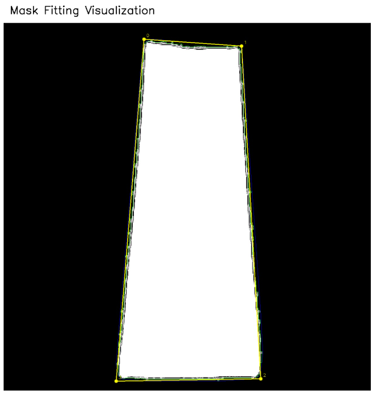
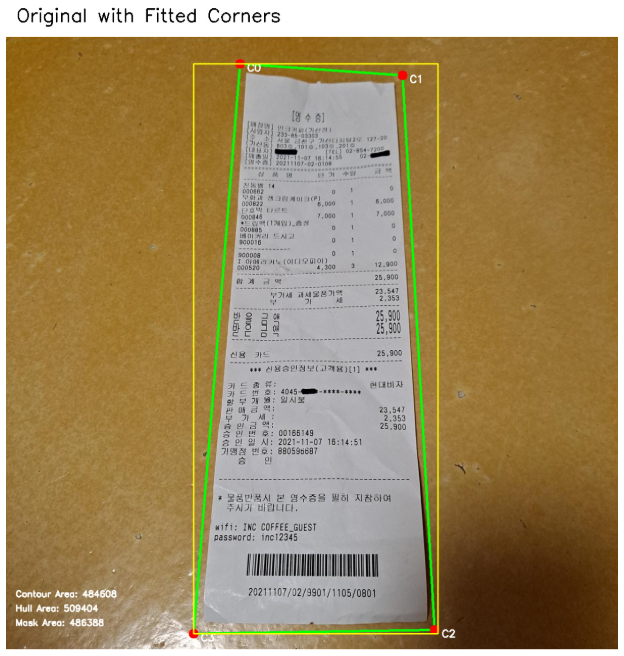
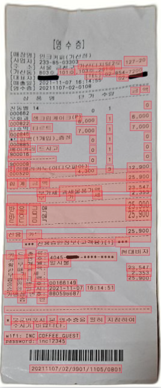
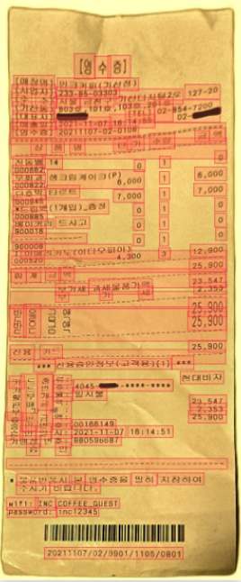

<div align="center">

[](https://github.com/Wchoi189/upstageailab-ocr-recsys-competition-ocr-2/actions)
[](https://python.org)
[](https://pytorch.org)
[](LICENSE)

# OCR Text Recognition & Layout Analysis System

**AI-optimized text-recognition system with layout analysis for accurate information extraction**

[Features](#-features) • [Progress](#-project-progress) • [Documentation](#-documentation)

</div>

---

## 📖 About

A continuation project building an end-to-end text-recognition system featuring layout recognition capabilities. Currently undergoing final preparation and safety checks before major architectural upgrades.

---

## ✨ Features

- 🤖 **AI-Optimized Documentation Framework**: Standardizes documentations and protocols to reduce ambiguity and clutter in AI collaboration.
- 📋 **Data Contracts & Validation**: Enforces structured data handling and validation.
- 🧪 **Comprehensive Test Suite**: Detects unexpected performance regressions during feature implementations.
- 🔍 **Custom VLM Tools**: Analyze images and generate technical reports describing defects and subtle changes.

---

## � Experiment Tracker: Organized AI-Driven Research

**Problem Solved**: Rapid AI-driven experimentation generates massive amounts of artifacts, scripts, and documentation that become unmanageable without systematic organization. Traditional project structures fail when experiments iterate daily and debugging requires instant access to reliable documentation.

**Solution**: `experiment-tracker/` - A structured system for organizing experimental artifacts optimized for both human readability and AI consumption.

### Technical Reports & Documentation

**Baseline Analysis**
- [📊 Baseline Metrics Summary](experiment-tracker/experiments/20251217_024343_image_enhancements_implementation/artifacts/20251218_1415_report_baseline-metrics-summary.md) - Comprehensive baseline metrics establishing performance benchmarks

**Incident Resolution**
- [🚨 Data Loss Incident Report](experiment-tracker/experiments/20251217_024343_image_enhancements_implementation/artifacts/20251220_0130_incident_report_perspective_correction_data_loss.md) - Critical data loss incident analysis and resolution strategy

**Comparative Analysis**
- [⚖️ Background Normalization Comparison](experiment-tracker/experiments/20251217_024343_image_enhancements_implementation/.metadata/reports/20251218_1458_report_background-normalization-comparison.md) - Background normalization strategy comparison with quantitative results

### Visual Results & Demos

<div align="center">

| Mask image | Fitted corners image | Corrected image |
|:---:|:---:|:---:|
|  |  |  |
| Innovative use of rembg output as input for robust edge detection, eliminating brittle traditional methods and achieving zero-failure perspective correction | Corner detection and fitting for precise geometric transformation | Final perspective-corrected output with normalized geometry |

</div>

### Key Benefits

- **🤖 AI-Optimized**: Documentation structure designed for efficient AI consumption
- **⚡ Standardized protocols**: Reduces manual prompting and produces high quality results
- **🔧 Traceability**: Easier to reproduce the exact steps taken to produce the results
- **📈 Scalable Organization**: Isolates experiment specific artifacts to reduce clutter and context chaos

---
## 🎯 Low Prediction Resolution

<div align="center">

| Before: Persistent Low Predictions | After: Successful Detection |
|:---:|:---:|
|  |  |
| Perspective Correction + Normalization = Although this enhancement combination greatly improved detection results, it contains empty patches and is unacceptable. | Perspective Correction + Experimental color filter produces excellent detection results. |

</div>

---
## �📊 Project Progress

<div align="center">

| Phase | Status | Progress |
|-------|--------|----------|
| **Phase 1-4: Core Development** | ✅ Complete | 100% |
| **Phase 5: Pre-Upgrade Preparation** | 🟡 In Progress | 80% |
| **Phase 6: Architectural Upgrades** | ⚪ Planned | 0% |

**Overall: 80% Complete**

</div>

**Current Focus:** Final safety checks, system validation, and preparation for major architectural enhancements.

📋 **Detailed roadmap:** [docs/roadmap.md](docs/roadmap.md)

---

## 🛠️ Tech Stack

| Category | Technologies |
|----------|-------------|
| **ML/DL** | PyTorch, PyTorch Lightning, Hydra |
| **Backend** | FastAPI, ONNX Runtime |
| **Frontend** | React 19, Next.js 16, Chakra UI, Streamlit |
| **Tools** | UV (Python), npm, W&B, Playwright, Vitest |

---

## 📚 Documentation

**AI-Facing Resources**
- [Architecture Overview](docs/architecture/architecture.md)
- [AgentQMS Workflows](AgentQMS/knowledge/agent/system.md)

**Reference**
- [API Documentation](docs/api-reference.md)
- [Changelog](CHANGELOG.md)

---

## 🏗️ Project Structure

```
├── AgentQMS/          # AI documentation and quality management
├── apps/              # Frontend & backend applications
├── configs/           # Hydra configuration (89 YAML files)
├── docs/              # AI-optimized documentation & artifacts
├── ocr/               # Core OCR Python package
├── runners/           # Training/testing/prediction scripts
├── scripts/           # Utility scripts
├── tests/             # Unit & integration tests
```

📖 **Detailed structure:** [docs/architecture/project-structure.md](docs/architecture/project-structure.md)

---

## 🤝 Contributing

Contributions welcome! See [CONTRIBUTING.md](CONTRIBUTING.md) for guidelines.

---

## 📄 License

MIT License - see [LICENSE](LICENSE) for details.

---

<div align="center">

<!-- **Built with ❤️ for OCR research and development** -->

[⬆ Back to Top](#ocr-text-recognition--layout-analysis-system)

</div>
