# 📑 OCR Text Recognition & Layout Analysis System
**AI-optimized document intelligence with agentic management and high-performance ETL.**

[Quick Start](#-tech-stack) • [Architecture](#-technical-architecture) • [Research & Pivots](#-research-insights--pivots) • [Model Zoo](#-model-zoo)

---

## 📖 Overview
A personal continuation of the Upstage AI Bootcamp Receipt Text Detection competition, is evolving into a Text-Recognition and Layout-Analysis pipeline. This system emphasizes **Agentic observability**, **Test Driven Development(TDD)** and the use of **Data Contracts** to enforce data quality and reliability.

### 📊 System Status
* **Core Development:** ✅ 100%
* **Pre-Upgrade Prep:** 🔄 90% (Refining PARSeq/CRNN training)
* **Architecture:** AI-First (via Project Compass/MCP)

---

## 🏗️ System Architecture

## Development Philosophy
The system is designed to be agentic and AI-first. It is built around a central "Agentic Control Layer" that is aware of the system state and uses a AI-Native schema only documentation philosophy to provide a quick and machine-readable knowledge base to AI agents.

Although this is a OCR project, the system prioritizes developing tools and documentations for AI to support AI agents in their development and maintenance. Some framework and tools that have been developed include AgentQMS which is a quality management system for AI agents that enforces project conventions that include documentation standardization. Experiment Manager is a tool that helps manage and track experiments. Project Compass is a tool that helps extract relevant information from session artifacts and organize them in a structured format which can be used to understand the complex development states and keep track of multiple goals at once without getting confused.

```mermaid
graph TD
    %% --- Define Styles ---
    classDef storage fill:#e5e7eb,stroke:#374151,stroke-width:2px,color:#000,stroke-dasharray: 5 5;
    classDef process fill:#dbeafe,stroke:#2563eb,stroke-width:2px,color:#000;
    classDef agent fill:#fef3c7,stroke:#d97706,stroke-width:2px,color:#000;
    classDef artifact fill:#dcfce7,stroke:#16a34a,stroke-width:2px,color:#000;

    %% --- Top Layer: Orchestration ---
    subgraph Orchestration["🧭 Project Compass (Agentic Control Layer)"]
        direction LR
        Agent["🤖 AI Agent / Developer<br/>(MCP Interface)"]:::agent
        State["📜 Session State &<br/>Manifest Files"]:::storage
        Agent <-->|Reads/Updates Context| State
    end

    %% --- Middle Layer: Data Engineering ---
    subgraph DataOps["🛠️ Data Engineering & ETL Pipelines"]
        RawData["📄 Raw Images<br/>(Receipts / AI Hub)"]:::storage

        subgraph LocalPipe["⚡ High-Perf Local ETL"]
            ETLProc["⚙️ ocr-etl-pipeline<br/>(Multi-core / RemBG / Cropping)"]:::process
            LMDB[("🗄️ LMDB<br/>Memory-Mapped<br/>Serialization")]:::storage
        end

        subgraph CloudPipe["☁️ Cloud-Native Batch"]
            AWSBatch["⚙️ aws-batch-processor<br/>(AWS Fargate Serverless)"]:::process
            S3Parquet[("☁️ S3 Bucket<br/>Parquet Annotations")]:::storage
        end

        RawData ==> ETLProc
        ETLProc ==> LMDB
        RawData ==> AWSBatch
        AWSBatch ==> S3Parquet
    end

    %% --- Bottom Layer: ML Core ---
    subgraph MLCore["🧠 AI Model Training Core"]
        Hydra["🐍 Hydra Configs"]:::storage
        Trainer["🏋️‍♂️ PyTorch Lightning Trainer<br/>(PARSeq / CRNN Architectures)"]:::process
        WandB["📈 W&B Logging"]:::process
        FinalModel["🦁 Hugging Face<br/>Model Registry"]:::artifact

        LMDB =="High-Speed I/O"==> Trainer
        S3Parquet -.-> Trainer
        Hydra -.-> Trainer
        Trainer --> WandB
        Trainer ==>|Exports| FinalModel
    end

    %% --- Control Flow Connections ---
    Agent -.-|Triggers & Monitors| ETLProc
    Agent -.-|Orchestrates| AWSBatch
    Agent -.-|Manages Experiments| Trainer
```

---
## 🧭 Project Compass: AI Navigation Layer
*Empowering AI agents to navigate and maintain the codebase via Model Context Protocol.*

* **Contextual Awareness:** Active trackers (`blockers.yml`, `current_session.yml`) provide instant context for AI-driven development.
* **MCP Tools:** Custom commands for environment validation, session initialization, and ETL integrity checks.

<b>📂 View Project State Structure (Click to Expand)</b>

| File                   | Purpose                                                   |
| :--------------------- | :-------------------------------------------------------- |
| `AGENTS.yaml`          | Registry of tools for MCP interaction.                    |
| `session_handover.md`  | Persistent state for seamless "Agent-to-Agent" handovers. |
| `dataset_registry.yml` | Single source of truth for dataset paths.                 |

---

## 🛠 Technical Architecture

### 🚀 Data Engineering (ETL)
* **LMDB Pipeline:** High-speed serialization for $O(1)$ data access.
* **AWS Fargate:** Serverless batch processing to handle heavy API-driven document parsing.
* **Parquet Storage:** Optimized columnar storage for large-scale annotation querying.

### 🖼 Computer Vision Features
* **Adaptive Warping:** Geometric perspective correction using RemBG masks.
* **Background Normalization:** Lighting-invariant preprocessing for high-accuracy detection.

---

## 💡 Research Insights & Pivots
*Documenting the engineering decisions that drive the project.*

> **Decision: Sequence over Spatial** > We pivoted from **LayoutLM** to **PARSeq/CRNN**.
> **Why?** Receipts are semi-linear text streams. LayoutLM's spatial embedding was "overkill," whereas sequence modeling provided a 15% reduction in inference latency with higher character-level accuracy.

[**View Detailed Bug Reports & Post-Mortems**](docs/artifacts/bug_reports/)

---

## 🏗 Tech Stack
* **Package Management:** `uv` (Required)
* **Frameworks:** PyTorch Lightning, Hydra, FastAPI
* **Cloud:** AWS S3, Fargate
* **Logging:** W&B (Weights & Biases)

---

[GitHub](https://github.com/Wchoi189/upstageailab-ocr-recsys-competition-ocr-2/) • [Hugging Face](https://huggingface.co/wchoi189/)
 

**© 2026 Woong Bi Choi | AI/Data Engineer Portfolio**

