# 📑 OCR Text Recognition & Layout Analysis System
**AI-optimized document intelligence with agentic management and high-performance ETL.**

[Quick Start](#-tech-stack) • [Architecture](#-system-architecture) • [Research & Pivots](#-research-insights--pivots) • [Model Zoo](#-model-zoo)

---

## 📖 Overview
A personal continuation of the Upstage AI Bootcamp, evolved into a production-ready Text-Recognition and Layout-Analysis pipeline. This system prioritizes **Agentic Observability**, **Test-Driven Development (TDD)**, and **Data Contracts** to ensure that high-quality data flows into high-performance models.

### 📊 Project Status
* **Phase:** Architectural Upgrades (Phase 6)
* **Current Focus:** Refining PARSeq/CRNN training via AI-generated LMDB datasets.
* **Philosophy:** AI-First & Machine-Readable Documentation. Zero Archaeology for AI agents.

---

## 🏗️ System Architecture
The following diagram illustrates the lifecycle of a document, from raw ingestion via cloud-native batch processors to agent-monitored model training.

```mermaid
graph TD
    %% --- Define Styles ---
    classDef storage fill:#e5e7eb,stroke:#374151,stroke-width:2px,color:#000,stroke-dasharray: 5 5;
    classDef process fill:#dbeafe,stroke:#2563eb,stroke-width:2px,color:#000;
    classDef agent fill:#fef3c7,stroke:#d97706,stroke-width:2px,color:#000;
    classDef artifact fill:#dcfce7,stroke:#16a34a,stroke-width:2px,color:#000;

    %% --- Top Layer: Orchestration ---
    subgraph Orchestration["🧭 Project Compass (Agentic Control Layer)"]
        direction LR
        Agent["🤖 AI Agent / Developer<br/>(MCP Interface)"]:::agent
        State["📜 Session State &<br/>Manifest Files"]:::storage
        Agent <-->|Reads/Updates Context| State
    end

    %% --- Middle Layer: Data Engineering ---
    subgraph DataOps["🛠️ Data Engineering & ETL Pipelines"]
        RawData["📄 Raw Images<br/>(Receipts / AI Hub)"]:::storage

        subgraph LocalPipe["⚡ High-Perf Local ETL"]
            ETLProc["⚙️ ocr-etl-pipeline<br/>(Multi-core / RemBG / Cropping)"]:::process
            LMDB[("🗄️ LMDB<br/>Memory-Mapped<br/>Serialization")]:::storage
        end

        subgraph CloudPipe["☁️ Cloud-Native Batch"]
            AWSBatch["⚙️ aws-batch-processor<br/>(AWS Fargate Serverless)"]:::process
            S3Parquet[("☁️ S3 Bucket<br/>Parquet Annotations")]:::storage
        end

        RawData ==> ETLProc
        ETLProc ==> LMDB
        RawData ==> AWSBatch
        AWSBatch ==> S3Parquet
    end

    %% --- Bottom Layer: ML Core ---
    subgraph MLCore["🧠 AI Model Training Core"]
        Hydra["🐍 Hydra Configs"]:::storage
        Trainer["🏋️‍♂️ PyTorch Lightning Trainer<br/>(PARSeq / CRNN Architectures)"]:::process
        WandB["📈 W&B Logging"]:::process
        FinalModel["🦁 Hugging Face<br/>Model Registry"]:::artifact

        LMDB =="High-Speed I/O"==> Trainer
        S3Parquet -.-> Trainer
        Hydra -.-> Trainer
        Trainer --> WandB
        Trainer ==>|Exports| FinalModel
    end

    %% --- Control Flow Connections ---
    Agent -.-|Triggers & Monitors| ETLProc
    Agent -.-|Orchestrates| AWSBatch
    Agent -.-|Manages Experiments| Trainer
```

---

## 🤖 AI-First Engineering Philosophy
*AI needs instructions, not tutorials.*

Unlike traditional OCR projects, this repository is built as an **Interactive AI Environment**. We treat AI agents as primary contributors, requiring specialized infrastructure:

Unlike traditional OCR projects, this repository is built on AI agents ability to efficiently navigate the large codebase and understand the project requirements. The codebase has gotten to big that it has become a challenge even to AI agents to understand.
An OCR project is incredibly complex requires excellent organization and documentation for reproducibility. To overcome many of these challenges, we have built a system that reduces the cognitive load on AI agents and providing them with the tools they need to succeed.(**DRAFT**)

### 🛠️ The Agentic Toolkit
* **AgentQMS (Quality Management System):** A framework that enforces project conventions and documentation standards, ensuring that AI-generated artifacts remain consistent and high-quality.
* **Project Compass (MCP):** Our "Central Nervous System." It bridges the gap between the codebase and AI agents using the **Model Context Protocol**, allowing agents to "understand" session goals and blockers without manual context-loading.
* **Experiment Manager:** A schema-driven tracking tool that prevents "artifact drift" during rapid AI-driven experimentation.

> [!IMPORTANT]
> **Data Contracts & TDD:** Every pipeline stage is governed by strict schemas. If the OCR ETL pipeline produces a malformed polygon, the TDD suite catches it before it poisons the LMDB training set.

---

## 🧭 Project Compass: AI Navigation Layer
*Empowering AI agents to navigate and maintain the codebase.*

* **Contextual Awareness:** Active trackers (`blockers.yml`, `current_session.yml`) provide instant "Save-State" for AI development.
* **MCP Tools:** Custom commands for environment validation (`env_check`) and atomic session handovers.

<b>📂 View Project State Structure (Click to Expand)</b>

| File                   | Purpose                                                   |
| :--------------------- | :-------------------------------------------------------- |
| `AGENTS.yaml`          | Registry of tools for MCP interaction.                    |
| `session_handover.md`  | Persistent state for seamless "Agent-to-Agent" handovers. |
| `dataset_registry.yml` | Single source of truth for dataset paths.                 |

---

## 🛠️ Technical Implementation

### 🚀 Data Engineering (ETL)
* **LMDB Serialization:** Solves the "Small File Problem" by providing $O(1)$ access to 600k+ images.
* **AWS Fargate Batching:** Offloads Document Parse API calls to serverless compute to bypass local rate limits.

### 🖼️ Computer Vision Features
* **Adaptive Warping:** Geometric perspective correction using RemBG masks for edge isolation.
* **Background Normalization:** Lighting-invariant preprocessing to resolve detection failures in high-variance environments.

---

## 💡 Research Insights & Pivots
*Strategic decisions that shaped the current architecture.*

> **Strategic Pivot: Sequence over Spatial**
> We moved from **LayoutLM** to **PARSeq/CRNN**.
> **The Rationale:** Receipts are semi-linear. The 2D spatial overhead of LayoutLM introduced unnecessary noise (HTML contamination) without a significant accuracy gain over high-performance sequence models.

---

[GitHub](https://github.com/Wchoi189/upstageailab-ocr-recsys-competition-ocr-2/) • [Hugging Face](https://huggingface.co/wchoi189/)
 
**© 2026 Woong Bi Choi | AI/Data Engineer Portfolio**

