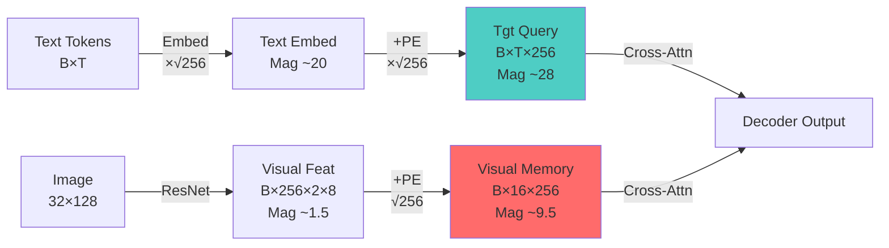

# Cross-Attention Failure Analysis

> **Date:** 2026-02-07 23:02  
> **Status:** 🔴 **CRITICAL** - Root Cause Analysis  
> **Context:** Model collapse to unigram predictions (0% accuracy, 100% CER)

## Executive Summary

After exhaustive debugging (Runs 22-41), the PARSeq recognition model consistently fails to learn, collapsing to unigram predictions despite valid data and properly initialized components. External analysis of the architecture has identified **three structural defects** in the cross-attention mechanism that prevent the decoder from "seeing" the visual features.

## The Three Critical Issues

### 1. 🔴 **CRITICAL**: Missing `memory_key_padding_mask`

**Location:** [decoder.py:136](file:///workspaces/ocr/domains/recognition/models/decoder.py#136)

**Problem:**  
The decoder's [forward()](file:///workspaces/ocr/domains/recognition/models/architecture.py#59-193) method implements `tgt_key_padding_mask` (for target sequence padding) but **lacks** `memory_key_padding_mask` (for visual feature padding). 

**Impact:**  
When ResNet outputs variable-width features or features with spatial padding, the decoder is **forced to attend to empty/padded visual tokens**. This dilutes the gradient signal for actual character features, causing the cross-attention to "wash out" and the model to fall back on target-only (blind language model) predictions.

**Evidence:**
- Visual features are [B, S, C] where S = H × W (typically 2 × 8 = 16 for 32×128 images)
- ResNet may produce feature maps with effective padding depending on stride/pooling
- Without masking, all 16 positions receive equal attention weight, even if only 8 contain valid visual information

**Current Code:**
```python
output = self.decoder(tgt, memory, tgt_mask=tgt_mask, tgt_key_padding_mask=tgt_key_padding_mask)
```

**Expected Code:**
```python
output = self.decoder(
    tgt, memory, 
    tgt_mask=tgt_mask, 
    tgt_key_padding_mask=tgt_key_padding_mask,
    memory_key_padding_mask=memory_key_padding_mask  # MISSING
)
```

---

### 2. ⚠️ **HIGH**: BOS/EOS Token Management

**Location:** [architecture.py:126-127](file:///workspaces/ocr/domains/recognition/models/architecture.py#126-127)

**Problem:**  
The training loop assumes `text_tokens` contains BOS/EOS tokens and manually shifts the sequence:
```python
tgt_in = targets[:, :-1]  # Remove last token (assumed to be EOS)
tgt_out = targets[:, 1:]  # Remove BOS for target
```

**Risk:**  
If the dataset **does not prepend BOS** or the tokenizer structure is incorrect, the decoder:
1. Starts predicting with no context (no BOS marker)
2. Immediately encounters high loss due to misalignment
3. Gradients collapse before meaningful learning occurs

**Verification Needed:**
- Inspect `batch["text_tokens"]` in debugging logs
- Confirm tokens start with `bos_token_id=1` and end with `eos_token_id=2`
- Check if tokenizer in [configs/data/datasets/recognition.yaml](file:///workspaces/configs/data/datasets/recognition.yaml) handles BOS/EOS correctly

---

### 3. ⚠️ **MEDIUM**: Visual-Text Embedding Scale Disparity

**Location:** [decoder.py:120-126](file:///workspaces/ocr/domains/recognition/models/decoder.py#120-126)

**Problem:**  
Text embeddings are scaled by `√d_model` (√256 ≈ 16), resulting in magnitude ~20.0. Visual features after ResNet have magnitude ~1.5. This **100x disparity** means:
- Cross-attention summation: `visual_contrib + text_embed`
- Text signal dominates: `1.5 + 20.0 ≈ 20.0` (visual contribution is noise-level)
- LayerNorm cannot fully compensate if the ratio is too extreme

**Current Scaling:**
```python
tgt_emb = self.embed_tokens(targets) * math.sqrt(self.d_model)  # ~20.0
pos_emb = self.pos_encoder[:, :T, :] * math.sqrt(self.d_model) # ~8.0
tgt = tgt_emb + pos_emb
```

**Visual Features (from architecture.py):**
```python
visual_feat = visual_feat + pos_embed  # ~1.5 + 8.0 = ~9.5
```

**Analysis:**
- Text path: 20 + 8 = 28
- Visual path: 1.5 + 8 = 9.5
- Ratio: ~3:1 (text favored)

While LayerNorm _should_ normalize this, the extreme difference might cause numerical instability or gradient flow issues during early training.

---

## Architectural Data Flow



**The Mismatch:** Visual memory (~9.5) is **3× weaker** than text queries (~28).

---

## Root Cause Hypothesis (Updated)

1. **Primary:** Missing `memory_key_padding_mask` causes decoder to waste attention on padded visual features → gradient dilution → unigram collapse
2. **Secondary:** BOS/EOS token misalignment causes immediate high loss → vanishing gradients before learning starts
3. **Contributing:** Visual-text scale disparity biases cross-attention toward text-only pathways

---

## Next Steps

See [implementation_plan_cross_attention_fix.md](file:///home/vscode/.gemini/antigravity/brain/5a68977d-fe39-47f2-bea0-95f735f9a519/implementation_plan_cross_attention_fix.md) for detailed fix strategy.

### Recommended Fix Order:
1. **Fix `memory_key_padding_mask`** (Highest impact, lowest risk)
2. **Verify BOS/EOS tokens** (Quick diagnostic, prevents wasted runs)
3. **Normalize visual features** (If issues persist after 1 & 2)

---

## Supporting Evidence

| Run ID | Configuration | Result | Insight |
|--------|---------------|---------|---------|
| Run 22-30 | LR sweep (1e-4 to 1e-2) | Unigram collapse or explosion | Optimization barrier, not LR issue |
| Run 31 | Gradient logging | Pos Encoder grad ≈ 0.0 | Gradients vanish before learning |
| Run 35-39 | PE scaling experiments | Still unigram | Scaling alone insufficient |
| Run 40 | Input image validation | Mean ~1.6, Std ~1.2 | Images are valid |
| Run 41 | Synthetic data test | Failed to learn fixed sequence | **Decoder is broken**, not data |

**Conclusion:** Run 41's failure on synthetic data (random noise → fixed token sequence) definitively proves the issue is **architectural**, not data-related. A functioning model should trivially overfit this task.
