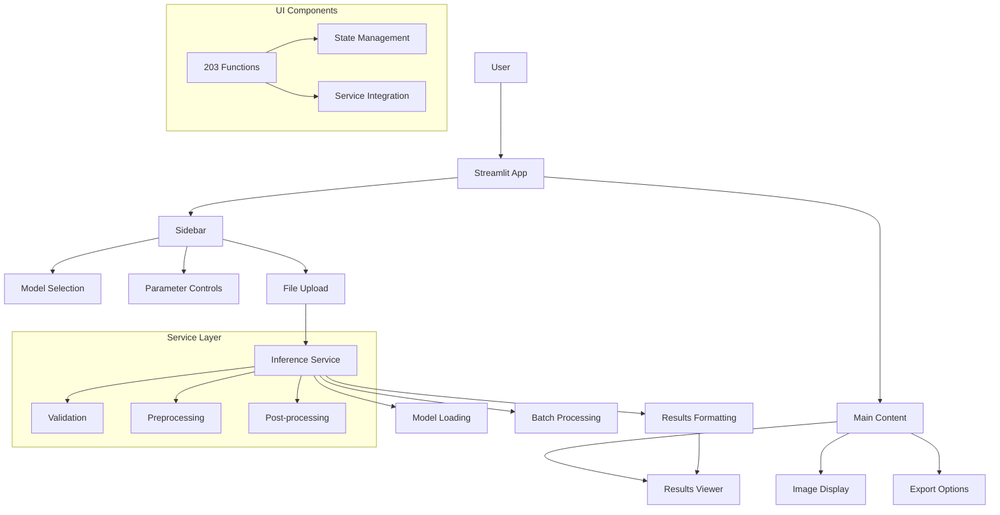

# UI & User Experience Flow Diagrams

<!-- ai_cue:diagram=ui_flow -->
<!-- ai_cue:priority=high -->
<!-- ai_cue:use_when=ui,streamlit,inference,checkpoint-catalog -->

## Streamlit Inference UI Flow

This diagram shows the complete user interaction flow from the Streamlit web interface through model inference to result display.



## Checkpoint Catalog System

This diagram illustrates how the checkpoint catalog discovers, validates, and presents available models to users.


## UI Component Architecture

Detailed view of the Streamlit app's modular component structure.


## Key UI Contracts

### **User Input Contracts**
- **Images**: JPG, PNG, BMP formats, max 10MB per file
- **Batch Size**: Up to 10 images simultaneously
- **Parameters**: Confidence threshold ∈ [0, 1], box threshold ∈ [0, 1]

### **Model Selection Contracts**
- **Checkpoint Format**: PyTorch Lightning .ckpt files
- **Metadata Required**: Training epoch, architecture, backbone, metrics
- **Compatibility**: Must match UI inference schema

### **Output Contracts**
- **Text Polygons**: List of (N, 2) coordinate arrays
- **Confidence Scores**: Float values ∈ [0, 1] per text region
- **Export Formats**: JSON, CSV, image overlays

## Performance Characteristics

### **UI Responsiveness**
- **Page Load**: <2 seconds (catalog building + component initialization)
- **Model Loading**: <5 seconds (checkpoint loading + GPU transfer)
- **Single Inference**: <200ms per image
- **Batch Inference**: <2 seconds for 10 images

### **Memory Usage**
- **Base UI**: ~100MB RAM
- **Model Loaded**: +2-4GB GPU memory
- **Batch Processing**: Temporary spike during inference

### **Scalability Limits**
- **Concurrent Users**: 1-2 (GPU memory bound)
- **Image Resolution**: Max 4096x4096 pixels
- **Text Regions**: Max 1000 per image

## Configuration Examples

### **UI Configuration**
```yaml
# configs/ui/inference.yaml
app:
  title: "🔍 Real-time OCR Inference"
  layout: "wide"
  max_upload_size_mb: 10

upload:
  enabled_file_types: [jpg, jpeg, png, bmp]
  multi_file_selection: true

hyperparameters:
  binarization_thresh:
    default: 0.3
    min: 0.0
    max: 1.0
  box_thresh:
    default: 0.4
    min: 0.0
    max: 1.0
```

### **Model Compatibility Schema**
```yaml
# configs/schemas/ui_inference_compat.yaml
model_families:
  - id: dbnet_resnet18_unet64
    encoder:
      model_names: ["resnet18"]
    decoder:
      class: ocr.models.decoder.UNet
    head:
      class: ocr.models.head.DBHead
```

## Usage Examples

### **UI Component Implementation**
```python
# ui/apps/inference/components/sidebar.py
def render_controls(state, config, catalog):
    with st.sidebar:
        # Model selection
        model_options = [ckpt.to_display_option() for ckpt in catalog]
        selected = st.selectbox("Select Model", model_options)

        # Parameters
        conf_thresh = st.slider("Confidence", 0.0, 1.0, 0.3)
        box_thresh = st.slider("Box Threshold", 0.0, 1.0, 0.4)

        # File upload
        uploaded = st.file_uploader("Upload Images", accept_multiple_files=True)

        return InferenceRequest(model=selected, images=uploaded, params={...})
```

### **Service Layer Implementation**
```python
# ui/apps/inference/services/inference_runner.py
class InferenceService:
    def run(self, state, request, hyperparams):
        # Load model
        model = self._load_model(request.model_path)

        # Process images
        results = []
        for image in request.images:
            processed = self._preprocess(image)
            predictions = model(processed)
            postprocessed = self._postprocess(predictions, hyperparams)
            results.append(postprocessed)

        return results
```

## Related References

- **Code**: `ui/apps/inference/app.py` - Main Streamlit application
- **Code**: `ui/apps/inference/services/` - Service layer implementations
- **Config**: `configs/ui/inference.yaml` - UI configuration
- **Schema**: `configs/schemas/ui_inference_compat.yaml` - Model compatibility
- **Docs**: `docs/ai_handbook/03_references/architecture/05_ui_architecture.md`

---

*Generated: 2025-10-19 | Auto-update when: UI changes, new inference features, catalog updates*</content>
<parameter name="filePath">/home/vscode/workspace/upstageailab-ocr-recsys-competition-ocr-2/docs/ai_handbook/03_references/architecture/diagrams/04_ui_flow.md
