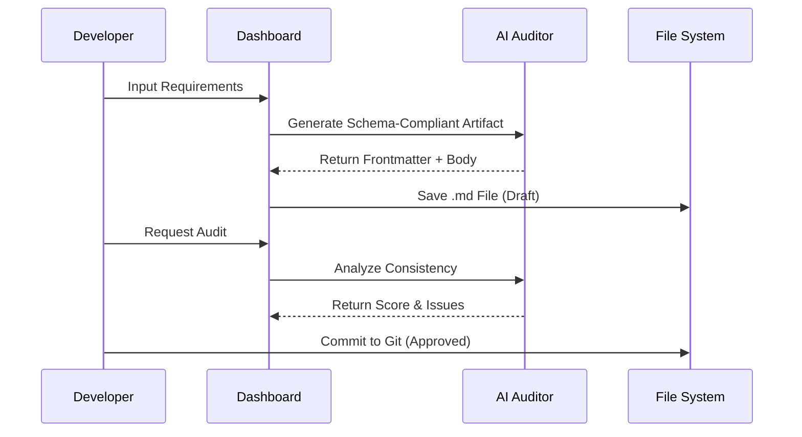

<div align="center">

# AgentQMS Architecture

**Created:** 2025-12-08 14:30 (KST) | **Updated:** 2025-12-08 14:30 (KST)

[**README**](../README.md) • [**Roadmap**](./agentqms-roadmap.md) • [**Architecture**](./agentqms-mermaid.md) • [**Features**](./agentqms-features.md) • [**API**](./agentqms-api.md)

</div>

---

## 1. System Context

```mermaid
graph TD
    User[Developer / Manager] -->|Interacts via| UI[AgentQMS Dashboard]
    UI -->|Generates| Artifacts[Markdown Artifacts]
    UI -->|Configures| Settings[.agentqms/config.json]

    subgraph "AgentQMS Framework"
        Tools[agent_tools/*.py]
        Registry[registry/*.json]
        Templates[templates/*.md]
    end

    subgraph "AI Layer"
        Gemini[Google Gemini]
        OpenAI[OpenAI / OpenRouter]
    end

    UI -->|Audits via| AI Layer
    Tools -->|Validates| Artifacts
    Tools -->|Updates| Registry
```

## 2. Artifact Lifecycle


