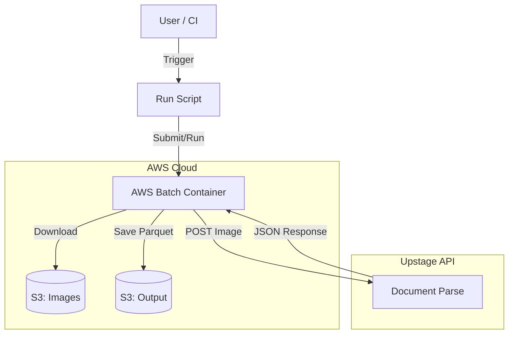

# AWS Batch Processor

Independent service for massive-scale OCR pseudo-label generation using Upstage Document Parse API.

## Purpose
Designed to process large image datasets (Train/Val/Test) asynchronously using AWS Batch and Upstage APIs. It manages API rate limits, resumable checkpointing, and data standardization for downstream KIE training.

## Key Features
- **Scalable Processing**: AWS Batch integration for parallel execution.
- **Resumable**: Checkpointing system prevents data loss during failures.
- **Dual API Support**: 
    - `document-parse` (async) for general documents.
    - `prebuilt-extraction` (sync) for receipts/invoices.
- **Centralized Config**: All settings managed in `configs/base.yaml`.
- **Modular Architecture**: Core logic in `src/batch_processor` package.

## Dataflow Architecture



## Usage
**Main Entry Point**:
```bash
python3 scripts/run_processor.py --dataset baseline_train --workers 3
```

**Exports**:
Finalized datasets are located in `data/export/`.

**Documentation**:
See `docs/artifacts/` for detailed logs, audits, and legacy guides.
