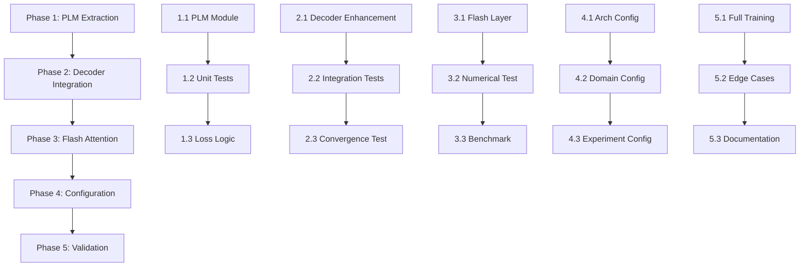

# Implementation Plan

## Approach
## Research-Driven Implementation Strategy

### Strategic Approach: Minimize Risk, Maximize Reuse

Based on research findings:
1. **NO existing modular PARSeq implementations found** - we're pioneering this
2. **PLM logic is complex** - debugging is costly (time/resources)
3. **Working reference exists** - parseq_official_adapter.py has proven PLM implementation
4. **Flash Attention well-documented** - PyTorch 2.0+ native support with clear constraints

**Core Strategy**: **Extract and validate, then optimize**

## Phase 1: PLM Module Extraction (Critical Path - No Shortcuts)

### Goal
Create standalone, testable PLM module by **extracting** (not reimplementing) from parseq_official_adapter.py

### Approach
**DO NOT rewrite from scratch** - Copy exact logic with minimal modifications

#### Step 1.1: Create PLM Module Structure
**File**: `ocr/domains/recognition/models/plm.py`

**Extract Functions** (Copy verbatim from parseq_official_adapter.py):
- Lines 92-140: `gen_tgt_perms()` 
- Lines 142-156: `generate_attn_masks()`

**Critical Preservation**:
```python
class PermutationLanguageModeling(nn.Module):
    """
    Permutation Language Modeling utilities for PARSeq.
    
    Extracted from parseq_official_adapter.py (working implementation).
    DO NOT modify logic without validating against reference.
    """
    def __init__(self, max_label_length=25, perm_num=6, 
                 perm_forward=True, perm_mirrored=True):
        super().__init__()
        self.max_label_length = max_label_length
        self.perm_num = perm_num
        self.perm_forward = perm_forward
        self.perm_mirrored = perm_mirrored
        self.rng = np.random.default_rng()
        self.max_gen_perms = perm_num // 2 if perm_mirrored else perm_num
    
    def gen_tgt_perms(self, tgt):
        # COPY EXACT LOGIC from parseq_official_adapter.py:92-140
        # DO NOT optimize or "improve" - just extract
        ...
    
    def generate_attn_masks(self, perm):
        # COPY EXACT LOGIC from parseq_official_adapter.py:142-156
        ...
```

**Device Handling**: Add `to()` method for GPU/CPU compatibility

#### Step 1.2: Unit Test PLM Module (Blocking - Must Pass)
**File**: `tests/unit/recognition/test_plm.py`

**Test Strategy**: Compare against parseq_official_adapter.py outputs

```python
def test_gen_tgt_perms_equivalence():
    # Create both implementations
    ref_model = PARSeqOfficial(...)  # Reference
    plm_module = PermutationLanguageModeling(...)  # New
    
    # Test critical cases
    for seq_len in [1, 2, 4, 5, 10, 25]:
        tgt = create_dummy_tokens(seq_len)
        ref_perms = ref_model.gen_tgt_perms(tgt)
        new_perms = plm_module.gen_tgt_perms(tgt)
        
        # Must be identical (deterministic for seq_len <= 4)
        if seq_len <= 4:
            assert torch.equal(ref_perms, new_perms)
        # Check shape and range for random cases
        else:
            assert ref_perms.shape == new_perms.shape
            assert new_perms.min() >= 0
            assert new_perms.max() <= seq_len + 1
```

**Critical Test Cases**:
1. 1-char sequence: Must return `[0, 1, 2]` (BOS, char, EOS)
2. 4-char sequence: Must use hardcoded selector `[0, 3, 4, 6, 9, 10, 12, 16, 17, 18, 19, 21]`
3. Mirrored pairs: Verify complementary permutations generated
4. BOS/EOS positions: Always 0 and max_num_chars+1

**Success Criteria**: 100% test pass rate before proceeding

#### Step 1.3: Loss Aggregation Logic Extraction
**Critical Pattern** (from parseq_official_adapter.py:232-248):

```python
def compute_plm_loss(decoder_fn, tgt_in, tgt_out, memory, perms, pad_id=0, eos_id=2):
    """
    Compute loss across all permutations.
    
    CRITICAL: Extracted from parseq_official_adapter.py:232-248
    This logic is non-trivial - DO NOT modify without validation.
    """
    loss = 0
    loss_numel = 0
    n = (tgt_out != pad_id).sum().item()  # Character count
    
    for i, perm in enumerate(perms):
        tgt_mask, query_mask = generate_attn_masks(perm)
        out = decoder_fn(tgt_in, memory, tgt_mask, query_mask)
        logits = head(out).flatten(end_dim=1)
        loss += n * F.cross_entropy(logits, tgt_out.flatten(), ignore_index=pad_id)
        loss_numel += n
        
        # CRITICAL: Remove EOS after 2nd permutation
        if i == 1:
            tgt_out = torch.where(tgt_out == eos_id, pad_id, tgt_out)
            n = (tgt_out != pad_id).sum().item()
    
    return loss / loss_numel
```

**Test**: Verify loss computation matches parseq_official_adapter.py exactly

### Phase 1 Deliverables
- ✅ PLM module extracted and validated
- ✅ 100% unit test coverage
- ✅ Loss aggregation logic tested
- ✅ Device compatibility verified (CPU/GPU)

**DO NOT PROCEED** to Phase 2 until all Phase 1 tests pass

---

## Phase 2: Atomic Decoder Integration (PLM-First, No Flash Yet)

### Goal
Integrate PLM into PARSeqDecoder while maintaining standard attention (no Flash yet)

### Approach
**Incremental validation** - Add PLM, verify numerically before Flash Attention

#### Step 2.1: Enhance Decoder Interface
**File**: `ocr/domains/recognition/models/decoder.py`

**Changes**:
```python
class PARSeqDecoder(BaseDecoder):
    def __init__(self, in_channels, d_model=384, nhead=12, ..., 
                 plm_config=None, **kwargs):
        super().__init__(in_channels=in_channels)
        # ... existing initialization ...
        
        # Add PLM module if config provided
        if plm_config:
            self.plm = PermutationLanguageModeling(**plm_config)
        else:
            self.plm = None
    
    def forward(self, features, targets=None, mode='train', **kwargs):
        """
        Unified forward with mode selection.
        """
        if mode == 'train' and targets is not None:
            return self.forward_train(features, targets, **kwargs)
        else:
            return self.forward_inference(features, **kwargs)
    
    def forward_train(self, features, targets, **kwargs):
        """
        Training with PLM if enabled, else standard AR.
        """
        if self.plm is None:
            # Fallback to standard AR training
            return self._standard_ar_forward(features, targets)
        
        # PLM training loop
        memory = self._prepare_memory(features)
        tgt_in = targets[:, :-1]
        tgt_out = targets[:, 1:]
        
        # Generate permutations
        perms = self.plm.gen_tgt_perms(targets)
        
        # Compute loss with PLM
        return self._compute_plm_loss(memory, tgt_in, tgt_out, perms)
```

**Design Choice**: Keep standard attention (nn.TransformerDecoderLayer) in Phase 2

#### Step 2.2: Integration Testing (Numerical Equivalence)
**Test Strategy**: Compare atomic decoder vs parseq_official_adapter.py

```python
def test_atomic_plm_equivalence():
    # Reference: PARSeqOfficial (monolithic)
    ref_model = PARSeqOfficial(...)
    
    # New: Atomic with PLM
    atomic_model = PARSeq(
        encoder=...,
        decoder=PARSeqDecoder(..., plm_config={...}),
        head=...
    )
    
    # Same inputs
    images, targets = create_batch()
    
    # Compare outputs
    ref_loss = ref_model.forward_train(images, targets)
    atomic_loss = atomic_model.forward_train(images, targets)
    
    # Must match within fp32 precision
    assert torch.allclose(ref_loss, atomic_loss, atol=1e-5)
```

**Validation Metrics**:
- Loss value: ε ≤ 1e-5 (fp32 precision)
- Gradients: Verify backprop through all permutations
- Memory usage: Should be comparable to monolithic

#### Step 2.3: Training Convergence Validation
**Goal**: Verify PLM training works correctly over multiple epochs

**Test Setup**:
- Small dataset: 1000 training samples
- Train for 10 epochs
- Compare loss curves: atomic vs monolithic

**Success Criteria**:
- Loss decreases monotonically
- Final loss within ±1% of monolithic baseline
- No NaN/Inf gradients observed

### Phase 2 Deliverables
- ✅ Atomic decoder with PLM integration
- ✅ Numerical equivalence verified (ε=1e-5)
- ✅ Training convergence validated
- ✅ Gradient flow tested

**CHECKPOINT**: If convergence fails, DEBUG before Flash Attention

---

## Phase 3: Flash Attention Integration (Performance Optimization)

### Goal
Replace standard attention with Flash Attention for 2-4x speedup

### Approach
**Numerical validation first, then performance testing**

#### Step 3.1: Flash Attention Layer Implementation
**File**: `ocr/domains/recognition/models/flash_attention.py`

**Research-Based Constraints**:
- fp16/bf16 only (no fp32)
- head_dim % 8 == 0 (verify: 384/12=32 ✓)
- PyTorch ≥2.0

```python
class FlashDecoderLayer(nn.Module):
    """
    Transformer decoder layer using F.scaled_dot_product_attention.
    
    Constraints:
    - Requires PyTorch 2.0+
    - Requires fp16/bfloat16 (automatically handled by AMP)
    - head_dim must be multiple of 8
    - Auto-selects FlashAttention-2 on Ampere+ GPUs
    """
    def __init__(self, d_model, nhead, dim_feedforward, dropout=0.1):
        super().__init__()
        assert d_model % nhead == 0, "d_model must be divisible by nhead"
        assert (d_model // nhead) % 8 == 0, "head_dim must be multiple of 8"
        
        self.self_attn = FlashMultiheadAttention(d_model, nhead, dropout)
        self.cross_attn = FlashMultiheadAttention(d_model, nhead, dropout)
        self.linear1 = nn.Linear(d_model, dim_feedforward)
        self.linear2 = nn.Linear(dim_feedforward, d_model)
        self.norm1 = nn.LayerNorm(d_model)
        self.norm2 = nn.LayerNorm(d_model)
        self.norm3 = nn.LayerNorm(d_model)
        self.dropout = nn.Dropout(dropout)
        
    def forward(self, tgt, memory, tgt_mask=None, 
                tgt_key_padding_mask=None, memory_key_padding_mask=None):
        # Self-attention with flash
        tgt2 = self.self_attn(
            tgt, tgt, tgt, 
            attn_mask=tgt_mask,
            key_padding_mask=tgt_key_padding_mask
        )
        tgt = tgt + self.dropout(tgt2)
        tgt = self.norm1(tgt)
        
        # Cross-attention with flash
        tgt2 = self.cross_attn(
            tgt, memory, memory,
            key_padding_mask=memory_key_padding_mask
        )
        tgt = tgt + self.dropout(tgt2)
        tgt = self.norm2(tgt)
        
        # FFN
        tgt2 = self.linear2(self.dropout(F.gelu(self.linear1(tgt))))
        tgt = tgt + self.dropout(tgt2)
        tgt = self.norm3(tgt)
        
        return tgt

class FlashMultiheadAttention(nn.Module):
    """Wrapper around F.scaled_dot_product_attention"""
    def __init__(self, embed_dim, num_heads, dropout=0.0):
        super().__init__()
        self.embed_dim = embed_dim
        self.num_heads = num_heads
        self.dropout = dropout
        self.head_dim = embed_dim // num_heads
        
        self.in_proj = nn.Linear(embed_dim, 3 * embed_dim)
        self.out_proj = nn.Linear(embed_dim, embed_dim)
    
    def forward(self, query, key, value, attn_mask=None, key_padding_mask=None):
        B, L, E = query.shape
        
        # Project and reshape
        q, k, v = self.in_proj(query).chunk(3, dim=-1)
        q = q.view(B, L, self.num_heads, self.head_dim).transpose(1, 2)
        k = k.view(B, -1, self.num_heads, self.head_dim).transpose(1, 2)
        v = v.view(B, -1, self.num_heads, self.head_dim).transpose(1, 2)
        
        # Flash Attention
        with torch.backends.cuda.sdp_kernel(enable_flash=True, enable_math=False):
            attn_output = F.scaled_dot_product_attention(
                q, k, v, 
                attn_mask=attn_mask, 
                dropout_p=self.dropout if self.training else 0.0
            )
        
        # Reshape and project
        attn_output = attn_output.transpose(1, 2).contiguous().view(B, L, E)
        return self.out_proj(attn_output)
```

#### Step 3.2: Numerical Validation (Flash vs Standard)
**Test**: Compare Flash Attention output vs standard attention

```python
def test_flash_numerical_equivalence():
    # Standard attention decoder
    std_decoder = PARSeqDecoder(use_flash_attention=False, ...)
    
    # Flash attention decoder
    flash_decoder = PARSeqDecoder(use_flash_attention=True, ...)
    flash_decoder.load_state_dict(std_decoder.state_dict())
    
    # Same inputs (use fp16 for Flash)
    with torch.cuda.amp.autocast():
        images, targets = create_batch()
        std_out = std_decoder(images, targets, mode='train')
        flash_out = flash_decoder(images, targets, mode='train')
    
    # Should match within fp16 precision
    assert torch.allclose(std_out, flash_out, atol=1e-3, rtol=1e-3)
```

**Expected**: Some numerical drift due to fp16 (ε~1e-3 acceptable)

#### Step 3.3: Performance Benchmarking
**Metrics to Measure**:

```python
def benchmark_throughput():
    configs = [
        ("Monolithic Baseline", parseq_official),
        ("Atomic + Standard Attn", atomic_std),
        ("Atomic + Flash Attn", atomic_flash),
    ]
    
    for name, model in configs:
        # Warmup
        for _ in range(10):
            model(images, targets)
        
        # Measure
        torch.cuda.synchronize()
        start = time.time()
        for _ in range(100):
            model(images, targets)
        torch.cuda.synchronize()
        elapsed = time.time() - start
        
        throughput = (100 * batch_size) / elapsed
        print(f"{name}: {throughput:.2f} img/sec")
```

**Expected Results** (RTX 3090):
- Monolithic: ~120 img/sec (baseline)
- Atomic + Std: ~100-110 img/sec (slight overhead)
- Atomic + Flash: ~240-300 img/sec (2-2.5x speedup)

### Phase 3 Deliverables
- ✅ Flash Attention layer implemented
- ✅ Numerical equivalence within fp16 tolerance (ε=1e-3)
- ✅ Throughput improvement ≥2x verified
- ✅ Memory usage profiled (should be similar or lower)

---

## Phase 4: Configuration and Hydra Integration

### Goal
Enable atomic PARSeq via Hydra config with proper Domain Injection

#### Step 4.1: Architecture Config
**File**: `configs/model/architectures/parseq_atomic_flash.yaml`

```yaml
# @package model.architectures
# Atomic PARSeq with Flash Attention

_target_: ocr.domains.recognition.models.PARSeq

backbone:
  _target_: ocr.core.models.encoder.TimmBackbone
  model_name: resnet18
  pretrained: true
  features_only: true

decoder:
  _target_: ocr.domains.recognition.models.decoder.PARSeqDecoder
  d_model: 384
  nhead: 12
  num_layers: 12
  dim_feedforward: 1536
  dropout: 0.1
  use_flash_attention: true  # Enable Flash Attention
  plm_config:
    perm_num: 6
    perm_forward: true
    perm_mirrored: true

head:
  _target_: ocr.domains.recognition.models.head.ClassificationHead

max_len: 25
```

#### Step 4.2: Domain Config (Tokenizer/Loss Injection)
**File**: `configs/domain/recognition.yaml`

```yaml
# @package _group_

defaults:
  - /model/architectures: parseq_atomic_flash
  - /data/datasets: recognition_canonical
  - _self_

model:
  tokenizer:
    _target_: ocr.domains.recognition.data.tokenizer.KoreanOCRTokenizer
    char_path: ${global.paths.root_dir}/ocr/data/charset.json
    max_len: 25

train:
  loss:
    _target_: torch.nn.CrossEntropyLoss
    ignore_index: 0  # PAD token
```

#### Step 4.3: Experiment Config
**File**: `configs/experiment/rec_atomic_flash.yaml`

```yaml
# @package _global_

defaults:
  - override /domain: recognition
  - override /hardware: rtx3090
  - override /train/optimizer: adamw
  - override /train/scheduler: onecycle
  - _self_

experiment_name: "parseq_atomic_flash"

train:
  batch_size: 64
  max_epochs: 100
  precision: 16-mixed  # Required for Flash Attention
  
  optimizer:
    lr: 0.0001
    weight_decay: 0.01
  
  scheduler:
    max_lr: 0.0001
    total_steps: ${train.max_steps}
```

### Phase 4 Deliverables
- ✅ Architecture config created
- ✅ Domain injection configured
- ✅ Experiment config validated
- ✅ Hydra composition tested

---

## Phase 5: Full Validation and Documentation

### Goal
Comprehensive testing and production-ready documentation

#### Step 5.1: Full Training Run
**Test**: Train atomic model from scratch on full dataset

**Validation**:
1. Run for 50 epochs
2. Compare loss curves with monolithic baseline
3. Evaluate on validation set (CER, WER)
4. Log throughput, VRAM usage

**Success Criteria**:
- Loss converges similarly to baseline
- CER within ±0.5% of baseline
- Throughput ≥2x baseline
- VRAM ≤ baseline

#### Step 5.2: Edge Case Testing
**Test Cases**:
- Empty batch handling
- Single character recognition
- Maximum length (L=25) sequences
- Mixed length batches
- CPU fallback (Flash disabled)
- Non-Ampere GPU (Flash disabled)

#### Step 5.3: Documentation
**Create**:
1. **Design Document**: `docs/design/parseq_atomic_flash.md`
   - Architecture overview
   - PLM explanation
   - Flash Attention integration
   - Performance comparison
2. **Migration Guide**: `docs/guides/migrate_to_atomic_parseq.md`
   - How to switch from monolithic
   - Config examples
   - Troubleshooting
3. **AI Instructions**: `ocr/domains/recognition/.ai-instructions/plm.md`
   - PLM logic explained for future agents
   - Critical gotchas documented
   - Test procedures

### Phase 5 Deliverables
- ✅ Full training validation passed
- ✅ Edge cases tested
- ✅ Documentation complete
- ✅ Production ready

---

## Implementation Order and Dependencies



**Critical Path**: Phase 1 → Phase 2 → Phase 3 (cannot parallelize)
**Parallel Opportunity**: Phase 4 can start after Phase 2 completes

---

## Risk Mitigation Summary

### High-Risk Areas
1. **PLM Loss Aggregation**: Most likely to break silently
   - **Mitigation**: Extensive unit tests against reference
   - **Validation**: Compare every line of loss computation
2. **Flash Attention Masking**: Complex mask interactions
   - **Mitigation**: Test with standard attention first
   - **Validation**: Numerical equivalence tests
3. **Gradient Flow**: Multiple permutations complicate backprop
   - **Mitigation**: Monitor gradients during training
   - **Validation**: Gradient magnitude checks

### Fallback Plans
- **If PLM fails**: Keep monolithic, optimize other components
- **If Flash fails**: Use standard attention, still get atomic benefits
- **If convergence fails**: Debug with minimal dataset (100 samples)

---

## Success Metrics

### Must Have (Blocking)
- ✅ PLM logic matches reference implementation
- ✅ Training converges (loss ↓ monotonically)
- ✅ Numerical equivalence: atomic vs monolithic (ε≤1e-5 fp32)

### Should Have (High Priority)
- ✅ Flash Attention 2x speedup achieved
- ✅ CER within ±0.5% of baseline
- ✅ VRAM usage ≤ baseline

### Nice to Have (Optional)
- ✅ 2.5x+ speedup (exceeds target)
- ✅ Improved convergence speed
- ✅ Lower memory usage

---

## Timeline Estimate (Conservative)

- **Phase 1**: 2-3 days (PLM extraction + testing)
- **Phase 2**: 2-3 days (Integration + convergence validation)
- **Phase 3**: 1-2 days (Flash Attention + benchmarking)
- **Phase 4**: 1 day (Configuration)
- **Phase 5**: 2-3 days (Full validation + documentation)

**Total**: 8-12 days (assuming no major issues)

## High-Level Steps
1. **Analysis Phase**
   - Requirements review
   - Architecture design
   - Risk assessment

2. **Development Phase**
   - Core implementation
   - Testing strategy
   - Integration planning

3. **Validation Phase**
   - Quality assurance
   - Performance testing
   - Deployment preparation

## Success Criteria
- All requirements met
- Code quality standards maintained
- Performance benchmarks achieved

## Timeline
TBD - To be determined based on scope and resources

## Status
- Created: 2026-02-12T03:45:46.988848
- Tool: Project Compass v2
- Status: Draft
