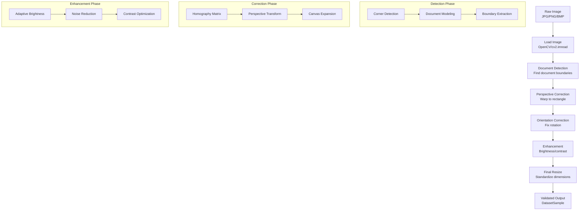
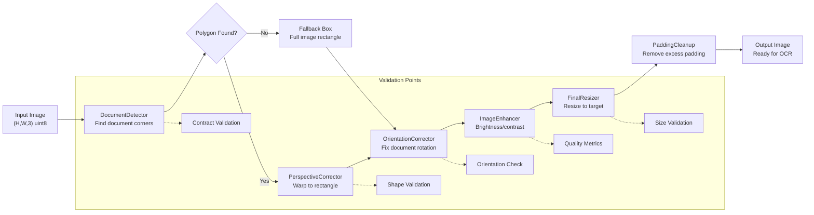
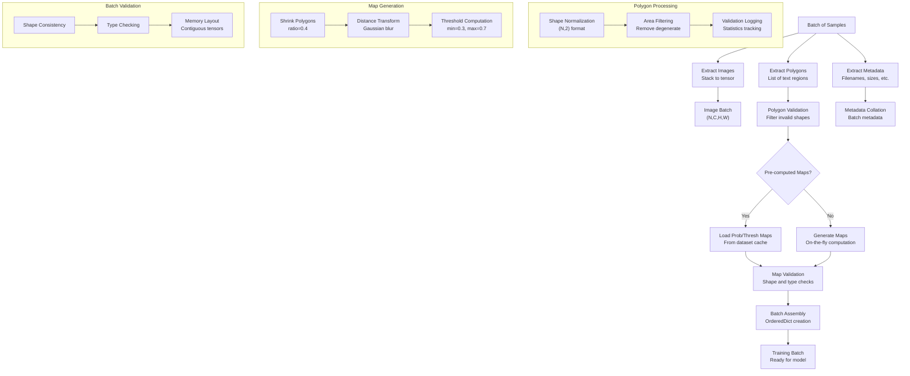
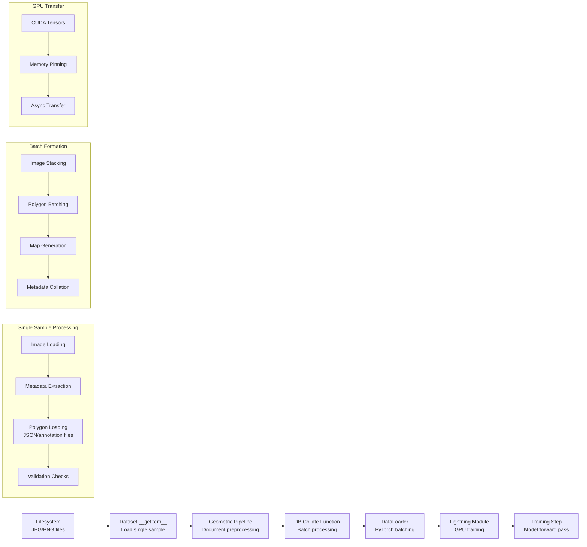

# Data Processing Pipeline Diagrams

<!-- ai_cue:diagram=data_pipeline -->
<!-- ai_cue:priority=high -->
<!-- ai_cue:use_when=preprocessing,data-loading,collate-functions,transforms -->

## Geometric Preprocessing Pipeline

This diagram shows the complete geometric preprocessing pipeline that transforms raw input images into properly oriented, flattened documents ready for OCR processing.



## Transform Operations Chain

Detailed view of individual transform operations and their data flow validation.



## DB Collate Function Flow

This diagram illustrates how the DB (Differentiable Binarization) collate function processes polygon annotations and generates training targets for the detection model.



## Data Loading Pipeline

Complete data flow from disk to GPU training batch, showing the full pipeline integration.



## Key Data Contracts

### **Input Contracts**
- **Images**: `(H, W, 3)` numpy arrays, uint8, RGB
- **Polygons**: List of `(N, 2)` numpy arrays (x, y coordinates)
- **Annotations**: ICDAR format with text content and polygon boundaries

### **Output Contracts**
- **Probability Maps**: `(batch_size, 1, H, W)` float32 tensors ∈ [0, 1]
- **Threshold Maps**: `(batch_size, 1, H, W)` float32 tensors ∈ [0, 1]
- **Text Polygons**: List of validated `(N, 2)` polygons per batch item

### **Validation Rules**
- Polygon area > 0 (no degenerate polygons)
- Polygon coordinates within image bounds
- Consistent shrink ratio application
- Proper tensor shapes and dtypes

## Performance Characteristics

### **Geometric Pipeline**
- **Orientation Detection**: ~50-100ms per image
- **Perspective Correction**: ~20-50ms per image
- **Document Flattening**: ~100-200ms per image (complex cases)

### **DB Collate Function**
- **Polygon Processing**: ~5-10ms per batch
- **Map Generation**: ~10-20ms per batch
- **GPU Transfer**: ~1-5ms per batch

### **Bottlenecks**
- Document flattening for severely curved documents
- Large polygon counts (>100 polygons per image)
- High-resolution images requiring downsampling

## Data Contracts Visualization

This diagram shows the Pydantic data contracts that enforce type safety and shape validation throughout the data pipeline.

```mermaid
graph TD
    A[Raw Data] --> B[Contract Validation]

    subgraph "Input Contracts"
        B1[ImageInputContract] --> B2[validate_image]
        B2 --> B3["Shape: (H,W,3) uint8"]
        B3 --> B4["Channels: 1-4 allowed"]
        B4 --> B5["Non-empty arrays"]
    end

    subgraph "Processing Contracts"
        C1[PreprocessingResultContract] --> C2[validate_result_image]
        C2 --> C3["Output: np.ndarray"]
        C3 --> C4["Metadata: dict"]
    end

    subgraph "Dataset Contracts"
        D1[DatasetSample] --> D2["image: (H,W,3) uint8"]
        D2 --> D3["polygons: List[(N,2)]"]
        D3 --> D4["prob_map: (H,W) float32"]
        D4 --> D5["thresh_map: (H,W) float32"]
        D5 --> D6["metadata: dict"]
    end

    subgraph "Batch Contracts"
        E1[DBCollateBatch] --> E2["images: (N,C,H,W)"]
        E2 --> E3["polygons: List[List[(N,2)]]"]
        E3 --> E4["prob_maps: (N,1,H,W)"]
        E4 --> E5["thresh_maps: (N,1,H,W)"]
    end

    B --> F[Validated Pipeline]
    F --> G[Type-Safe Processing]

    subgraph "Validation Flow"
        V1[Runtime Checks] --> V2[Pydantic Models]
        V2 --> V3[Shape Assertions]
        V3 --> V4[Type Enforcement]
        V4 --> V5[Error Handling]
    end

    G --> H[Model Input<br/>Guaranteed Valid]
```



### **Contract Enforcement Points**
- **Image Loading**: Input validation before preprocessing
- **Transform Chain**: Result validation after each step
- **Dataset Creation**: Sample validation before collation
- **Batch Formation**: Final validation before model input

### **Error Handling**
- **Fallback Mechanisms**: Graceful degradation on validation failures
- **Logging**: Detailed error reporting for debugging
- **Recovery**: Alternative processing paths for edge cases

## Usage Examples

### **Geometric Pipeline Configuration**
```python
# In preprocessing config
geometric_pipeline:
  enable_orientation: true
  enable_perspective: true
  enable_flattening: true
  confidence_threshold: 0.8
  max_correction_angle: 45
```

### **DB Collate Configuration**
```python
# In dataloader config
collate_fn:
  _target_: ocr.datasets.db_collate_fn.DBCollateFN
  shrink_ratio: 0.4
  thresh_min: 0.3
  thresh_max: 0.7
```

## Related References

- **Code**: `ocr/datasets/preprocessing/` - Geometric operations implementation
- **Code**: `ocr/datasets/db_collate_fn.py` - DB collate function
- **Docs**: `docs/pipeline/data_contracts.md` - Data format specifications
- **Config**: `configs/data/` - Data loading configurations

---

*Generated: 2025-10-19 | Auto-update when: Data pipeline changes, new preprocessing steps*
