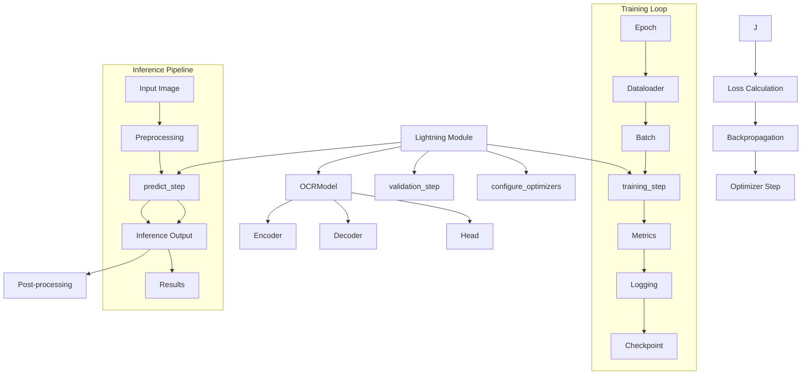

# Training & Inference Flow Diagrams

<!-- ai_cue:diagram=training_inference -->
<!-- ai_cue:priority=high -->
<!-- ai_cue:use_when=training,inference,lightning,pytorch -->

## PyTorch Lightning Training Loop

This diagram shows the complete training iteration flow from data loading through loss computation and parameter updates.

## Inference Pipeline

Complete inference flow from user input to final text detection results.

## Key Lightning Methods

### **training_step(batch, batch_idx)**
- Receives training batch from DataLoader
- Forward pass through OCRModel
- Computes loss using configured loss function
- Returns loss for backpropagation

### **validation_step(batch, batch_idx)**
- Similar to training_step but for validation data
- Computes metrics without gradient computation
- Used for model evaluation during training

### **predict_step(batch)**
- Inference mode forward pass
- Returns raw model outputs for post-processing
- Used for actual OCR predictions

### **configure_optimizers()**
- Returns optimizer and optional learning rate scheduler
- Configured via Hydra settings in `configs/trainer/`

## Training Configuration

### **Key Hyperparameters**
- **Batch Size**: Controlled by DataLoader configuration
- **Learning Rate**: Set in optimizer configuration
- **Gradient Accumulation**: Optional for larger effective batch sizes
- **Mixed Precision**: Automatic if enabled in trainer config

### **Checkpointing**
- **Automatic**: Saves model weights at validation intervals
- **Best Model**: Tracks best validation metric
- **Resume**: Can resume training from checkpoints

## Performance Characteristics

### **Training Throughput**
- **Small batches (< 8)**: ~10-20 samples/second
- **Large batches (≥ 16)**: ~5-10 samples/second
- **GPU Memory**: 4-8GB depending on model size

### **Inference Speed**
- **Single image**: ~50-100ms
- **Batch processing**: ~10-20ms per image
- **GPU Acceleration**: 5-10x faster than CPU

## Related References

- **Code**: `ocr/lightning_modules/ocr_pl.py` - Lightning module implementation
- **Config**: `configs/trainer/` - Training configuration
- **Code**: `runners/train.py` - Training script
- **Docs**: `docs/ai_handbook/02_components/01_lightning_module.md`

---

*Generated: 2025-01-19 | Auto-update when: Lightning module changes, training methods added/removed*
