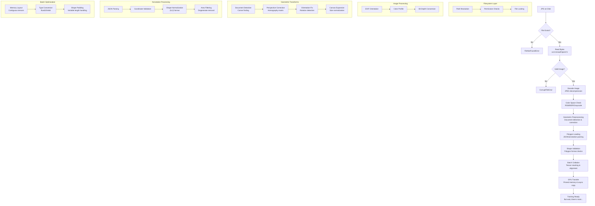

# Data Loading Complexity Deep Dive

<!-- ai_cue:diagram=data_loading_complexity -->
<!-- ai_cue:priority=high -->
<!-- ai_cue:use_when=data-loading,complexity,understanding,pipeline -->

## What You're Missing About Data Loading

Your mentor is absolutely right to emphasize understanding the data loading phase. While it may seem like "just loading JPGs from filesystem," the reality is far more complex and critical to model performance. Here's what happens beyond the filesystem operations:

## The Hidden Complexity of Data Loading

## Why This Matters: Performance & Robustness

### **Data Loading ≠ Simple File I/O**

The data loading phase is where your model's robustness is established or broken:

## Critical Operations You Might Overlook

### **1. Geometric Document Preprocessing**

**Why it matters:**
- Documents in photos are rarely perfectly aligned
- Perspective distortion affects text recognition accuracy
- Orientation detection prevents upside-down training data

### **2. Polygon Annotation Processing**

**Why it matters:**
- Text detection requires precise polygon boundaries
- Invalid polygons cause training instability
- DB algorithm needs specific probability/threshold map generation

### **3. Batch Collation Complexity**

**Why it matters:**
- PyTorch DataLoader requires consistent tensor shapes
- Variable-length sequences (polygons) need special handling
- GPU memory transfer is a major bottleneck

## The "Black Box" Problem

Your concern about black boxes is valid. Here's what becomes opaque without proper understanding:

### **Dangerous Operations in Data Loading**

## What Your Mentor Wants You to Understand

### **Data Loading as Model Foundation**

### **Key Insights to Internalize**

1. **Data loading is 80% of the battle** - Garbage in = garbage out
2. **Geometric transforms are lossy operations** - Each transform introduces artifacts
3. **Polygon processing is numerically sensitive** - Small errors compound
4. **Batch collation affects memory and speed** - Not just convenience
5. **Validation prevents silent failures** - Better to crash early than train wrong

## Practical Understanding Checklist

- [ ] Can you explain why document detection matters for OCR?
- [ ] Do you understand polygon shrinking in DB algorithm?
- [ ] Can you debug a shape mismatch error in batch collation?
- [ ] Do you know why EXIF orientation handling is crucial?
- [ ] Can you identify when geometric transforms fail silently?

## Educational Diagrams for Clarity

The dedicated diagrams I've created should help demystify:

1. **Geometric Preprocessing Pipeline** - Step-by-step document preparation
2. **Transform Operations Chain** - Individual operation flow with validation
3. **DB Collate Function Flow** - Complex polygon processing for training
4. **Data Loading Pipeline** - End-to-end flow with performance considerations
5. **Data Contracts Visualization** - Type safety and validation enforcement

These diagrams transform the "black box" into a transparent, understandable system where you can see exactly what happens to your data and catch dangerous operations before they cause problems.

---

*Understanding data loading complexity prevents countless hours of debugging and ensures robust, reproducible model training.*
