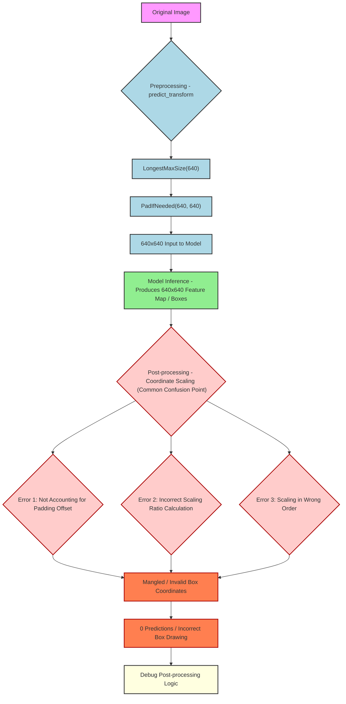

```mermaid
graph TD
    A[Original Image] --> B{Preprocessing - predict_transform};
    B --> B1["LongestMaxSize(640)"];
    B1 --> B2["PadIfNeeded(640, 640)"];
    B2 --> C[640x640 Input to Model];
    C --> D["Model Inference - Produces 640x640 Feature Map / Boxes"];
    D --> E{"Post-processing - Coordinate Scaling <br/> (Common Confusion Point)"};
    E --> F{"Error 1: Not Accounting for Padding Offset"};
    E --> G{"Error 2: Incorrect Scaling Ratio Calculation"};
    E --> H{"Error 3: Scaling in Wrong Order"};
    F --> I[Mangled / Invalid Box Coordinates];
    G --> I;
    H --> I;
    I --> J["0 Predictions / Incorrect Box Drawing"];
    J --> K[Debug Post-processing Logic];

    style A fill:#f9f,stroke:#333,stroke-width:2px;
    style B fill:#add8e6,stroke:#333,stroke-width:2px;
    style B1 fill:#add8e6,stroke:#333,stroke-width:2px;
    style B2 fill:#add8e6,stroke:#333,stroke-width:2px;
    style C fill:#add8e6,stroke:#333,stroke-width:2px;
    style D fill:#90ee90,stroke:#333,stroke-width:2px;
    style E fill:#ffcccb,stroke:#a00,stroke-width:2px;
    style F fill:#ffcccb,stroke:#a00,stroke-width:2px;
    style G fill:#ffcccb,stroke:#a00,stroke-width:2px;
    style H fill:#ffcccb,stroke:#a00,stroke-width:2px;
    style I fill:#ff7f50,stroke:#a00,stroke-width:2px;
    style J fill:#ff7f50,stroke:#a00,stroke-width:2px;
    style K fill:#ffffe0,stroke:#333,stroke-width:2px;

```
