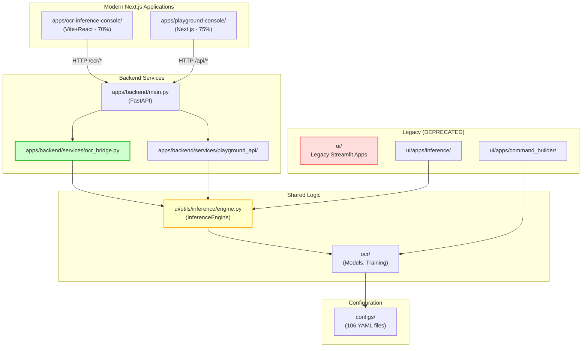

# System Overview

**Last Updated**: 2025-12-12

This document provides a high-level overview of the OCR system's current architecture, focusing on the four distinct applications and their relationships.

---

## Current Architecture: 4 Applications

| # | Application | Type | Location | Status | Purpose |
|---|-------------|------|----------|--------|---------|
| 1 | **Legacy Streamlit Apps** | Streamlit | [`ui/`](file:///workspaces/upstageailab-ocr-recsys-competition-ocr-2/ui/) | ⚠️ DEPRECATED | Inference, Command Builder, Visualization (fully functional, slow) |
| 2 | **Playground Console** | Next.js | [`apps/playground-console/`](file:///workspaces/upstageailab-ocr-recsys-competition-ocr-2/apps/playground-console/) | 🟡 75% Complete | Full playground: command builder, inference, comparison |
| 3 | **OCR Inference Console** | Vite+React | [`apps/ocr-inference-console/`](file:///workspaces/upstageailab-ocr-recsys-competition-ocr-2/apps/ocr-inference-console/) | 🟡 70% Complete | Inference-focused, lightweight UI |
| 4 | **Backend (FastAPI)** | Python API | [`apps/backend/`](file:///workspaces/upstageailab-ocr-recsys-competition-ocr-2/apps/backend/) | ✅ Active | Serves both Next.js consoles |

---

## Dependency Graph



---

## Application Details

### 1. Legacy Streamlit Apps (DEPRECATED)

**Location**: `ui/`
**Status**: ⚠️ Maintenance only, slated for deprecation
**Tech Stack**: Python + Streamlit

**Components**:
- Command Builder (`ui/apps/command_builder/`)
- Inference UI (`ui/apps/inference/`)
- Evaluation Viewer (`ui/evaluation/`)

**Usage**: Still functional but slow. Use for reference only. New development should use Next.js consoles.

**Deprecation Timeline**: Will be fully deprecated after Playground Console reaches 100%.

---

### 2. Playground Console (Modern)

**Location**: `apps/playground-console/`
**Status**: 🟡 75% complete, requires polish
**Tech Stack**: Next.js + React + TypeScript + Chakra UI

**Features**:
- ✅ Command Builder
- ✅ Inference
- ✅ Preprocessing options
- 🟡 Comparison Studio
- ⚪ Session management

**Backend**: Uses `apps/backend/services/playground_api/`

**How to Run**:
```bash
cd apps/playground-console
npm install
npm run dev
# Open http://localhost:3000
```

---

### 3. OCR Inference Console (Modern)

**Location**: `apps/ocr-inference-console/`
**Status**: 🟡 70% complete, core features working
**Tech Stack**: Vite + React + TypeScript + TailwindCSS

**Features**:
- ✅ Image upload and inference
- ✅ Polygon overlay rendering
- ✅ Demo mode
- ✅ Checkpoint selection
- 🟡 Batch processing

**Backend**: Uses `apps/backend/services/ocr_bridge.py`

**How to Run**:
```bash
cd apps/ocr-inference-console
npm install
npm run dev
# Open http://localhost:5173
```

---

### 4. Backend (FastAPI)

**Location**: `apps/backend/`
**Status**: ✅ Active development
**Tech Stack**: Python + FastAPI + PyTorch

**Endpoints**:
- `/ocr/*` - OCR Inference Console endpoints
- `/api/*` - Playground Console endpoints
- `/docs` - Swagger documentation

**Key Components**:
- `services/ocr_bridge.py` - Wraps `InferenceEngine` for inference
- `services/playground_api/` - Full playground API

**How to Run**:
```bash
export OCR_CHECKPOINT_PATH="outputs/experiments/train/ocr/.../epoch-14.ckpt"
python -m uvicorn apps.backend.main:app --port 8000
```

---

## Development Guidelines

### Which App to Use?

| Use Case | Application | Why |
|----------|-------------|-----|
| Quick inference testing | OCR Inference Console | Lightweight, fast |
| Command building | Playground Console | Full command builder UI |
| Comparing models | Playground Console | Comparison studio |
| Training experiments | Legacy Streamlit (temporary) | Full inference UI |
| Production inference | Backend API directly | No UI overhead |

### Which App to Modify?

| Status | Apps | Development Policy |
|--------|------|-------------------|
| ✅ **Active Development** | `apps/playground-console/`, `apps/ocr-inference-console/`, `apps/backend/` | Full development, new features welcome |
| ⚠️ **Maintenance Only** | `ui/` (Legacy Streamlit) | Bug fixes only, no new features |
| ⛔ **DO NOT USE** | `docs/__archive__/` | Archived, unmaintained |

---

## Shared Logic Architecture

### InferenceEngine (Core)

**Location**: `ui/utils/inference/engine.py`
**Used By**: OCR Bridge, Playground API, Legacy Streamlit

**Features**:
- Model loading and caching
- Image preprocessing (LongestMaxSize + PadIfNeeded)
- Coordinate transformation
- Polygon extraction
- Lazy loading for fast startup

**Why Shared?**: Eliminates code duplication, ensures consistent behavior across all applications.

---

## Configuration Files

**Location**: `configs/`
**Count**: 106 YAML files

**Structure**:
- `configs/_base/` - Base templates
- `configs/model/` - Model architectures
- `configs/data/` - Dataset configurations
- `configs/trainer/` - Training configurations
- `configs/ui/` - UI-specific configs

**Consumed By**: All applications (training, legacy Streamlit, Next.js consoles)

---

## Migration Status

### Legacy Streamlit → Next.js Consoles

| Feature | Legacy Streamlit | Playground Console | OCR Inference Console |
|---------|------------------|-------------------|----------------------|
| Inference | ✅ | ✅ | ✅ |
| Command Builder | ✅ | ✅ | ❌ Not needed |
| Comparison | ✅ | 🟡 In progress | ❌ Not planned |
| Preprocessing | ✅ | ✅ | 🟡 Planned |
| Batch Processing | ✅ | ⚪ Planned | 🟡 In progress |

---

## Roadmap

See [docs/roadmap.md](file:///workspaces/upstageailab-ocr-recsys-competition-ocr-2/docs/roadmap.md) for detailed project roadmap.

**Current Focus**:
- Complete Playground Console (target: 100%)
- Complete OCR Inference Console (target: 100%)
- Deprecate Legacy Streamlit apps

**Timeline**: 2-4 weeks to complete both Next.js consoles.

---

## References

- [Architecture Audit](file:///home/vscode/.gemini/antigravity/brain/e233fabb-0950-4377-903d-e30dbc71cd13/ARCHITECTURE_AND_DOCS_AUDIT.md)
- [Roadmap](file:///workspaces/upstageailab-ocr-recsys-competition-ocr-2/docs/roadmap.md)
- [OCR Bridge Refactoring](file:///home/vscode/.gemini/antigravity/brain/e233fabb-0950-4377-903d-e30dbc71cd13/walkthrough.md)
- [Config Architecture](file:///workspaces/upstageailab-ocr-recsys-competition-ocr-2/docs/architecture/CONFIG_ARCHITECTURE.md)
