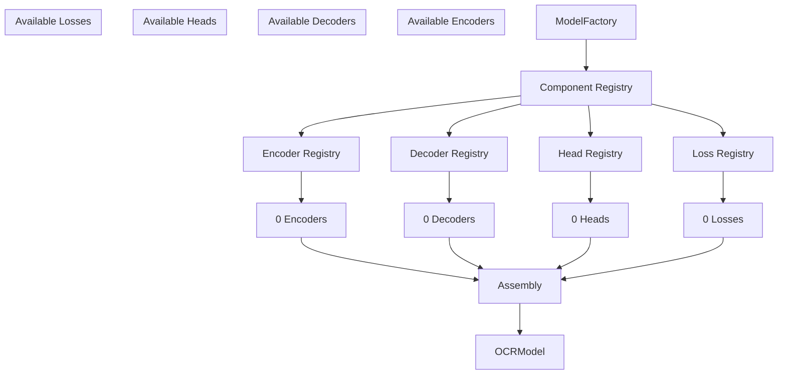

# Component Registry Flow Diagram

<!-- ai_cue:diagram=component_registry -->
<!-- ai_cue:priority=high -->
<!-- ai_cue:use_when=architecture,registry,component-assembly -->

## Component Registry Architecture

This diagram illustrates how the OCR system's modular architecture uses a component registry to enable plug-and-play experimentation with different encoders, decoders, heads, and loss functions.



## Key Flow Explanation

### **1. Configuration Input**
- Hydra configuration specifies `architecture: "dbnet"`
- Registry resolves this to component mapping: `{"encoder": "timm_backbone", "decoder": "unet", "head": "db_head", "loss": "db_loss"}`

### **2. Component Resolution**
- Registry lookups retrieve concrete classes (e.g., `TimmBackbone`, `UNetDecoder`, `DBHead`, `DBLoss`)
- Each component implements standardized interfaces (`BaseEncoder`, `BaseDecoder`, etc.)

### **3. Dynamic Assembly**
- Components instantiated with configuration parameters
- Channel dimensions automatically propagated (encoder → decoder → head)
- Runtime validation ensures compatibility

### **4. Architecture Flexibility**
- New architectures added by registering component combinations
- Existing components reused across different architectures
- Configuration-driven experimentation without code changes

## Usage Examples

### **Adding New Architecture**
```python
# In ocr/models/architectures/new_arch.py
from ocr.models.core.registry import registry

def register_new_architecture():
    registry.register_encoder("new_encoder", NewEncoder)
    registry.register_decoder("new_decoder", NewDecoder)
    registry.register_architecture(
        name="new_arch",
        encoder="new_encoder",
        decoder="new_decoder",
        head="db_head",  # Reuse existing
        loss="db_loss"   # Reuse existing
    )
```

### **Configuration Usage**
```yaml
# config/model/dbnet.yaml
architecture: "dbnet"
encoder:
  name: "timm_backbone"
  model_name: "resnet50"
  pretrained: true
decoder:
  name: "unet"
  in_channels: [256, 512, 1024, 2048]
  out_channels: 256
head:
  name: "db_head"
  in_channels: 256
loss:
  name: "db_loss"
```

## Related References

- **Code**: `ocr/models/core/registry.py` - Registry implementation
- **Code**: `ocr/models/architecture.py` - OCRModel assembly
- **Config**: `configs/model/` - Architecture configurations
- **Docs**: `docs/ai_handbook/03_references/architecture/02_hydra_and_registry.md`

---

*Generated: 2025-10-19 | Auto-update when: Architecture changes, new components added*</content>
<parameter name="filePath">/home/vscode/workspace/upstageailab-ocr-recsys-competition-ocr-2/docs/ai_handbook/03_references/architecture/diagrams/01_component_registry.md
