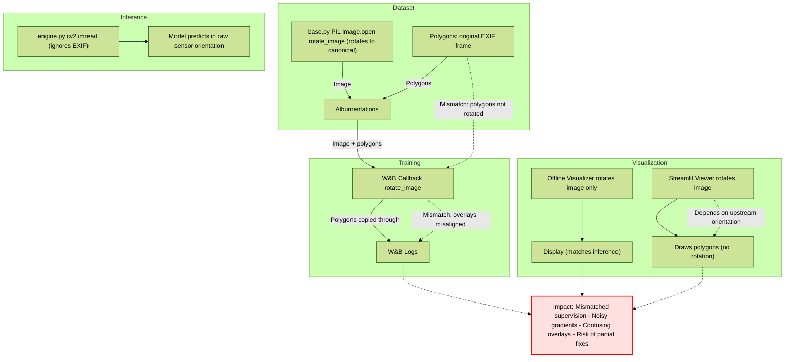

```mermaid
---
config:
  theme: "forest"
---
flowchart TD
    subgraph Dataset
      A["base.py PIL Image.open rotate_image (rotates to canonical)"]
      B["Polygons: original EXIF frame"]
      A -->|Image| C[Albumentations]
      B -->|Polygons| C
    end

    subgraph Training
      C -->|Image + polygons| D["W&B Callback rotate_image"]
      D -->|Polygons copied through| E["W&B Logs"]
    end

    subgraph Visualization
      F["Offline Visualizer rotates image only"] --> G["Display (matches inference)"]
      H["Streamlit Viewer rotates image"] --> I["Draws polygons (no rotation)"]
    end

    subgraph Inference
      J["engine.py cv2.imread (ignores EXIF)"]
      J --> K["Model predicts in raw sensor orientation"]
    end

    %% Highlight mismatches
    B -.->|Mismatch: polygons not rotated| D
    D -.->|Mismatch: overlays misaligned| E
    H -.->|Depends on upstream orientation| I

    %% Impact
    L[Impact: Mismatched supervision - Noisy gradients - Confusing overlays - Risk of partial fixes]:::impact
    E -.-> L
    G -.-> L
    I -.-> L

    classDef impact fill:#ffe0e0,stroke:#ff0000,stroke-width:2px;
```
