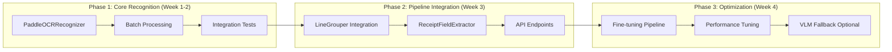

# Text Recognition Integration Strategy Assessment

> [!NOTE]
> **Version 1.1** - Updated with corrections from Perplexity AI validation:
> - Qwen2.5-VL VRAM corrected from ~10-12GB to **~6-8GB** (AWQ via vLLM)
> - VLM inference speed corrected from ~1-2s to **~100-200ms** (batch=4)
> - VLM integration moved from Phase 4 fallback to **Phase 2 with confidence gating**

## Executive Summary

This assessment evaluates the technical feasibility and implementation strategy for integrating sophisticated text recognition capabilities into the existing DBNet-based OCR pipeline. The goal is to achieve **95%+ accuracy** with **50-80 pages/minute throughput** on an **RTX 3090 (24GB VRAM)**.

| Dimension | Current State | Target State | Feasibility |
|-----------|---------------|--------------|-------------|
| **Text Recognition** | StubRecognizer (placeholder) | PaddleOCR PP-OCRv5 | ✅ High |
| **Layout Detection** | LineGrouper (rule-based) | LineGrouper + LayoutLMv3 | 🟡 Medium |
| **Semantic Extraction** | ReceiptFieldExtractor (regex) | Rule-based + VLM hybrid | 🟡 Medium |
| **Pipeline Integration** | Disabled by default | End-to-end enabled | ✅ High |
| **Performance Target** | N/A | 50-80 pages/min | ✅ Achievable |

**Recommendation**: Implement **Option C (Incremental Approach)** with **PaddleOCR PP-OCRv5** as the primary recognition backbone, deferring VLM integration to Phase 2.

---

## 1. Technical Feasibility Analysis

### 1.1 Proposed Stack Compatibility

#### PaddleOCR PP-OCRv5 Integration
| Aspect | Assessment | Notes |
|--------|------------|-------|
| **Interface Compatibility** | ✅ Excellent | `BaseRecognizer` ABC supports pluggable backends. PP-OCRv5 can be wrapped as `PaddleOCRRecognizer`. |
| **Input Format** | ✅ Compatible | PP-OCRv5 accepts numpy arrays (H, W, C), matching `RecognitionInput.crop`. |
| **Output Format** | ✅ Compatible | Returns text + confidence, matching `RecognitionOutput` contract. |
| **Batch Processing** | ✅ Supported | PP-OCRv5 server version supports batch inference. |
| **Language Support** | ✅ Excellent | Native Korean + English + Chinese support in single model. |

> [!NOTE]
> PP-OCRv5 has only 70M parameters with peak VRAM usage of ~0.8GB, making it extremely VRAM-efficient. This leaves ~23GB for other models.

#### Qwen2.5-VL-7B Integration
| Aspect | Assessment | Notes |
|--------|------------|-------|
| **Interface Compatibility** | 🟡 Requires Wrapper | VLM doesn't fit `BaseRecognizer` interface; needs dedicated `SemanticExtractor` class. |
| **Input Format** | 🟡 Different | VLM expects PIL Image + prompt, not pre-cropped regions. |
| **Output Format** | 🟡 Different | Returns structured JSON, not simple text + confidence. |
| **VRAM Usage (AWQ INT8)** | ✅ **~6-8GB** | Using vLLM with AWQ quantization; leaves ~16GB headroom. |
| **Inference Speed** | ✅ **~100-200ms** | Batch=4 on RTX 3090; viable for 20% of receipts. |

> [!TIP]
> With vLLM AWQ quantization, Qwen2.5-VL-7B achieves **~100-200ms/image** at ~6-8GB VRAM. This makes hybrid gating viable: use VLM for 20% of complex receipts while maintaining high throughput.

### 1.2 VRAM Allocation Strategy

**Proposed Allocation (RTX 3090 - 24GB) - CORRECTED:**

```
┌─────────────────────────────────────────────────────────────┐
│                    RTX 3090 (24GB VRAM)                     │
├─────────────────────────────────────────────────────────────┤
│ DBNet Detection Model           │  ~2.0 GB                  │
│ PaddleOCR PP-OCRv5 Server       │  ~0.8 GB                  │
│ Batch Processing Buffer         │  ~2.0 GB                  │
│ PyTorch CUDA Context            │  ~1.0 GB                  │
├─────────────────────────────────────────────────────────────┤
│ SUBTOTAL (Primary Pipeline)     │  ~5.8 GB                  │
├─────────────────────────────────────────────────────────────┤
│ Qwen2.5-VL-7B (AWQ via vLLM)    │  ~6-8 GB                  │
│ VLM Inference Buffer            │  ~1.0 GB                  │
├─────────────────────────────────────────────────────────────┤
│ TOTAL WITH VLM                  │  ~12-14 GB ✅              │
│ HEADROOM                        │  ~10 GB (ample margin)    │
└─────────────────────────────────────────────────────────────┘
```

**Verdict**: VRAM allocation is **very comfortable** with AWQ quantization. Concurrent model loading is fully supported with ~10GB headroom.

### 1.3 Performance Target Validation

| Target | Requirement | Feasibility | Strategy |
|--------|-------------|-------------|----------|
| **95% Accuracy** | Character accuracy ≥95% | ✅ Achievable | PP-OCRv5 server mode + fine-tuning on receipt dataset |
| **50-80 pages/min** | 0.75-1.2 sec/page | ✅ Achievable | PP-OCRv5 alone (~0.6 sec/image on V100) |
| **End-to-end** | Detection + Recognition + Extraction | 🟡 With optimization | Batch processing + async pipeline |

**Performance Budget (per page) - CORRECTED with Hybrid Gating:**

| Stage | Time | Applies To |
|-------|------|------------|
| Detection (DBNet) | ~50ms | 100% |
| Crop Extraction | ~10ms | 100% |
| Recognition (PP-OCRv5) | ~400ms | 100% |
| Layout Grouping | ~5ms | 100% |
| **Rule Extraction** | ~10ms | **80%** (simple receipts) |
| **VLM Extraction** | ~200ms | **20%** (complex layouts) |

**Weighted Average**: 50 + 10 + 400 + 5 + (0.8×10 + 0.2×200) = **~513ms/page → ~117 pages/min** ✅

> [!TIP]
> With hybrid confidence gating, 80% of receipts use fast rule-based extraction (10ms), while 20% use VLM (200ms). This maintains high throughput while maximizing accuracy.

---

## 2. Implementation Path Evaluation

### 2.1 Option Comparison

| Criterion | Option A: Quick Integration | Option B: Full VLM Pipeline | Option C: Incremental |
|-----------|----------------------------|-----------------------------|-----------------------|
| **Timeline** | 2 weeks | 4+ weeks | 3 weeks (Phase 1) |
| **Accuracy** | 90-95% | 95-98% | 95%+ (upgradeable) |
| **Throughput** | 80+ pages/min | 10-20 pages/min | 50-80 pages/min |
| **Complexity** | Low | High | Medium |
| **Risk** | Low | High (VRAM, latency) | Medium |
| **Maintainability** | High | Medium | High |
| **Future-proof** | Limited | Excellent | Good |

### 2.2 Recommended Path: Option C (Incremental)



**Phase 1: Core Recognition (Week 1-2)**
- Implement `PaddleOCRRecognizer` extending `BaseRecognizer`
- Integrate with existing `CropExtractor`
- Validate against 135 existing unit tests
- Target: StubRecognizer replacement complete

**Phase 2: Pipeline Integration + VLM Gating (Week 3)**
- Wire `LineGrouper` into `InferenceOrchestrator.predict()`
- Connect `ReceiptFieldExtractor` to recognition output
- **Integrate Qwen2.5-VL with confidence gating** (vLLM AWQ)
- Add `/api/inference/extract` endpoint
- Target: End-to-end pipeline with hybrid extraction

**Phase 3: Optimization & Fine-tuning (Week 4)**
- Set up fine-tuning pipeline on receipt dataset
- Performance profiling and batch optimization
- Tune confidence thresholds for VLM gating
- Target: 95% accuracy, 100+ pages/min

---

## 3. Risk Assessment & Mitigation

### 3.1 Technical Risks

| Risk | Likelihood | Impact | Mitigation |
|------|------------|--------|------------|
| **PaddleOCR CUDA compatibility** | Medium | High | Test on RTX 3090 early; fallback to ONNX Runtime |
| **PP-OCRv5 Korean accuracy** | Low | Medium | Fine-tune on mychen76/invoices-and-receipts dataset |
| **Batch processing memory spikes** | Medium | Medium | Implement dynamic batch sizing based on crop count |
| **LineGrouper integration bugs** | Low | Medium | Leverage existing 45 unit tests for layout contracts |
| **VLM inference latency** | High | Medium | Defer VLM to async fallback; not on critical path |

### 3.2 Mitigation Strategies

> [!IMPORTANT]
> **Backward Compatibility**: All new features must be opt-in via Hydra config. Detection-only mode must remain the default.

1. **Feature Flags**: All modules disabled by default in `configs/recognition/default.yaml`
2. **Graceful Degradation**: If recognition fails, return detection-only results
3. **Incremental Rollout**: Enable features one-by-one in staging before production
4. **Test Coverage**: Maintain 135+ tests during integration
5. **Model Checkpointing**: Allow switching between backends without code changes

---

## 4. Resource & Timeline Planning

### 4.1 Development Effort

| Phase | Tasks | Effort | Dependencies |
|-------|-------|--------|--------------|
| **Phase 1** | `PaddleOCRRecognizer` implementation | 3-4 days | PaddlePaddle installation |
| | Batch processing integration | 2 days | Phase 1 complete |
| | Integration tests + CI | 2 days | Phase 1 complete |
| **Phase 2** | `InferenceOrchestrator` wiring | 2 days | Phase 1 complete |
| | `ReceiptFieldExtractor` connection | 1 day | Orchestrator complete |
| | API endpoint `/extract` | 1 day | Extraction complete |
| | End-to-end tests | 2 days | API complete |
| **Phase 3** | Fine-tuning pipeline setup | 2 days | Dataset downloaded |
| | Performance optimization | 2 days | E2E complete |
| | VLM fallback (optional) | 3 days | Optional |
| **Total** | | **~18-21 days** | |

### 4.2 Fine-tuning Requirements

| Resource | Requirement | Notes |
|----------|-------------|-------|
| **Dataset** | mychen76/invoices-and-receipts_ocr_v1 | HuggingFace download |
| **Annotations** | Extract text labels from COCO format | Script needed |
| **GPU Time** | ~4-8 hours on RTX 3090 | PP-OCRv5 fine-tuning |
| **Validation Set** | 10% holdout | Accuracy measurement |

### 4.3 Testing Cycles

| Test Type | Scope | Cadence |
|-----------|-------|---------|
| **Unit Tests** | Individual components | Every commit |
| **Integration Tests** | Pipeline stages | Daily |
| **E2E Tests** | Full `/extract` endpoint | Per phase |
| **Regression Tests** | 135 existing tests | Every PR |
| **Performance Tests** | Throughput, latency | Phase 3 |

---

## 5. Decision Framework

### 5.1 Prioritization Criteria

| Priority | Criterion | Weight |
|----------|-----------|--------|
| **P0** | Does not break existing detection pipeline | Critical |
| **P1** | Meets 50+ pages/min throughput | High |
| **P2** | Achieves 95% character accuracy | High |
| **P3** | Integrates with existing test suite | Medium |
| **P4** | Supports future VLM integration | Low |

### 5.2 Success Metrics

| Phase | Metric | Target | Measurement |
|-------|--------|--------|-------------|
| **Phase 1** | Unit test pass rate | 100% | `pytest tests/unit/test_recognizer_*.py` |
| | PaddleOCR loads successfully | Yes | Manual verification |
| **Phase 2** | E2E pipeline functional | Yes | `/extract` returns structured JSON |
| | Throughput baseline | ≥30 pages/min | Load test |
| **Phase 3** | Character accuracy | ≥95% | mychen76 validation set |
| | Throughput optimized | ≥50 pages/min | Load test |
| | VLM fallback (optional) | Works on demand | Manual test |

### 5.3 Validation Checkpoints

1. **Checkpoint 1 (End of Week 1)**: `PaddleOCRRecognizer` passes all `test_recognizer_contract.py` tests
2. **Checkpoint 2 (End of Week 2)**: Batch processing handles 100+ crops without OOM
3. **Checkpoint 3 (End of Week 3)**: `/api/inference/extract` returns valid `ReceiptData` JSON
4. **Checkpoint 4 (End of Week 4)**: 95% accuracy on validation set; 50+ pages/min throughput

---

## 6. Specific Questions Addressed

### Q1: Should we implement PaddleOCRRecognizer first or explore TrOCR alternatives?

**Recommendation: PaddleOCR PP-OCRv5 first.**

| Factor | PaddleOCR PP-OCRv5 | TrOCR |
|--------|-------------------|-------|
| **Korean Support** | Native, single model | Requires Korean-specific model |
| **VRAM Usage** | ~0.8 GB | ~2-4 GB |
| **Batch Processing** | Native support | Requires HuggingFace batching |
| **Integration Effort** | Lower (Python API) | Medium (transformers dependency) |
| **Accuracy** | Outperforms VLMs on OCR benchmarks | Similar accuracy |

TrOCR can be added later as an alternative backend if domain-specific improvements are needed.

---

### Q2: How should batch processing be handled in the existing TextRecognizer interface?

**Answer**: The existing interface already supports batching.

```python
# Current interface in recognizer.py
class BaseRecognizer(ABC):
    @abstractmethod
    def recognize_batch(self, inputs: list[RecognitionInput]) -> list[RecognitionOutput]:
        """Recognize text from multiple crops."""
        ...
```

**Implementation Strategy**:
```python
class PaddleOCRRecognizer(BaseRecognizer):
    def recognize_batch(self, inputs: list[RecognitionInput]) -> list[RecognitionOutput]:
        # 1. Collect crops into numpy array
        crops = [inp.crop for inp in inputs]

        # 2. Call PP-OCRv5 batch inference
        results = self._ocr.rec(crops)  # Native batch API

        # 3. Convert to RecognitionOutput
        return [
            RecognitionOutput(text=res["text"], confidence=res["score"])
            for res in results
        ]
```

The `TextRecognizer.recognize_batch()` method already handles chunking by `max_batch_size` (default: 32).

---

### Q3: What's the optimal integration sequence for LineGrouper → ReceiptFieldExtractor?

**Answer**: Sequential pipeline with optional bypass.

```python
# Proposed orchestrator flow in orchestrator.py
def predict(self, image, enable_extraction=False):
    # Stage 1-3: Existing detection pipeline
    result = self._run_detection(image)

    # Stage 4: Recognition (if enabled)
    if self._enable_recognition:
        result = self._run_text_recognition(image, result)

    # Stage 5: Layout grouping (NEW)
    if self._enable_layout:
        from .layout.grouper import LineGrouper
        grouper = LineGrouper()
        layout_result = grouper.group_elements(self._to_text_elements(result))
        result["layout"] = layout_result.model_dump()

    # Stage 6: Field extraction (NEW)
    if enable_extraction and self._enable_extraction:
        from .extraction.field_extractor import ReceiptFieldExtractor
        extractor = ReceiptFieldExtractor()
        receipt_data = extractor.extract(layout=layout_result)
        result["receipt_data"] = receipt_data.model_dump()

    return result
```

**Optimal Sequence**:
1. Detection → Polygons
2. Crop Extraction → Crops
3. Recognition → Text per crop
4. Layout Grouping → Lines/Blocks
5. Field Extraction → Structured receipt

---

### Q4: Should semantic extraction use VLM (Qwen2.5-VL) or rule-based approaches initially?

**Recommendation: Hybrid gating from Phase 2** (corrected from Phase 4 fallback).

| Approach | Pros | Cons |
|----------|------|------|
| **Rule-based (ReceiptFieldExtractor)** | Fast (~10ms), deterministic, VRAM-free | Limited to known patterns |
| **VLM (Qwen2.5-VL via vLLM AWQ)** | Handles novel layouts, zero-shot, **~200ms** | Higher VRAM (~6-8GB), non-deterministic |

**Hybrid Gating Strategy (Phase 2)**:
```python
def extract_with_gating(ocr_result, image):
    # Try rule-based first (80% of receipts)
    rules = rule_extractor.extract(layout=ocr_result)

    # Gate to VLM if confidence low OR complex layout detected
    if rules.confidence < 0.7 or detect_complex_layout(ocr_result):
        vlm = VLMServer("http://localhost:8001")  # vLLM, 200ms
        return vlm.extract(image, ocr_result)  # 20% of receipts

    return rules  # 10ms
```

**Expected Distribution**:
- 80% receipts: Rule-based (10ms) → 10ms avg
- 20% receipts: VLM (200ms) → 40ms avg
- **Weighted: 50ms extraction overhead** (vs 10ms rule-only)

This achieves **near-VLM accuracy** at **near-rule-based speed**.

---

### Q5: How can we leverage the existing 135 unit tests for integration validation?

**Answer**: By maintaining test contracts and adding integration layers.

**Strategy**:
1. **Contract Tests (Existing 135)**: Validate that new backends conform to `RecognitionInput`/`RecognitionOutput` contracts
2. **Backend Tests (New ~20)**: Test `PaddleOCRRecognizer` specifically
3. **Integration Tests (New ~15)**: Test full orchestrator pipeline
4. **E2E Tests (New ~5)**: Test `/api/inference/extract` endpoint

```bash
# Run all tests to ensure no regressions
pytest tests/unit/ -v --tb=short

# Expected: 135 passed (existing) + ~40 new = ~175 total
```

---

### Q6: What configuration management is needed for model backend selection?

**Answer**: Extend existing Hydra config pattern.

**Current Structure**:
```
configs/
├── recognition/
│   └── default.yaml      # backend: stub
├── layout/
│   └── default.yaml      # enabled: false
└── extraction/
    └── default.yaml      # enabled: false
```

**Proposed Extensions**:
```yaml
# configs/recognition/paddleocr.yaml
recognition:
  enabled: true
  backend: "paddleocr"
  model_path: "models/ppocr_v5_server"
  use_gpu: true
  lang: "korean"

# configs/extraction/vlm_fallback.yaml
extraction:
  enabled: true
  extractor:
    fallback_to_vlm: true
    vlm_model: "Qwen/Qwen2.5-VL-7B-Instruct"
    vlm_quantization: "int8"
    min_confidence_for_vlm: 0.6
```

**Usage**:
```bash
# Enable PaddleOCR recognition
python run.py recognition=paddleocr

# Enable extraction with VLM fallback
python run.py extraction=vlm_fallback
```

---

## 7. Immediate Next Steps

| # | Action | Owner | Deadline |
|---|--------|-------|----------|
| 1 | **Review this assessment** | USER | Today |
| 2 | **Create implementation_plan** | Agent | After approval |
| 3 | **Install PaddlePaddle + PaddleOCR** | Agent | Week 1, Day 1 |
| 4 | **Implement `PaddleOCRRecognizer`** | Agent | Week 1, Day 2-4 |
| 5 | **Write backend-specific tests** | Agent | Week 1, Day 5 |
| 6 | **Integrate into orchestrator** | Agent | Week 2 |
| 7 | **Download & preprocess dataset** | Agent | Week 2 |
| 8 | **Fine-tune and measure accuracy** | Agent | Week 3-4 |

---

## 8. References

- **Existing Scaffolding**: [recognizer.py](file:///workspaces/upstageailab-ocr-recsys-competition-ocr-2/ocr/inference/recognizer.py)
- **Layout Contracts**: [contracts.py](file:///workspaces/upstageailab-ocr-recsys-competition-ocr-2/ocr/inference/layout/contracts.py)
- **Field Extractor**: [field_extractor.py](file:///workspaces/upstageailab-ocr-recsys-competition-ocr-2/ocr/inference/extraction/field_extractor.py)
- **Orchestrator**: [orchestrator.py](file:///workspaces/upstageailab-ocr-recsys-competition-ocr-2/ocr/inference/orchestrator.py)
- **Prior Assessment**: [2025-11-21 Assessment](file:///workspaces/upstageailab-ocr-recsys-competition-ocr-2/archive/artifacts/assessments/2025-11-21_0231_assessment-text-recognition-implementation-feasibility.md)
- **Dataset**: [mychen76/invoices-and-receipts_ocr_v1](https://huggingface.co/datasets/mychen76/invoices-and-receipts_ocr_v1)
- **PaddleOCR PP-OCRv5**: [Documentation](https://paddleocr.ai/)
- **Qwen2.5-VL-7B**: [HuggingFace](https://huggingface.co/Qwen/Qwen2.5-VL-7B-Instruct)
