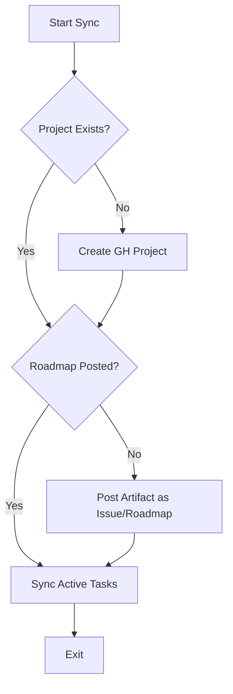

# GitHub Sync Roadmap & Project Initialization Assessment

**Date:** 2026-01-05
**Type:** Assessment
**Tags:** github-integration, roadmap, automation

---

## Requirement Assessment

The user objective is to extend the `sync_github_projects.py` script to support:
1. **Initial Roadmap Publishing:** Creating a GitHub Project or Issue from existing artifacts (Assessment, Implementation Plan, etc.).
2. **Project Initialization:** Setting up a GitHub Project based on session context if it doesn't exist.
3. **Iterative Sync:** Updating the project/issues with session progress (already partially implemented).
4. **Public Visibility:** Ensuring the resulting GitHub Project structures (Kanban, Roadmap) are suitable for public display.

### 1. Feature Gap Analysis

| Feature                     | Current State                                 | Target State                                                        | Priority |
| --------------------------- | --------------------------------------------- | ------------------------------------------------------------------- | -------- |
| **Logic: IF/IF NOT EXISTS** | Missing existence checks for projects/issues. | Robust checking for Project/Issue presence before creation/update.  | High     |
| **Initial Plan Posting**    | Only syncs individual tasks.                  | Can post full Markdown content of artifacts.                        | High     |
| **Project Setup**           | Manual setup assumed.                         | Automated Project creation with predefined views (Kanban, Roadmap). | Medium   |
| **Publicity/Roadmap View**  | Basic task list.                              | Multi-view Project (Board, Table, Roadmap).                         | Low      |

### 2. Functional Requirements

1. **Existence Verification:**
   - Command to list projects and filter by title/ID.
   - Command to check for specific issues (e.g., using a tag or unique title).
2. **Artifact Content Injection:**
   - Ability to read `.md` files from `docs/artifacts/`.
   - Parsing frontmatter to use as metadata (labels, milestones).
3. **Conditional Execution Flow:**
   - Logic: `if not project_exists: create_project()`.
   - Logic: `if not roadmap_issue_exists: create_issue() else: update_issue()`.

---

## Technical Considerations

### 1. Simple Checking Logic (The "IF/IF NOT" Challenge)

The complexity of existence checks can be managed by standardizing the "identity" of GitHub objects:
- **Project Identity:** Based on `[Session ID] - [Objective]` title.
- **Roadmap Identity:** A pinned Issue or a specific Project View named "Roadmap".
- **Unique Tasks:** Search issues with label `compass-task` and title matching the task description.

**Recommended Flow:**

### 2. GitHub CLI (`gh`) Integration

| Goal                     | `gh` Command Pattern                                           |
| ------------------------ | -------------------------------------------------------------- |
| **List Projects**        | `gh project list --owner "@me" --format json`                  |
| **Create Project**       | `gh project create --owner "@me" --title "..."`                |
| **Add Item to Project**  | `gh project item-add [project-id] --url [issue-url]`           |
| **Post Issue with Body** | `gh issue create --title "..." --body-file [path-to-artifact]` |

---

## Recommendations & Roadmap

### Phase 1: Robust Identification (Immediate)
- Implement a `GitHubManager` class in the script to handle `gh` CLI interactions.
- Add utility methods: `find_project_by_title`, `find_issue_by_title`.

### Phase 2: Initialization (Next Step)
- Add `--init` flag to specify an artifact to publish as the roadmap.
- Logic: Create project if missing, post issue, add issue to project.

### Phase 3: Enhanced Synchronization
- Implement mapping of Compass task status (in-progress, done) to GitHub Project columns/fields.

> [!IMPORTANT]
> **Key Decision:** Use GitHub "Draft Issues" for initial project items if they don't need to be full issues yet, but for "Roadmap", a full Issue is better for comments and history.

---

## Actionable Process

1. **Prerequisite:** Ensure `gh auth status` includes `project` scope.
2. **Move Logic:** Transition from simple list-based sync to a state-aware sync.
3. **Metadata Sync:** Store the GitHub Project ID and Roadmap Issue URL in `current_session.yml` to minimize searching on subsequent runs.
