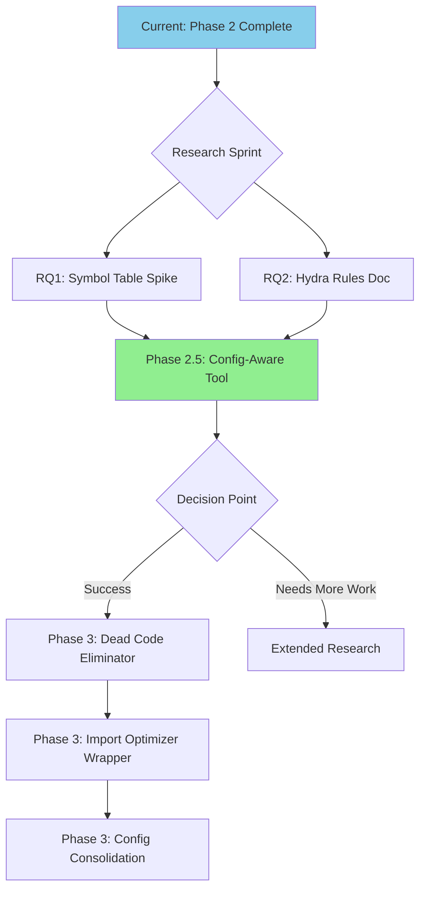

# Assessment - AST Analyzer Phase 3 Feasibility Review & Research Requirements

## Purpose

Evaluate the Phase 3 conceptual implementation plan, assess the research requirements to transform it into an executable plan, and determine the feasibility of the **Config-Aware Refactoring** tool mentioned in the audit survey.

---

## Executive Summary

| Question                        | Answer                                                                                        |
| ------------------------------- | --------------------------------------------------------------------------------------------- |
| **Research Required?**          | **Moderate to High** - 2-4 days of spike work + library evaluation                            |
| **Config-Aware Tool Feasible?** | **Yes, with limitations** - Static analysis achievable; runtime resolution requires tradeoffs |
| **Recommended Next Step**       | Implement Config-Aware Refactoring tool as **Phase 2.5** before automated refactoring         |

---

## 1. Research Requirements Analysis

### Current State

The Phase 3 conceptual plan correctly identifies 5 research questions requiring resolution:

| Question                                   | Complexity | Research Effort | Resolution Path                |
| ------------------------------------------ | ---------- | --------------- | ------------------------------ |
| AST unparsing fidelity (`ast` vs `libcst`) | Medium     | 1-2 days        | Spike implementation with both |
| Cross-file refactoring                     | High       | 2-3 days        | Scope tracking + symbol table  |
| Test coverage integration                  | Low        | 0.5 days        | pytest hooks available         |
| Agent interaction model                    | Medium     | 1 day           | Design decision                |
| Rollback strategy                          | Low        | 0.5 days        | Git atomic commits             |

### Research Spikes Needed

#### Spike 1: `libcst` vs `ast.unparse()` Comparison (1-2 days)

```yaml
objective: Determine best approach for source-preserving transformations
deliverable:
  - Working prototype removing unused imports with both libraries
  - Comparison table: formatting preservation, speed, API complexity
recommendation: libcst for refactoring, ast for read-only analysis
```

#### Spike 2: Cross-File Symbol Resolution (2-3 days)

```yaml
objective: Build minimal symbol table for import resolution
deliverable:
  - Symbol table tracking definitions → usages across files
  - Handles: from X import Y, import X.Y, relative imports
required_for:
  - Dead code elimination (can't detect unused without call graph)
  - Config-Aware Refactoring (must resolve cfg.encoder → file)
```

#### Spike 3: Config-to-Python Mapping (1-2 days)

```yaml
objective: Prototype Hydra config key → Python file resolver
deliverable:
  - Parser for `_target_: path.to.Class` resolution
  - Handler for `dataset_module: ocr.data.datasets` patterns
  - Static fallback when runtime interpolation detected
required_for: Config-Aware Refactoring tool
```

### Total Research Phase Estimate: **4-7 days**

---

## 2. Config-Aware Refactoring Tool Feasibility

### Tool Request (from Audit Survey)

> "A tool that can map Hydra configuration keys (e.g., `dataset_module: ocr.data.datasets`) to the actual Python file `ocr.data.datasets/__init__.py` or class definitions. Currently, this link is opaque to static analysis."

### Feasibility Assessment: **YES, with design constraints**

#### What IS Achievable (Static Analysis)

| Pattern                             | Detection              | Resolution                     |
| ----------------------------------- | ---------------------- | ------------------------------ |
| `_target_: ocr.models.Encoder`      | ✅ Regex/AST            | ✅ Direct path conversion       |
| `_target_: ${module}.${class}`      | ✅ Detect interpolation | ⚠️ Cannot resolve statically    |
| `dataset_module: ocr.data.datasets` | ✅ Key-value extraction | ✅ Path + `__init__.py` mapping |
| `encoder: ${encoder_config}`        | ✅ Detect reference     | ✅ Follow to referenced config  |

#### What Requires Workarounds

| Pattern                                | Challenge        | Workaround                             |
| -------------------------------------- | ---------------- | -------------------------------------- |
| Runtime interpolation (`${env:VAR}`)   | Requires runtime | Flag as "unable to resolve statically" |
| Computed `_target_` (f-string, concat) | Dynamic          | Report potential candidates            |
| Registry-based instantiation           | No static path   | Index registry entries separately      |

### Proposed Architecture

```yaml
name: HydraConfigResolver
components:
  - yaml_parser: Parse Hydra config files (including defaults)
  - target_extractor: Find _target_, _convert_, _recursive_ keys
  - python_resolver: Convert dotted path → absolute file path
  - interpolation_detector: Flag ${...} patterns
  - registry_indexer: Optional - index REGISTRY globals

output:
  config_map:
    - config_file: conf/model/encoder.yaml
      target_key: _target_
      target_value: ocr.models.encoders.ResNet
      resolved_file: /abs/path/ocr/models/encoders.py
      resolved_class: ResNet
      line_number: 45
      confidence: high  # vs "interpolated" or "dynamic"
```

### Implementation Complexity: **Medium (3-5 days)**

This tool should be implemented as a **Phase 2.5 intermediate step** because:

1. It provides **immediate value** for the refactor/audit use case
2. It serves as a **prerequisite** for automated refactoring (Phase 3)
3. It validates the cross-file symbol resolution approach (research spike dependency)

---

## 3. Phase 3 Transformation Assessment

### Current State → Executable Gap

| Phase 3 Feature      | Conceptual Completeness | Missing for Execution                                 |
| -------------------- | ----------------------- | ----------------------------------------------------- |
| Dead Code Eliminator | 70%                     | Cross-file call graph, `libcst` integration           |
| Config Consolidation | 50%                     | YAML schema, migration script template                |
| Import Optimizer     | 90%                     | Already achievable with Phase 1 + `autoflake` wrapper |
| Function Extraction  | 30%                     | Complex - needs refactoring engine design             |
| Legacy Migrator      | 40%                     | Deprecation warning parser, domain-specific rules     |

### Recommended Prioritization

| Priority  | Feature                  | Rationale                                                  |
| --------- | ------------------------ | ---------------------------------------------------------- |
| **P1**    | Import Optimizer         | Low risk, existing tools (`autoflake`, `isort`), quick win |
| **P1**    | Config-Aware Refactoring | High value from audit, enables Phase 3                     |
| **P2**    | Dead Code Eliminator     | Moderate risk, requires call graph                         |
| **P3**    | Config Consolidation     | Medium risk, requires YAML manipulation                    |
| **DEFER** | Function Extraction      | High risk, requires significant design                     |
| **DEFER** | Legacy Migrator          | Domain-specific, case-by-case handling                     |

---

## 4. Recommendations

### Immediate Actions (This Sprint)

1. **Implement Config-Aware Refactoring Tool** (Priority: **HIGH**)
   - New analyzer: `analyzers/hydra_config_resolver.py`
   - CLI command: `adt resolve-configs <config_dir> --output markdown`
   - MCP tool: `resolve_hydra_configs`
   - Estimated effort: 3-5 days

2. **Wrap `autoflake` for Import Optimization** (Priority: **MEDIUM**)
   - Integrate as optional dependency
   - Expose via CLI: `adt optimize-imports <path> --apply`
   - Estimated effort: 1 day

### Near-Term (Next Sprint)

3. **Execute Research Spike 1** (`libcst` evaluation)
   - If `libcst` proves viable, proceed with Dead Code Eliminator
   - Estimated effort: 2 days

4. **Build Symbol Table Infrastructure** (Research Spike 2)
   - Required foundation for cross-file operations
   - Estimated effort: 3 days

### Deferred

5. **Function Extraction, Legacy Migrator** - Defer until Phase 2.5 and research complete

---

## 5. Tool Catalog Update

If Config-Aware Refactoring tool is implemented, update `AGENTS.yaml`:

```yaml
agent_debug_toolkit:
  commands:
    # ... existing commands ...
    resolve_configs: "uv run adt resolve-configs <config_dir> [--module ocr]"
  use_cases:
    # ... existing use cases ...
    - "Map Hydra _target_ keys to Python file paths for static analysis"
    - "Audit config-to-code mappings during refactors"
```

---

## Summary

| Aspect                | Status                                        |
| --------------------- | --------------------------------------------- |
| Phase 3 as written    | **Not executable** - requires research spikes |
| Config-Aware Tool     | **Feasible** - implement as Phase 2.5         |
| Research effort       | **4-7 days** before Phase 3 can proceed       |
| Recommended next step | Implement Config-Aware Refactoring tool       |

---

## 6. External Expert Validation (Perplexity AI Feedback)

**Date**: 2026-01-07 18:41 KST

### Key Validations

| Our Assessment                             | Expert Confirmation                                                                          |
| ------------------------------------------ | -------------------------------------------------------------------------------------------- |
| `ast` for analysis, `libcst` for rewriting | ✅ "Use `ast` + `symtable` for cheap, read-only analysis; LibCST for source-preserving edits" |
| Config-Aware tool as Phase 2.5             | ✅ "HydraConfigResolver spec already reads like a tool contract"                              |
| Symbol table service needed                | ✅ "Your Spike 2 essentially defines a symbol-table service"                                  |
| Agent-tool separation model                | ✅ "The AST layer lives outside the model as a set of tools the agent calls"                  |

### Refined Architecture (Per Expert Guidance)

```yaml
architecture:
  agent_layer:
    role: "Planner/Explainer"
    sees: "Tool signatures + structured JSON/diff outputs"
    does_not_see: "libcst/ast internals"

  ast_toolkit_layer:
    role: "Ground-truth executor"
    read_only_tools:
      backend: "ast + symtable"
      examples: [list_imports, find_dead_symbols, resolve_hydra_targets]
    transform_tools:
      backend: "libcst"
      examples: [remove_unused_imports, rename_symbol, apply_config_mapping]
    output_format: "JSON summaries + unified diffs"

  safety_layer:
    role: "Verification and rollback"
    components: [git, pytest, pre-commit hooks]
```

### Concrete Tool Boundary Design

The expert feedback identifies that our Phase 3 gap is a **missing tool boundary** between agent and AST engine. Here are the refined interfaces:

```yaml
high_level_commands:
  - name: scan_project_for_dead_code
    input: {project_root: str, exclude_patterns: list}
    output: {dead_symbols: list, confidence_scores: dict}
    errors: [no_call_graph, ambiguous_export]

  - name: resolve_hydra_configs
    input: {config_dir: str, module_root: str}
    output: {config_map: list[ConfigMapping], unresolved: list}
    errors: [interpolated_target, dynamic_registry]

  - name: optimize_imports
    input: {path: str, dry_run: bool}
    output: {diff: str, removed_count: int}
    errors: [parse_error, protected_import]

  - name: summarize_changes
    input: {diff_files: list}
    output: {summary: str, affected_modules: list}
```

### Qwen Coder / Coding Agent Integration Notes

> "Qwen Coder is still just a causal LLM at runtime, but it was trained with AST-aware preprocessing using Tree-sitter."

**Implications for our toolkit**:

| Aspect           | Recommendation                                                                                 |
| ---------------- | ---------------------------------------------------------------------------------------------- |
| AST exposure     | Provide **structured AST/CFG summaries in prompts** - trained on this structure                |
| Tool affordances | Give high-level operations ("refactor this symbol everywhere"), engine enforces correctness    |
| Model role       | Planner/explainer only; **never trust model to generate correct AST transformations directly** |
| Safety           | Git + tests as mandatory safety net for all code modifications                                 |

---

## 7. Targeted Research Questions

Based on expert feedback, the following **concrete questions** should guide implementation spikes:

### RQ1: Symbol Table Service Design

```yaml
question: "What is the minimal viable symbol table schema for cross-file operations?"
priority: HIGH
blocks: [dead_code_eliminator, config_resolver]
expected_output:
  schema:
    modules:
      "ocr.data.datasets":
        file: "ocr/data/datasets/__init__.py"
        symbols:
          MyDataset: {kind: class, line: 42, exported: true}
    imports:
      - {from: "ocr.data.datasets", name: "MyDataset", in_file: "train.py", line: 15}
research_approach:
  - Start with `ast` + `symtable` for per-module scope
  - Overlay cross-module links manually
  - Test on 3-5 module import chain
```

### RQ2: Hydra `_target_` Resolution Rules

```yaml
question: "What are the complete Hydra _target_ resolution rules for static analysis?"
priority: HIGH
blocks: [config_resolver]
known_rules:
  - _target_ is always a fully qualified class/function name
  - Can use ${} interpolation (runtime only)
  - _convert_ and _recursive_ affect instantiation but not resolution
research_approach:
  - Review Hydra documentation for `instantiate()` behavior
  - Check if hydra-zen provides static analysis helpers
  - Document edge cases: relative targets, partial functions
```

### RQ3: LibCST vs ast Performance

```yaml
question: "What is the performance impact of libcst vs ast on large codebases?"
priority: MEDIUM
blocks: [dead_code_eliminator, import_optimizer]
metrics_to_measure:
  - Parse time per file (avg, p95, p99)
  - Memory usage for 1000-file project
  - Diff quality (formatting preservation, comment retention)
research_approach:
  - Benchmark on ocr/ directory (real codebase)
  - Test import removal operation with both
  - Measure diff accuracy against original formatting
```

### RQ4: Error Classification for Agent UX

```yaml
question: "What error codes should the toolkit return to help agents gracefully degrade?"
priority: MEDIUM
blocks: [all_tools]
proposed_error_taxonomy:
  parse_errors: "File cannot be parsed as Python"
  scope_errors: "Symbol not found in scope"
  resolution_errors:
    interpolated_target: "Contains ${} - cannot resolve statically"
    dynamic_registry: "Uses runtime registry - index separately"
    circular_import: "Circular dependency detected"
    ambiguous_export: "Multiple definitions found"
  transform_errors:
    protected_symbol: "Symbol marked as do-not-modify"
    test_failure: "Post-transform tests failed"
research_approach:
  - Run tools on real codebase, catalog all error conditions
  - Map each error to agent recovery strategy
```

### RQ5: Hydra Config Composition

```yaml
question: "How do Hydra defaults and overrides compose, and can we trace them statically?"
priority: LOW (defer if complex)
blocks: [config_consolidator]
complexity_factors:
  - defaults: list in YAML specifies composition order
  - command-line overrides not visible statically
  - package directives change namespace
research_approach:
  - Limit scope to file-level composition (ignore CLI overrides)
  - Parse defaults: list to build config graph
  - Mark CLI-affected values as "runtime-dependent"
```

---

## 8. Updated Implementation Roadmap

Based on expert validation and research questions:



### Sprint Plan

| Sprint      | Focus             | Deliverables                               |
| ----------- | ----------------- | ------------------------------------------ |
| **Current** | Research + Design | RQ1, RQ2 answered; tool contract finalized |
| **Next**    | Phase 2.5         | `HydraConfigResolver` analyzer + CLI + MCP |
| **+1**      | Validation        | Test on real refactor use case             |
| **+2**      | Phase 3 Start     | Dead Code Eliminator (if libcst viable)    |
