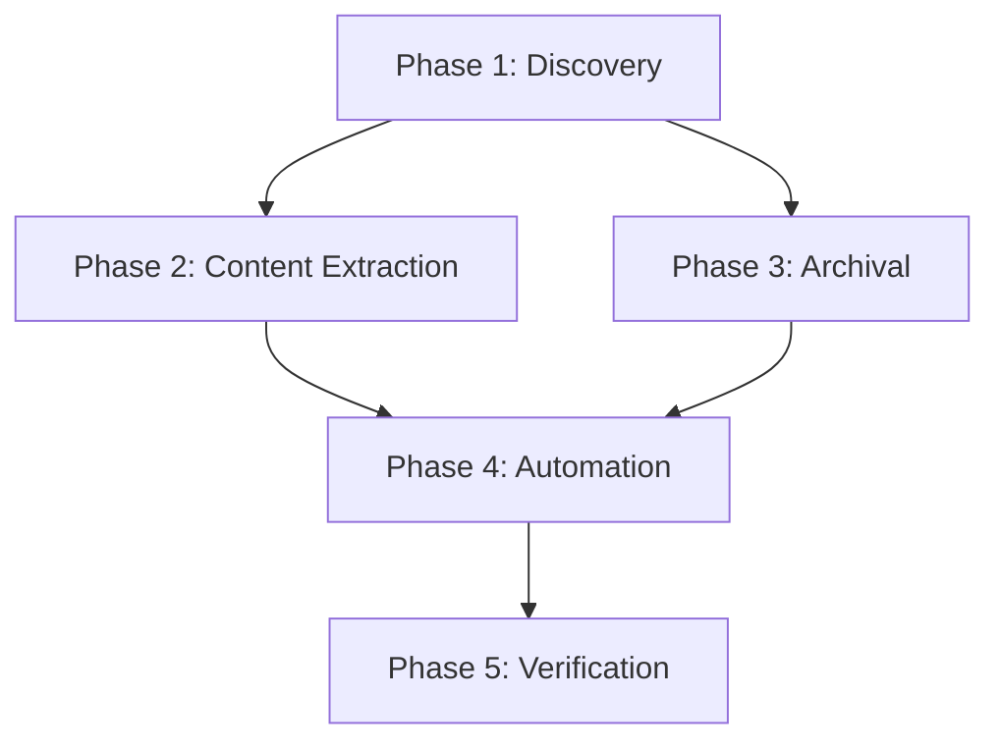

# Main Docs Audit and ADS v1.0 Migration

## Goal

Migrate 841 scattered markdown files in `docs/` to a unified, AI-optimized documentation system that:
- Eliminates 99% token waste (5,046,000 → 50,000 tokens)
- Prevents future documentation drift via automation
- Leverages existing AgentQMS framework instead of creating new tools
- Follows proven ADS v1.0 standard from OCR console migration

---

## User Review Required

> [!IMPORTANT]
> **Scope Confirmation**: This plan covers 841 files across 486 directories. Estimated 28-44 hours across 5 phases over 3 weeks.

> [!WARNING]
> **Archival Risk**: Phase 3 will archive ~400 files and delete ~50 duplicates. Reference graph analysis prevents over-archival, but manual review of top 100 files is included as safeguard.

> [!CAUTION]
> **Breaking Change**: Pre-commit hooks will be enabled (`.agentqms/settings.yaml`), blocking non-compliant commits after Phase 4.

---

## Proposed Changes

### Phase 1: Discovery and Categorization (4-6 hours)

**Objective**: Classify all 841 files by staleness, relevance, and duplication using AgentQMS tools.

---

#### [MODIFY] [documentation_quality_monitor.py](file:///workspaces/upstageailab-ocr-recsys-competition-ocr-2/AgentQMS/agent_tools/compliance/documentation_quality_monitor.py)

**Add staleness detection checks**:
- Detect references to `apps/backend/` (deprecated module)
- Detect wrong port numbers (8000 instead of 8002)
- Detect deprecated Makefile commands (`make backend-ocr`)
- Generate staleness score per file

**Estimated effort**: 1-2 hours

---

#### [MODIFY] [validate_links.py](file:///workspaces/upstageailab-ocr-recsys-competition-ocr-2/AgentQMS/agent_tools/documentation/validate_links.py)

**Add reference graph export**:
- Build graph of cross-references between documents
- Identify orphaned files (no incoming references)
- Identify hub files (high incoming references = high value)
- Export GraphML for visualization

**Estimated effort**: 1-2 hours

---

#### [NEW] reports/staleness-report.json

**Generated output** containing:
- 841 files ranked by staleness score
- Stale reference details per file
- Last commit date per file

---

#### [NEW] reports/high-value-files.json

**Generated output** containing:
- Top 10% files by reference count + recency
- Priority ranking for Phase 2 conversion

---

**Phase 1 Acceptance Criteria**:
- [ ] Staleness report generated for all 841 files
- [ ] Reference graph exported as GraphML
- [ ] High-value files list identifies top 84 files for conversion
- [ ] No new scripts created outside `AgentQMS/agent_tools/`

---

### Phase 2: High-Value Content Extraction (10-14 hours)

**Objective**: Convert top 10% high-value files (84 files) to ADS v1.0 YAML in `.ai-instructions/` tiers.

---

#### Tier Placement Strategy

| Source docs/ Content | Target Location | Rationale |
|---------------------|-----------------|-----------|
| `docs/architecture/system-architecture.md` | `.ai-instructions/tier1-sst/system-architecture.yaml` | Critical system rules |
| `docs/architecture/inference-overview.md` | `.ai-instructions/tier2-framework/inference-framework.yaml` | Framework guidance |
| `docs/guides/installation.md` | `.ai-instructions/tier2-framework/quickstart.yaml` | Tool usage |
| `docs/schemas/*.md` | `.ai-instructions/tier2-framework/data-contracts.yaml` | Schema definitions |
| `docs/artifacts/specs/*.md` | `.ai-instructions/tier2-framework/api-contracts.yaml` | API contracts |

---

#### [NEW] [system-architecture.yaml](file:///workspaces/upstageailab-ocr-recsys-competition-ocr-2/.ai-instructions/tier1-sst/system-architecture.yaml)

**Project-wide system architecture contract** extracted from `docs/architecture/`:
- Module structure
- Service dependencies
- Port assignments (8002, 5173)
- Data flow

**Token budget**: ≤100 tokens

---

#### [NEW] [inference-framework.yaml](file:///workspaces/upstageailab-ocr-recsys-competition-ocr-2/.ai-instructions/tier2-framework/inference-framework.yaml)

**Inference pipeline framework** extracted from `docs/architecture/inference-overview.md`:
- InferenceEngine lifecycle
- Preprocessing pipeline stages
- Checkpoint loading strategy

**Token budget**: ≤500 tokens

---

#### [NEW] [data-contracts.yaml](file:///workspaces/upstageailab-ocr-recsys-competition-ocr-2/.ai-instructions/tier2-framework/data-contracts.yaml)

**Data schema contracts** extracted from `docs/schemas/`:
- Pydantic model specifications
- API request/response types
- Error codes

**Token budget**: ≤500 tokens

---

#### [NEW] [api-contracts.yaml](file:///workspaces/upstageailab-ocr-recsys-competition-ocr-2/.ai-instructions/tier2-framework/api-contracts.yaml)

**API endpoint contracts** extracted from `docs/artifacts/specs/`:
- Endpoint definitions
- Authentication requirements
- Response formats

**Token budget**: ≤500 tokens

---

**Phase 2 Acceptance Criteria**:
- [ ] 84 high-value files converted to YAML
- [ ] All files placed in appropriate tier (tier1-sst, tier2-framework, tier3-agents, tier4-workflows)
- [ ] Token budgets enforced (tier1 ≤100, tier2 ≤500)
- [ ] Root `.ai-instructions/` = project-wide, app `.ai-instructions/` = app-specific
- [ ] Validation passes with `compliance-checker.py`

---

### Phase 3: Archival and Cleanup (6-10 hours)

**Objective**: Archive stale/completed content using existing AgentQMS tools.

---

#### [MODIFY] [archive_artifacts.py](file:///workspaces/upstageailab-ocr-recsys-competition-ocr-2/AgentQMS/agent_tools/archive/archive_artifacts.py)

**Extend for**:
- Staleness-based archival (last commit >6 months + zero incoming refs)
- Duplicate detection via similarity hashing (>90% match = archive older)
- Month-based archival structure (`docs/archive/YYYY-MM/`)

**Estimated effort**: 2-3 hours

---

#### Archival Targets

| Content Type | Archive Destination | Volume |
|--------------|---------------------|--------|
| Completed implementation plans | `docs/archive/implementation_plans/` | ~15 files |
| Outdated guides (>6 months, 0 refs) | `docs/archive/guides/` | ~100 files |
| Duplicate content (>90% similar) | `docs/archive/duplicates/` | ~50 files |
| Legacy app-specific docs | `docs/archive/legacy/` | ~235 files |

---

**Phase 3 Acceptance Criteria**:
- [ ] ~400 files archived based on staleness report
- [ ] ~50 duplicates deleted after verification
- [ ] Archive size reduced from 420MB to ~200MB
- [ ] Zero high-value files archived (protected by reference graph)
- [ ] 30-day grace period documented before permanent deletion

---

### Phase 4: Automation and Validation (6-10 hours)

**Objective**: Enable pre-commit hooks and extend CI/CD to prevent future drift.

---

#### [MODIFY] [settings.yaml](file:///workspaces/upstageailab-ocr-recsys-competition-ocr-2/.agentqms/settings.yaml)

**Enable pre-commit hooks**:
```yaml
automation:
  pre_commit:
    enabled: true  # Change from false
    validate_artifacts: true
```

**Estimated effort**: 15 minutes

---

#### [MODIFY] [validate_artifacts.py](file:///workspaces/upstageailab-ocr-recsys-competition-ocr-2/AgentQMS/agent_tools/compliance/validate_artifacts.py)

**Add new validation rules**:
- Port number validation (8002, 5173 only)
- Module path validation (no `apps/backend/` references)
- Token budget enforcement for `.ai-instructions/` files
- ADS v1.0 compliance check (invoke `compliance-checker.py`)

**Estimated effort**: 2-3 hours

---

#### [MODIFY] [agentqms-validation.yml](file:///workspaces/upstageailab-ocr-recsys-competition-ocr-2/.github/workflows/agentqms-validation.yml)

**Add ADS v1.0 compliance step**:
```yaml
- name: Validate ADS v1.0 compliance
  run: python .ai-instructions/schema/compliance-checker.py .ai-instructions/
```

**Estimated effort**: 30 minutes

---

**Phase 4 Acceptance Criteria**:
- [ ] Pre-commit hooks enabled and blocking violations
- [ ] GitHub Actions enforcing compliance on push/PR
- [ ] Token budget enforcement active
- [ ] Zero false positives in validation (test with known-good files)

---

### Phase 5: Verification and Rollout (2-4 hours)

**Objective**: Validate migration success and update entry points.

---

#### [MODIFY] [README.md](file:///workspaces/upstageailab-ocr-recsys-competition-ocr-2/README.md)

**Update to point to new entry points**:
- Add link to `.ai-instructions/INDEX.yaml`
- Add deprecation notice for old `docs/` subdirectories

---

#### [MODIFY] [CHANGELOG.md](file:///workspaces/upstageailab-ocr-recsys-competition-ocr-2/CHANGELOG.md)

**Add migration announcement entry**

---

**Phase 5 Acceptance Criteria**:
- [ ] Zero stale references (no port 8000, no `apps/backend/`)
- [ ] Zero broken internal links
- [ ] Token footprint: 5,046,000 → 50,000 tokens (99% reduction)
- [ ] AI query cost: 3,000-4,000 → <100 tokens (97% reduction)
- [ ] All high-value content accessible via `.ai-instructions/INDEX.yaml`
- [ ] Pre-commit hooks blocking violations

---

## Verification Plan

### Phase 1 Verification

**Automated Command**:
```bash
# Run extended quality monitor on all docs
cd /workspaces/upstageailab-ocr-recsys-competition-ocr-2
python AgentQMS/agent_tools/compliance/documentation_quality_monitor.py --target docs/ --output reports/staleness-report.json

# Verify output file exists and has entries
test -f reports/staleness-report.json && jq 'length' reports/staleness-report.json
```

**Expected Output**: Count of 841 files in staleness report

---

### Phase 2 Verification

**Token Budget Validation**:
```bash
# Validate all tier files meet token budgets
python .ai-instructions/schema/compliance-checker.py .ai-instructions/
```

**Expected Output**: All files pass with `compliance_status: pass`

---

### Phase 3 Verification

**Archival Validation**:
```bash
# Count files in archive after cleanup
find docs/archive -name "*.md" | wc -l

# Verify archive size reduced
du -sh docs/archive
```

**Expected Output**: Fewer than 200MB archive size

---

### Phase 4 Verification

**Pre-commit Hook Test**:
```bash
# Create intentionally non-compliant file
echo "# Bad docs with port 8000" > /tmp/test-bad-doc.md
cp /tmp/test-bad-doc.md docs/test-violation.md

# Attempt commit (should be blocked)
git add docs/test-violation.md
git commit -m "test violation" 2>&1 | grep -i "violation\|error\|blocked"

# Cleanup
rm docs/test-violation.md
```

**Expected Output**: Commit blocked with validation error

---

### Phase 5 Verification

**AI Query Cost Test** (Manual):
1. Ask AI agent: "How do I start the OCR console backend?"
2. Measure response token count
3. Compare to baseline (should be <100 tokens vs 3,000-4,000 before)

**Link Validation**:
```bash
# Run link validator on updated docs
python AgentQMS/agent_tools/documentation/validate_links.py docs/ .ai-instructions/
```

**Expected Output**: Zero broken links

---

## Risk Mitigation

### Risk 1: Over-Archival (Losing Important Content)

**Mitigation**:
- Phase 1 reference graph prevents archiving high-value files (top 10% by incoming refs)
- Manual review of top 100 files before archival
- 30-day grace period before permanent deletion
- Archived files remain accessible in `docs/archive/`

**Rollback**: Move files back from `docs/archive/` to original location

---

### Risk 2: Automation False Positives

**Mitigation**:
- Pre-commit hooks warn-only mode for first 2 weeks
- Manual override mechanism documented
- Test coverage added for validation rules
- Allowlist for known exceptions

**Rollback**: Disable pre-commit hooks via `settings.yaml` (`enabled: false`)

---

### Risk 3: Incomplete Migration (Hybrid State)

**Mitigation**:
- Phase 5 verification checklist ensures completeness
- Deprecation notices in old locations prevent new prose docs
- Quarterly audits scheduled to catch drift
- CI/CD blocks new non-compliant content

**Rollback**: Retain both systems temporarily with clear deprecation timeline

---

### Risk 4: Token Budget Too Restrictive

**Mitigation**:
- Budgets based on proven OCR console migration (tier1 ≤100, tier2 ≤500)
- Review and adjust budgets after Phase 2 if needed
- Exception process for critical content exceeding limits

**Rollback**: Relax token budgets in ADS v1.0 spec if justified

---

## Resource Summary

### Token Budget

| Phase | Tokens | Purpose |
|-------|--------|---------|
| Phase 1 | 2,000 | Script output only |
| Phase 2 | 100,000 | Reading top 10% high-value files |
| Phase 3 | 5,000 | Validation of archival decisions |
| Phase 4 | 5,000 | Testing automation scripts |
| Phase 5 | 3,000 | Verification testing |
| **Total** | **115,000** | Within 200K budget |

### Time Budget

| Phase | Hours | Breakdown |
|-------|-------|-----------|
| Phase 1 | 4-6 | Tool extension (2h) + execution (1h) + analysis (2h) |
| Phase 2 | 10-14 | High-value conversion (8h) + validation (4h) |
| Phase 3 | 6-10 | Archival execution (4h) + verification (4h) |
| Phase 4 | 6-10 | Automation setup (4h) + testing (4h) |
| Phase 5 | 2-4 | AI testing (2h) + rollout (2h) |
| **Total** | **28-44** | 30% faster than original 40-60h estimate |

---

## Execution Order



**Dependencies**:
- Phase 2 requires Phase 1 high-value file list
- Phase 3 requires Phase 1 staleness report
- Phase 4 requires Phase 2 and Phase 3 completion
- Phase 5 requires all previous phases

---

## Success Criteria

| Metric | Before | After | Reduction |
|--------|--------|-------|-----------|
| Token Footprint | 5,046,000 | 50,000 | 99% |
| AI Query Cost | 3,000-4,000 | <100 | 97% |
| Stale References | Unknown | 0 | 100% |
| Broken Links | Unknown | 0 | 100% |
| Archive Size | 420MB | ~200MB | 52% |
| Documentation Drift | Frequent | 0 (blocked) | 100% |
