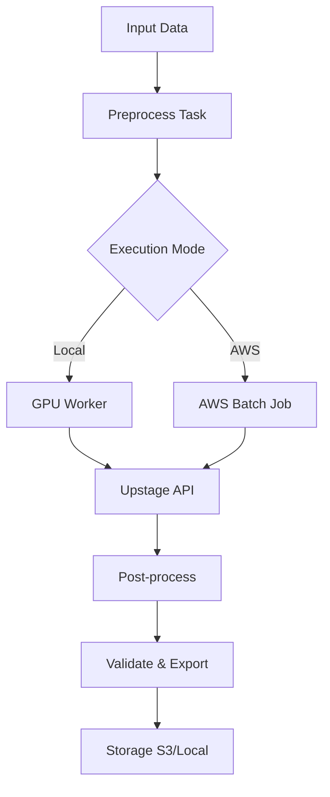

# Implementation Plan - Airflow Batch Processor for Upstage APIs

## Executive Summary

Create an Airflow-based batch processing system for OCR and KIE data processing using Upstage APIs. The system will provide independent, reusable workflows with local and AWS Batch execution capabilities, supporting GPU acceleration via RTX 3090.

## Goals & Benefits

### Primary Goals
- **Independent Processing**: Process data without AI dependency for reliability
- **Reusability**: Modular DAGs and tasks for multiple use cases
- **Workflow Storage**: Centralized workflow definitions and execution history
- **Operational Control**: Monitoring, retry logic, and failure handling

### Key Benefits
- Scalable batch processing for large datasets
- Cost-effective API usage with rate limiting
- Resumable operations with checkpointing
- GPU-accelerated local processing
- AWS Batch integration for cloud scaling

## Requirements Analysis

### Functional Requirements

#### Core Processing Operations
1. **Local/AWS Batch API Processing**
   - Upstage Document Parse API integration
   - Upstage KIE (Key Information Extraction) API integration
   - Dual execution modes: local GPU vs AWS Batch
   - Rate limiting and quota management

2. **Deferred Operations** (Future Phases)
   - JPG to LMDB conversion pipeline
   - Image optimization (resolution normalization)
   - IT textbook PDF processing pipeline

#### Data Management
- Input: Images, PDFs, documents
- Output: Structured JSON, Parquet files
- Checkpointing for resumable processing
- Data validation and quality checks

### Technical Requirements

#### Environment
- **GPU Support**: RTX 3090 24GB with WSL2 passthrough
- **Python Version**: 3.11 preferred (containerized, independent of main OCR project)
- **Containerization**: Docker for Airflow environment
- **Dependencies**: Airflow 2.x, Upstage SDK, AWS SDK

#### Existing Assets to Leverage
- **aws-batch-processor**: AWS Batch integration, resumable checkpointing, API rate limiting
- **ocr-etl-pipeline**: LMDB dataset creation, multi-threaded ETL patterns

### Non-Functional Requirements
- **Performance**: Handle 1000+ documents per batch
- **Reliability**: 99% success rate with automatic retries
- **Monitoring**: Real-time DAG status, failure alerts
- **Security**: Secure API key management via environment variables

## Architecture Design

### System Components

#### 1. Airflow Core
- **Webserver**: UI for monitoring and manual triggers
- **Scheduler**: DAG orchestration and task scheduling
- **Workers**: Task execution (local GPU or AWS Batch)
- **Database**: Metadata storage (PostgreSQL)

#### 2. Processing Modules
- **API Client Layer**: Upstage SDK integration with retry logic
- **Data Processing Layer**: Image preprocessing, format conversion
- **Storage Layer**: S3 for input/output, local filesystem for temp
- **Monitoring Layer**: Custom sensors and callbacks

#### 3. DAG Structure
```
batch_processor_dag.py
├── preprocess_task
├── api_call_task (parallel)
├── validate_task
├── export_task
└── cleanup_task
```

### Data Flow Architecture



## Implementation Phases

### Phase 1: Foundation (Week 1-2)
- [ ] Set up Airflow environment with Docker
- [ ] Configure RTX 3090 GPU passthrough
- [ ] Create base DAG structure
- [ ] Integrate Upstage API client
- [ ] Implement basic local processing DAG

### Phase 2: Core Processing (Week 3-4)
- [ ] Add AWS Batch integration
- [ ] Implement checkpointing system
- [ ] Add rate limiting and quota management
- [ ] Create monitoring and alerting
- [ ] Add data validation tasks

### Phase 3: Advanced Features (Week 5-6)
- [ ] Implement KIE processing workflows
- [ ] Add PDF processing capabilities
- [ ] Create reusable DAG templates
- [ ] Add comprehensive testing
- [ ] Documentation and deployment guides

### Phase 4: Deferred Features (Future)
- [ ] JPG to LMDB conversion
- [ ] Image optimization pipeline
- [ ] IT textbook processing DAG

## Proposed Changes

### Configuration
- [ ] Create `airflow.cfg` with GPU and AWS settings
- [ ] Add environment-specific config files
- [ ] Configure connection strings for Upstage APIs
- [ ] Set up S3 and local storage connections

### Code Structure
```
airflow-batch-processor/
├── dags/
│   ├── batch_processor_dag.py
│   ├── kie_processor_dag.py
│   └── pdf_processor_dag.py
├── plugins/
│   ├── upstage_plugin.py
│   └── monitoring_plugin.py
├── config/
│   ├── base.yaml
│   └── environments/
├── src/
│   ├── api_clients/
│   ├── processors/
│   └── utils/
├── tests/
└── docker/
    ├── Dockerfile
    └── docker-compose.yml
```

### Key Implementation Tasks
- [ ] Migrate core logic from `aws-batch-processor`
- [ ] Adapt ETL patterns from `ocr-etl-pipeline`
- [ ] Create custom Airflow operators for Upstage APIs
- [ ] Implement GPU task scheduling
- [ ] Add comprehensive logging and metrics

## Risk Assessment

### Technical Risks
- **GPU Compatibility**: WSL2 passthrough may have performance overhead
- **API Limits**: Upstage rate limits could bottleneck processing
- **Container Complexity**: Docker GPU setup may require specific configurations

### Mitigation Strategies
- **GPU Testing**: Early validation of GPU performance in containers
- **API Management**: Implement intelligent queuing and backoff strategies
- **Incremental Deployment**: Start with local-only, add AWS Batch later

## Verification Plan

### Automated Tests
- [ ] `pytest tests/test_api_client.py` - API integration tests
- [ ] `pytest tests/test_dag_logic.py` - DAG execution logic
- [ ] `pytest tests/test_gpu_processing.py` - GPU task validation
- [ ] `pytest tests/test_aws_batch.py` - Cloud integration tests

### Manual Verification
- [ ] Process sample dataset (100 images) locally
- [ ] Execute AWS Batch job with monitoring
- [ ] Validate output data quality and format
- [ ] Test failure recovery and checkpointing
- [ ] Performance benchmark: processing time vs dataset size

### Success Criteria
- [ ] 95%+ success rate on test datasets
- [ ] <5% GPU idle time during processing
- [ ] <10% API quota utilization overhead
- [ ] Full workflow execution in <2 hours for 1000 documents

## Dependencies & Prerequisites

### External Dependencies
- Upstage API access and quotas
- AWS Batch environment (if using cloud)
- RTX 3090 GPU with WSL2
- Docker and docker-compose

### Internal Dependencies
- Access to existing `aws-batch-processor` code
- `ocr-etl-pipeline` patterns and utilities
- `.env.local` with UPSTAGE_API_KEY values

## Timeline & Milestones

- **Week 1**: Environment setup and basic DAG
- **Week 2**: API integration and local processing
- **Week 3**: AWS Batch integration
- **Week 4**: Monitoring and validation
- **Week 5**: KIE workflows and testing
- **Week 6**: Documentation and deployment

## Success Metrics

- **Functional**: All operations process data correctly
- **Performance**: <2 hour processing for 1000 documents
- **Reliability**: >99% success rate with retries
- **Usability**: Easy DAG triggering and monitoring
- **Maintainability**: Clear code structure and documentation
