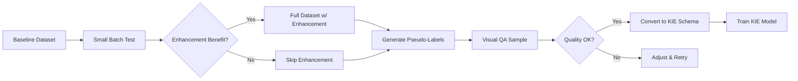

# KIE Implementation Strategy Assessment

## Executive Summary

This assessment evaluates the current project state and defines a clear path forward for **Key Information Extraction (KIE)** implementation on the baseline OCR dataset. The shift from text-recognition to KIE is strategically sound given dataset constraints and API availability.

| **Dimension** | **Status** | **Notes** |
|---|---|---|
| **Current Focus** | Sepia Enhancement Complete | Proven optimal for OCR accuracy |
| **Dataset Readiness** | Baseline in Parquet Format | 4,089 train + 404 val images ready |
| **API Infrastructure** | Upstage API Available | Document Parse + Solar API (free until March 2026) |
| **KIE Schema** | Implemented | [KIEStorageItem](file:///workspaces/upstageailab-ocr-recsys-competition-ocr-2/ocr/data/schemas/storage.py#59-72) ready in [ocr/data/schemas/storage.py](file:///workspaces/upstageailab-ocr-recsys-competition-ocr-2/ocr/data/schemas/storage.py) |
| **Field Extraction** | Implemented | [ReceiptFieldExtractor](file:///workspaces/upstageailab-ocr-recsys-competition-ocr-2/ocr/inference/extraction/field_extractor.py#115-419) with regex + VLM support |
| **Pseudo-Label Script** | Implemented | Enhancement-aware with inverse mapping |

**Recommendation**: Proceed with pseudo-labeling the baseline dataset using Upstage Document Parse API with sepia enhancement preprocessing, then implement KIE model training.

---

## 1. Project State Analysis

### 1.1 What Has Been Implemented

#### ✅ Image Enhancement Pipeline
- **Sepia Enhancement**: Confirmed as optimal strategy for OCR accuracy (+3 words vs grayscale on worst-case image)
- **Experiment**: [20251225_233304_sepia_enhancement_study](file:///workspaces/upstageailab-ocr-recsys-competition-ocr-2/experiment_manager/experiments/20251225_233304_sepia_enhancement_study/.metadata/reports/FINDINGS.md)
- **Components**: Rembg + Perspective Correction + Sepia Tone
- **Status**: Ready for production use

#### ✅ Data Infrastructure
- **Storage Schema**: [KIEStorageItem](file:///workspaces/upstageailab-ocr-recsys-competition-ocr-2/ocr/data/schemas/storage.py#59-72) with `kie_labels` and `linking` fields
- **Baseline Dataset**: Converted to Parquet format in `data/processed/`
  - `baseline_train.parquet` (7.3 MB)
  - `baseline_val.parquet` (1.3 MB)
  - `baseline_test.parquet` (15.8 KB)
- **Dataset Catalog**: Documented in `.ai-instructions/tier2-framework/dataset-catalog.yaml`

#### ✅ Pseudo-Labeling Infrastructure
- **Script**: `scripts/data/generate_pseudo_labels.py`
- **Features**:
  - Async Upstage API integration with rate limiting
  - Enhancement pipeline integration (Rembg + Perspective)
  - Inverse matrix mapping to preserve original coordinates
  - Outputs to `OCRStorageItem` Parquet format
- **Status**: Tested on worst performers (7 images)

#### ✅ Field Extraction Module
- **Implementation**: `ocr/inference/extraction/field_extractor.py`
- **Capabilities**:
  - Regex-based extraction for 14+ fields
  - Korean receipt pattern support
  - VLM fallback via `vlm_extractor.py`
  - Confidence scoring
- **Output Schema**: `ReceiptData` with `LineItem[]`, metadata

#### ✅ Text Recognition Roadmap
- **Assessment**: [2025-12-25_0330_assessment-text-recognition-integration-strategy.md](file:///workspaces/upstageailab-ocr-recsys-competition-ocr-2/docs/artifacts/assessments/2025-12-25_0330_assessment-text-recognition-integration-strategy.md)
- **Implementation Plan**: [2025-12-25_0410_implementation_plan_phase2-pipeline-integration.md](file:///workspaces/upstageailab-ocr-recsys-competition-ocr-2/docs/artifacts/implementation_plans/2025-12-25_0410_implementation_plan_phase2-pipeline-integration.md)
- **Status**: Paused pending KIE strategy

### 1.2 What Is Missing

#### ❌ Pseudo-Labels for Baseline Dataset
- **Gap**: No KIE labels on the 4,089 baseline training images
- **Blocker**: Enhancement experiment was stopped before full dataset labeling
- **Impact**: Cannot train KIE model without labeled data

#### ❌ KIE Model Implementation
- **Gap**: No KIE-specific model (LayoutLMv3, PICK, or similar)
- **Blocker**: No training pipeline for KIE models
- **Impact**: Cannot perform automated KIE

#### ❌ Enhancement Verification on Full Dataset
- **Gap**: Sepia enhancement only tested on 7 worst-case images
- **Concern**: User suspects empty results from experiment were from inference pipeline, not API
- **Impact**: Need validation that enhancement benefits generalize

#### ⚠️ API Cost Monitoring
- **Gap**: No tracking of API usage vs free tier limits
- **Risk**: Could exceed free tier before March 2026
- **Mitigation**: Implement usage tracking

---

## 2. Data Requirements Assessment

### 2.1 Available Datasets

| **Dataset** | **Images** | **Format** | **KIE Labels** | **Priority** |
|---|---|---|---|---|
| **baseline_train** | 4,089 | Parquet | ❌ No | 🔴 High |
| **baseline_val** | 404 | Parquet | ❌ No | 🔴 High |
| **hf_invoices_receipts** | 2,043 | Cached | ✅ Yes | 🟡 Medium |
| **hf_wildreceipts** | 1,618 | Cached | ✅ Yes | 🟡 Medium |
| **hf_receipt_cord** | 800 | Cached | ✅ Yes | 🟡 Medium |
| **pseudo_labels_worst_performers** | 7 | Parquet | ✅ Yes | 🟢 Low |

### 2.2 Data Catalog Location

**Primary Catalog**: `.ai-instructions/tier2-framework/dataset-catalog.yaml`

**Key Insights**:
- HuggingFace datasets have KIE annotations BUT require cropping for line-level recognition
- Baseline dataset has no text labels (detection polygons only)
- `pseudo_label/` directory exists but unknown status (3,683 images)

### 2.3 Storage Requirements

**Pseudo-Label Storage**:
```
4,089 images × ~50 KB/image ≈ 204 MB (Parquet)
```

**Enhancement Artifacts**:
```
4,089 images × ~150 KB/image ≈ 613 MB (enhanced JPEGs)
```

**Total**: ~820 MB (manageable)

---

## 3. Pseudo-Labeling Strategy

### 3.1 Recommended Workflow



### 3.2 Phase 1: Small Batch Validation (50 images)

**Objective**: Confirm enhancement benefits on diverse samples

**Steps**:
1. Sample 50 images from `baseline_train.parquet` (stratified by ID ranges)
2. Generate pseudo-labels with 3 configurations:
   - Baseline (no enhancement)
   - Sepia enhancement
   - Grayscale enhancement
3. Compare word counts and confidence scores
4. Visual inspection of 10 samples

**Success Criteria**:
- Sepia enhancement increases word count by ≥5% on average
- No empty results (unlike experiment findings)
- Visual QA confirms accuracy

**Script**:
```bash
uv run python scripts/data/generate_pseudo_labels.py \
  --image_dir data/processed/sample_50 \
  --output data/processed/pseudo_labels_test_baseline.parquet \
  --name baseline_test \
  --limit 50

uv run python scripts/data/generate_pseudo_labels.py \
  --image_dir data/processed/sample_50 \
  --output data/processed/pseudo_labels_test_sepia.parquet \
  --name baseline_test \
  --limit 50 \
  --enhance
```

### 3.3 Phase 2: Full Dataset Pseudo-Labeling

**Objective**: Generate KIE pseudo-labels for entire baseline dataset

**Approach**:
- Use sepia enhancement (if Phase 1 confirms benefit)
- Process in batches of 500 to enable checkpointing
- Implement retry logic for API failures

**Estimated Time**:
```
4,089 images ÷ 50 requests/min = 82 minutes (~1.4 hours)
```

**Storage**:
```python
# Output schema: KIEStorageItem
{
  "id": "baseline_000001",
  "split": "train",
  "image_path": "data/datasets/images/train/000001.jpg",
  "polygons": [...],  # From API
  "texts": [...],     # From API
  "kie_labels": [...],  # From API classification (if available)
  "metadata": {"source": "upstage_api", "enhanced": true}
}
```

### 3.4 Phase 3: KIE Label Enhancement

**Challenge**: Upstage Document Parse may not return KIE class labels

**Options**:
1. **Use Solar API** for semantic classification of detected text
2. **Manual annotation** of 100-200 samples for validation set
3. **Heuristic labeling** using field extractor patterns

**Recommended**: Hybrid approach
- Solar API for initial classification
- Field extractor heuristics as fallback
- Manual QA on 50 samples

---

## 4. KIE Implementation Roadmap

### 4.1 Short-Term (Week 1-2)

#### Task 1: Validate Enhancement on Sample Batch
- [ ] Extract 50 diverse samples from baseline dataset
- [ ] Run pseudo-labeling with 3 configurations
- [ ] Compare results and create validation report
- [ ] Decision: proceed with enhancement or skip

#### Task 2: Full Dataset Pseudo-Labeling
- [ ] Split baseline dataset into 9 batches (500 images each)
- [ ] Generate pseudo-labels with Upstage API
- [ ] Implement checkpointing and retry logic
- [ ] Convert to `KIEStorageItem` schema

#### Task 3: Quality Assurance
- [ ] Visual inspection of 50 random samples
- [ ] Validate polygon accuracy against original annotations
- [ ] Check for empty results or API failures
- [ ] Create QA report

### 4.2 Medium-Term (Week 3-4)

#### Task 4: KIE Label Assignment
- [ ] Experiment with Solar API for semantic classification
- [ ] Apply field extractor heuristics for label assignment
- [ ] Manual annotation of 50 validation samples
- [ ] Create labeled validation set

#### Task 5: KIE Model Selection
- [ ] Research KIE models (LayoutLMv3, PICK, DocFormer)
- [ ] Evaluate pre-trained models on validation set
- [ ] Select model based on accuracy and inference speed
- [ ] Create implementation plan

### 4.3 Long-Term (Week 5+)

#### Task 6: KIE Model Training
- [ ] Implement training pipeline
- [ ] Fine-tune on pseudo-labeled dataset
- [ ] Validate on manually annotated samples
- [ ] Benchmark accuracy vs field extractor

#### Task 7: Pipeline Integration
- [ ] Integrate KIE model into `InferenceOrchestrator`
- [ ] Add `/api/inference/kie` endpoint
- [ ] Implement hybrid gating (rule-based vs model)
- [ ] Performance optimization

---

## 5. Risk Assessment & Mitigation

### 5.1 Technical Risks

| **Risk** | **Likelihood** | **Impact** | **Mitigation** |
|---|---|---|---|
| Enhancement shows no benefit | Medium | Medium | Skip enhancement, use raw images |
| API rate limits exceeded | Medium | High | Batch processing with checkpoints |
| Empty API results on complex images | Low | Medium | Fallback to raw images without enhancement |
| Pseudo-labels have low quality | Medium | High | Manual QA + Solar API refinement |
| KIE model accuracy \u003c field extractor | Medium | Medium | Hybrid approach with confidence gating |

### 5.2 Data Quality Risks

#### Upstage API Reliability
- **Issue**: User suspects empty results were from inference pipeline, not API
- **Validation**: Compare API response structure vs stored results
- **Mitigation**: Add API response logging

#### Coordinate Mapping Accuracy
- **Issue**: Inverse matrix may introduce errors
- **Validation**: Visual overlay of polygons on original images
- **Mitigation**: Test on 10 samples before full run

### 5.3 Resource Risks

#### API Cost Overrun
- **Free Tier**: Unknown request limit
- **Current Usage**: 7 images processed
- **Estimated Usage**: 4,089 images ≈ 8,200 API calls (baseline + validation + sepia)
- **Mitigation**: Track usage, implement quota alerts

---

## 6. Clarifications Needed

### 6.1 Enhancement Experiment Findings

> [!WARNING]
> **User Statement**: "I know from personal experience that Upstage Document Parse never returns empty prediction results. The empty results indicate that it was from inference made by my inference pipeline and not the Upstage API."

**Questions**:
1. Were the empty results stored in the experiment artifacts or observed during testing?
2. Can we access the raw API responses to confirm this hypothesis?
3. Should we re-run the experiment with API response logging?

### 6.2 Pseudo-Label Directory Status

**Dataset Catalog Shows**:
- `pseudo_label/` directory with 3,683 images
- Unknown annotation status

**Questions**:
1. Are these images already pseudo-labeled?
2. What format are the annotations (if any)?
3. Do they overlap with baseline dataset?

### 6.3 KIE vs Text Recognition Priority

**Current State**:
- Text recognition roadmap exists but paused
- KIE now identified as better immediate goal

**Questions**:
1. Should we fully abandon text recognition for now?
2. Is KIE sufficient for the competition/project goals?
3. How do KIE and text recognition relate in the long-term vision?

---

## 7. Recommended Next Steps

### Immediate Actions (This Week)

1. **Validate Enhancement Hypothesis**
   - Re-run sepia experiment with API response logging
   - Confirm empty results source (API vs inference)
   - Document findings

2. **Sample Batch Test** (50 images)
   - Extract diverse samples from baseline
   - Generate pseudo-labels with/without enhancement
   - Visual QA and comparison report

3. **Audit `pseudo_label/` Directory**
   - Check annotation format and quality
   - Determine overlap with baseline dataset
   - Assess usability for KIE training

### Decision Points

**After Sample Batch Test**:
- ✅ **If enhancement helps**: Proceed with sepia for full dataset
- ❌ **If no benefit**: Use raw images only

**After Pseudo-Label Generation**:
- ✅ **If quality high**: Proceed to KIE model training
- ❌ **If quality low**: Iterate with Solar API or manual annotation

---

## 8. Success Metrics

| **Phase** | **Metric** | **Target** |
|---|---|---|
| **Sample Validation** | Word count increase (sepia vs baseline) | ≥5% |
| | Empty results | 0% |
| **Full Pseudo-Labeling** | API success rate | ≥95% |
| | Processing time | ≤2 hours |
| | Parquet file size | ~200 MB |
| **Quality Assurance** | Visual QA pass rate (50 samples) | ≥90% |
| | Polygon accuracy (IoU vs original) | ≥0.85 |
| **KIE Model** | Validation accuracy | ≥field extractor baseline |
| | Inference speed | ≥50 images/min |

---

## 9. References

### Key Documents
- [Sepia Enhancement Findings](file:///workspaces/upstageailab-ocr-recsys-competition-ocr-2/experiment_manager/experiments/20251225_233304_sepia_enhancement_study/.metadata/reports/FINDINGS.md)
- [Text Recognition Assessment](file:///workspaces/upstageailab-ocr-recsys-competition-ocr-2/docs/artifacts/assessments/2025-12-25_0330_assessment-text-recognition-integration-strategy.md)
- [Phase 2 Implementation Plan](file:///workspaces/upstageailab-ocr-recsys-competition-ocr-2/docs/artifacts/implementation_plans/2025-12-25_0410_implementation_plan_phase2-pipeline-integration.md)
- [Dataset Catalog](.ai-instructions/tier2-framework/dataset-catalog.yaml)

### Key Code
- [KIE Storage Schema](file:///workspaces/upstageailab-ocr-recsys-competition-ocr-2/ocr/data/schemas/storage.py#L59-L72)
- [Pseudo-Label Script](file:///workspaces/upstageailab-ocr-recsys-competition-ocr-2/scripts/data/generate_pseudo_labels.py)
- [Field Extractor](file:///workspaces/upstageailab-ocr-recsys-competition-ocr-2/ocr/inference/extraction/field_extractor.py)

### External Resources
- Upstage Document Parse API: `https://api.upstage.ai/v1/document-ai/ocr`
- Solar API: Available (free until March 2026)
