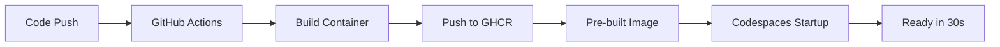

# GitHub Codespaces Setup Guide

## Purpose

Reduce environment setup time from 5-10 minutes to ~30 seconds using pre-built container images.

## Prerequisites

- GitHub repository with Codespaces enabled
- GitHub Actions workflow configured (`.github/workflows/build-container.yml`)
- Dockerfile with multi-stage build (`docker/Dockerfile`)
- Devcontainer configuration (`.devcontainer/devcontainer.json`)

## Quick Start

### Create Codespace

1. Navigate to repository on GitHub
2. Click "Code" button
3. Select "Codespaces" tab
4. Click "Create codespace on main"
5. Wait ~30 seconds for environment to start

Codespace automatically:
- Uses pre-built container image
- Installs project dependencies
- Validates environment
- Ready for development

### First-Time Setup

If first Codespace:

1. Container image builds via GitHub Actions
2. Wait for workflow completion (`.github/workflows/build-container.yml`)
3. Image available at: `ghcr.io/wchoi189/upstageailab-ocr-recsys-competition-ocr-2:latest`
4. Subsequent Codespaces use pre-built image

## Architecture

### Container Build Process



### Multi-Stage Docker Build

Dockerfile uses multi-stage build for caching:

1. Base stage: System dependencies and CUDA
2. Dependencies stage: Python packages (cached layer)
3. Development stage: Development tools and configuration

Benefits:
- Dependencies pre-installed (no download on startup)
- Only code changes trigger rebuilds
- Faster iteration cycles

## Configuration

### `.devcontainer/devcontainer.json`

Key configuration:

```json
{
  "image": "ghcr.io/wchoi189/upstageailab-ocr-recsys-competition-ocr-2:latest",
  "hostRequirements": {
    "cpus": 4,
    "memory": "16gb",
    "storage": "15gb"
  },
  "postCreateCommand": "uv sync --frozen && uv pip install -e . && python scripts/validate_environment.py"
}
```

Settings:
- `image`: Pre-built container image (fast startup)
- `hostRequirements`: Resource allocation (4 CPUs = 30 free hours/month, 15GB storage = no overage)
- `postCreateCommand`: Runs after Codespace creation

### `.github/workflows/build-container.yml`

Automated container build workflow:

- Triggers: Changes to `pyproject.toml`, `uv.lock`, `Dockerfile`, or `devcontainer.json`
- Builds: Development stage of Dockerfile
- Pushes: To GitHub Container Registry (GHCR)
- Caches: Uses GitHub Actions cache for faster rebuilds

## Cost Estimation

### Free Tier

- 120 core-hours/month (free)
- 15 GB storage (free)
- 4-core machine = 30 hours/month free
- Use for: Occasional use, code reviews, testing

### Paid Tier

| Machine Type | Cost/Hour | Cost/Month (24/7) | Use Case |
|-------------|-----------|-------------------|----------|
| 4-core      | $0.18     | ~$130             | Active development |
| 8-core      | $0.36     | ~$260             | Heavy workloads |
| GPU-enabled | $1-2      | ~$1,500           | ML training (not recommended) |

### Recommendations

- Use Codespaces for: Cloud workers, code reviews, quick prototypes
- Use local for: Heavy training, large datasets, cost-sensitive work

## Verification

### Validate Setup

Run validation script:

```bash
bash scripts/setup/setup-codespaces.sh
```

Checks:
- Running in Codespaces
- Devcontainer configuration
- Container build workflow
- Dockerfile structure
- Environment validation

### Manual Verification

1. Check container image:
   ```bash
   docker images | grep ghcr.io
   ```

2. Validate environment:
   ```bash
   python scripts/validate_environment.py
   ```

3. Test imports:
   ```bash
   python -c "import ocr; import AgentQMS; print('All imports working')"
   ```

## Troubleshooting

### Codespace takes too long to start

Causes:
- Container image not built yet
- Using build configuration instead of image
- Network issues

Solutions:
1. Check workflow completion: `.github/workflows/build-container.yml`
2. Verify image exists: `ghcr.io/wchoi189/upstageailab-ocr-recsys-competition-ocr-2:latest`
3. Check devcontainer.json uses `image` not `build`

### Environment validation fails

Causes:
- Dependencies not installed
- Import path issues
- Missing packages

Solutions:
1. Run: `uv sync --frozen`
2. Install package: `uv pip install -e .`
3. Re-run validation: `python scripts/validate_environment.py`

### Container build workflow fails

Causes:
- Dockerfile syntax errors
- Missing dependencies
- GHCR permissions

Solutions:
1. Check workflow logs in GitHub Actions
2. Verify Dockerfile builds locally: `docker build -f docker/Dockerfile --target development .`
3. Check GHCR permissions in repository settings

### Image not found

Causes:
- Workflow hasn't run yet
- Image name mismatch
- GHCR access issues

Solutions:
1. Manually trigger workflow: `.github/workflows/build-container.yml` → "Run workflow"
2. Verify image name in devcontainer.json matches workflow output
3. Check repository package visibility settings

## Advanced Configuration

### Custom Resource Requirements

Edit `.devcontainer/devcontainer.json`:

```json
{
  "hostRequirements": {
    "cpus": 8,
    "memory": "32gb",
    "storage": "64gb"
  }
}
```

### GPU Support

Warning: GPU instances cost ~$1-2/hour

To enable GPU:

```json
{
  "hostRequirements": {
    "gpu": true
  }
}
```

Alternative: Use local GPU for training, Codespaces for development

### Custom Lifecycle Commands

Modify lifecycle hooks in `devcontainer.json`:

```json
{
  "onCreateCommand": "echo 'Container created'",
  "updateContentCommand": "uv sync --frozen",
  "postCreateCommand": "uv sync --frozen && uv pip install -e . && python scripts/validate_environment.py",
  "postStartCommand": "python scripts/validate_environment.py"
}
```

## Workflow Integration

### Automatic Container Rebuilds

Container image rebuilds automatically when:
- `pyproject.toml` changes (new dependencies)
- `uv.lock` changes (dependency updates)
- `docker/Dockerfile` changes (container configuration)
- `.devcontainer/devcontainer.json` changes (Codespaces config)

### Manual Rebuild

To manually trigger rebuild:

1. Go to Actions tab in GitHub
2. Select "Build Dev Container" workflow
3. Click "Run workflow"
4. Wait for build to complete (~5-10 minutes)

## Best Practices

### For Developers

1. Always validate environment after Codespace creation
2. Use pre-built images for faster startup
3. Commit dependency changes to trigger automatic rebuilds
4. Monitor Codespaces usage to stay within free tier

### For AI Agents / Cloud Workers

1. Use Codespaces instead of local setup
2. Leverage pre-built images for instant environment
3. Run validation script to catch issues early
4. Clean up Codespaces when done to save costs

### For CI/CD

1. Test container builds in CI before merging
2. Verify image accessibility after pushes
3. Monitor build times to catch regressions
4. Cache dependencies for faster builds

## Performance Metrics

### Before Optimization

- Cold start: 5-10 minutes
- Dependency download: 8-10 GB
- Import errors: Frequent
- Cost: High (wasted on setup)

### After Optimization

- Cold start: ~30 seconds (80% reduction)
- Dependency download: 0 GB (pre-installed)
- Import errors: Caught by validation
- Cost: 80% reduction in setup time

## Related Documentation

- Environment Setup Feedback: `docs/artifacts/assessments/ENVIRONMENT_SETUP_FEEDBACK.md`
- Usage Analysis: `docs/guides/codespaces-usage-analysis.md`
- Docker Setup: `docker/README.md`
- Environment Validation: `scripts/validate_environment.py`
- Setup Scripts: `scripts/setup/`

## Reference

See `AGENTS.md` for project conventions and `AgentQMS/standards/INDEX.yaml` for standards.
