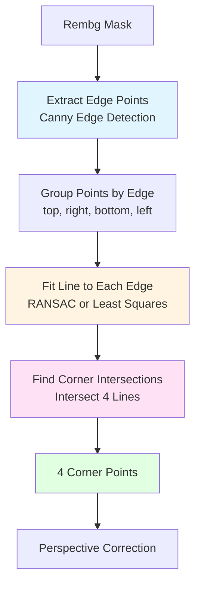

# Improved Edge-Based Perspective Correction Approach

**Date**: 2025-11-23
**Status**: ✅ Implementation Complete - Ready for Testing
**Author**: AI Agent

## Overview

This document describes the improved edge-based approach for perspective correction that uses **multiple points per edge** and **line fitting** instead of just 4 extreme corner points.

## Problem with Current Approach

The current approach has limitations:

1. **Only 4 Points**: Uses only extreme points (topmost, rightmost, bottommost, leftmost)
2. **No Edge Shape Consideration**: Doesn't account for the actual shape of document edges
3. **Noisy Single Points**: Extreme points may be outliers or noise
4. **No Line Fitting**: Doesn't fit lines to multiple edge points

**Visual Evidence**: Corner detection in worst performers shows poor corner placement, even though the math (area ratios) may be correct.

## Solution: Multi-Point Edge Detection & Line Fitting

### Process Flow



### Key Components

#### 1. Edge Point Extraction
- **Method**: `extract_edge_points_from_mask()`
- **Process**:
  - Use `cv2.Canny()` on mask to get clean edge pixels
  - Extract all edge pixel coordinates
  - Fallback to contour points if Canny fails

#### 2. Edge Point Grouping
- **Method**: `group_edge_points()`
- **Process**:
  - Divide image into 4 regions (top, right, bottom, left)
  - Use position-based grouping (more robust)
  - For middle points, use angle from center
  - Returns 4 groups of points (one per edge)

#### 3. Line Fitting
- **Method**: `fit_line_ransac()` or `fit_line_to_points()`
- **Process**:
  - **RANSAC** (preferred): Robust against outliers
    - Randomly sample 2 points
    - Fit line and count inliers
    - Repeat to find best line
  - **Least Squares** (fallback): Simple linear regression
  - Returns line equation: `y = mx + b`

#### 4. Corner Detection
- **Method**: `fit_quadrilateral_from_edges()`
- **Process**:
  - Fit line to each of 4 edge groups
  - Find intersections:
    - Top-left: top line ∩ left line
    - Top-right: top line ∩ right line
    - Bottom-right: bottom line ∩ right line
    - Bottom-left: bottom line ∩ left line
  - Clamp corners to image bounds

### Advantages

1. **Uses Multiple Points**: Each edge uses many points, not just one extreme
2. **Robust Line Fitting**: RANSAC handles outliers and noise
3. **Accurate Edge Representation**: Lines represent actual document edges
4. **Better Corner Detection**: Intersections are more accurate than extreme points

## Implementation Files

### Core Implementation
- `scripts/improved_edge_based_correction.py`
  - `extract_edge_points_from_mask()`: Extract edge points from mask
  - `group_edge_points()`: Group points by edge
  - `fit_line_ransac()`: Robust line fitting with RANSAC
  - `fit_line_to_points()`: Simple least squares line fitting
  - `intersect_lines()`: Find intersection of two lines
  - `fit_quadrilateral_from_edges()`: Main function to fit quadrilateral
  - `visualize_edges_and_lines()`: Visualization helper

### Testing Script
- `scripts/test_improved_edge_approach.py`
  - Compares current vs improved approach
  - Tests on worst performers
  - Generates comparison visualizations

### Documentation
- `docs/perspective_correction_process.md`
  - Mermaid diagram of current process
  - Component descriptions
  - Limitations and proposed improvements

## Usage

### Test on Worst Performers

```bash
cd experiment-tracker/experiments/20251122_172313_perspective_correction
python scripts/test_improved_edge_approach.py \
    --worst-performers \
    --num-samples 10 \
    --use-gpu
```

### Test on Custom Images

```bash
python scripts/test_improved_edge_approach.py \
    --input-dir /path/to/images \
    --num-samples 20
```

## Expected Improvements

1. **Better Corner Accuracy**: Lines fitted to multiple points should give more accurate corners
2. **Robustness**: RANSAC handles noise and outliers better
3. **Edge Shape Awareness**: Considers actual edge shape, not just extremes
4. **Higher Success Rate**: Should improve area retention on difficult cases

## Recent Enhancements (BUG-20251124-002)

- **Mask reinforcement & collaring**: Prior to Canny/edge grouping the mask is dilated and padded so every side has a thin background “halo”, preventing edge loss when the document touches the canvas.
- **Passthrough & hybrid logic**: The improved pipeline now skips correction when background ratio <5%, corners hug the borders, corners are collinear, or the baseline already retains ≥85% area.
- **Homography validation**: Condition numbers are computed for every warp; ill-conditioned matrices (cond > 1e10) are rejected before metrics/logging.
- **Result classification**: Test harness reports attempts vs skipped vs rejected cases so comparisons with the baseline remain meaningful.

## Observed Limitations (2025-11-24 Regression Run)

- **Broadcasting failures persist** on tall, narrow documents (e.g., `selectstar_000040`, `000023`, `000112`, `000141`), preventing improved outputs from being saved even though masks are clean. Additional guards are required around edge-group arrays used during visualisation.
- **Rectified inputs still processed** (e.g., `selectstar_000042`), indicating the hybrid skip threshold needs to consider asymmetric background (large top/bottom fill but minimal lateral margins).
- **Asymmetric background gaps**: When rembg removes background on only some sides, edge detection still struggles. A forthcoming heuristic will synthesise a thin background layer wherever the mask lacks the “white” fill so every side can anchor a line exactly as suggested by user observations.
- **Mask continuity is critical**: Any discontinuity around the object causes the fitter to latch onto interior content. Ensuring a continuous collar (or generating one from the diff between original/rembg outputs) is now a tracked follow-up task.

## Next Steps

1. **Test on Worst Performers**: Run comparison test on 50 worst performers
2. **Analyze Results**: Compare area ratios and success rates
3. **Refine Parameters**: Adjust RANSAC thresholds, edge grouping margins
4. **Production Integration**: Integrate into main pipeline if results are positive

## Technical Details

### RANSAC Parameters
- `max_iterations`: 100 (default)
- `threshold`: 5.0 pixels (distance for inliers)

### Edge Grouping
- `margin`: 15% of image dimension (for overlap region)
- Uses position-based grouping with angle fallback

### Line Fitting
- Prefers RANSAC for robustness
- Falls back to least squares if RANSAC fails
- Handles vertical lines separately

## Visualization

The implementation includes visualization that shows:
- Edge points colored by edge (top=green, right=blue, bottom=red, left=cyan)
- Fitted lines for each edge
- Detected corners
- Final quadrilateral

This helps debug and understand the algorithm's behavior.

