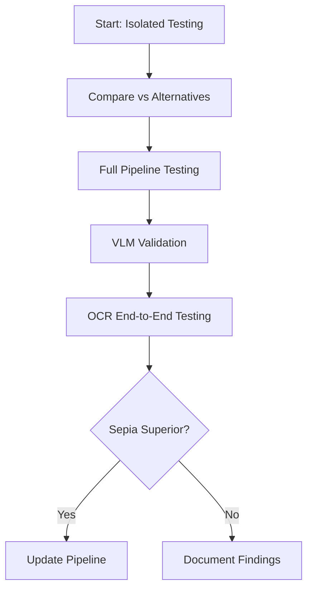

# 🎨 Sepia Enhancement Testing - Navigation Index

**Experiment**: 20251217_024343_image_enhancements_implementation
**Status**: ✅ Ready for Testing
**Date**: December 21, 2025

---

## 📋 Quick Navigation

### 🚀 Start Here
- **[Quick Start Commands](../SEPIA_QUICK_START.md)** - Copy/paste commands to get started
- **[Implementation Summary](SEPIA_IMPLEMENTATION_SUMMARY.md)** - What was built and why
- **[Full Testing Guide](SEPIA_TESTING_GUIDE.md)** - Comprehensive testing workflow

### 📜 Scripts
| Script | Purpose | Size |
|--------|---------|------|
| [sepia_enhancement.py](../scripts/sepia_enhancement.py) | Core sepia methods (4 variations) | 13KB |
| [compare_sepia_methods.py](../scripts/compare_sepia_methods.py) | Compare vs gray-scale/normalization | 13KB |
| [sepia_perspective_pipeline.py](../scripts/sepia_perspective_pipeline.py) | Full pipeline integration | 15KB |
| [vlm_validate_sepia.sh](../scripts/vlm_validate_sepia.sh) | VLM quality validation | 5.7KB |

### 📊 Outputs
| Directory | Contains |
|-----------|----------|
| [outputs/sepia_tests/](../outputs/sepia_tests/) | Isolated sepia method tests |
| [outputs/sepia_comparison/](../outputs/sepia_comparison/) | Comparison grids & metrics |
| [outputs/sepia_pipeline/](../outputs/sepia_pipeline/) | Full pipeline results |
| [outputs/sepia_vlm_reports/](../outputs/sepia_vlm_reports/) | VLM validation reports |

### 📝 State Tracking
- **[state.yml](../state.yml)** - Experiment state with sepia tasks

---

## 🎯 Recommended Testing Workflow



### Step-by-Step

1. **Isolated Testing** (30 min)
   - Test all 4 sepia methods
   - Generate metrics
   - Visual inspection

2. **Comparison** (45 min)
   - Compare vs gray-scale/normalization
   - Generate comparison grid
   - Analyze metrics

3. **Pipeline** (30 min)
   - Test sepia + perspective correction
   - Optional deskewing
   - Full pipeline metrics

4. **VLM Validation** (1 hour)
   - Visual quality assessment
   - Method ranking
   - Recommendations

5. **OCR Testing** (2 hours)
   - Run with epoch-18 checkpoint
   - Compare accuracy
   - Document results

---

## 📚 Documentation Structure

```
docs/
├── INDEX.md                          ← You are here
├── SEPIA_IMPLEMENTATION_SUMMARY.md   ← What was built
├── SEPIA_TESTING_GUIDE.md            ← How to test
└── (other experiment docs...)
```

---

## 🔍 Reference Samples

### Test Images to Use

**Problematic (poor OCR)**:
```
drp.en_ko.in_house.selectstar_000732
```
- High background tint
- Poor contrast
- Current baseline failure case

**Target Quality (good OCR)**:
```
drp.en_ko.in_house.selectstar_000712_sepia.jpg
```
- Reference sepia output
- Good OCR results observed
- Quality target

---

## ⚙️ Sepia Methods

| Method | Speed | Use Case | Recommended |
|--------|-------|----------|-------------|
| **Classic** | Fast | Standard sepia | General use |
| **Adaptive** | Medium | Detail preservation | Complex docs |
| **Warm** | Fast | OCR optimization | ⭐ **Start here** |
| **Contrast** | Slow | Low contrast docs | Problematic images |

---

## 📈 Success Metrics

Track these for comparison:

- **Color Tint**: Target < 20 (baseline: 58.1, gray-world: 14.6)
- **Contrast**: Maintain or improve from baseline
- **Edge Strength**: Higher = better text clarity
- **Processing Time**: Target < 100ms
- **VLM Score**: Target > 4.5/5
- **OCR Accuracy**: Better than alternatives

---

## 🚦 Current Status

### ✅ Completed
- [x] Sepia enhancement implementation (4 methods)
- [x] Comparison framework
- [x] Pipeline integration script
- [x] VLM validation script
- [x] Documentation suite
- [x] Output directories
- [x] Experiment state updated

### ⏳ Pending (Your Next Steps)
- [ ] Run isolated sepia tests
- [ ] Generate comparison analysis
- [ ] Test full pipeline
- [ ] VLM validation
- [ ] OCR end-to-end testing
- [ ] Document findings
- [ ] Update experiment state
- [ ] Integration decision

---

## 💡 Pro Tips

1. **Start with warm sepia** - Best initial results for OCR
2. **Test on reference samples first** - Validate on known cases
3. **Save all metrics** - Use `--save-metrics` flag
4. **Compare visually** - Grid images show differences clearly
5. **Use VLM validation** - Confirms visual quality
6. **Batch processing** - Test multiple images together

---

## 🆘 Need Help?

### Common Issues

**Script won't run?**
```bash
cd experiment-tracker/experiments/20251217_024343_image_enhancements_implementation/scripts
python sepia_enhancement.py --help
```

**Missing dependencies?**
```bash
pip install opencv-python numpy
```

**VLM not working?**
```bash
export DASHSCOPE_API_KEY='your_key'
./vlm_validate_sepia.sh ../outputs/sepia_comparison/
```

### Documentation

- Quick commands: [SEPIA_QUICK_START.md](../SEPIA_QUICK_START.md)
- Full guide: [SEPIA_TESTING_GUIDE.md](SEPIA_TESTING_GUIDE.md)
- Implementation: [SEPIA_IMPLEMENTATION_SUMMARY.md](SEPIA_IMPLEMENTATION_SUMMARY.md)

---

## 🎬 Get Started Now!

```bash
# 1. Navigate to scripts
cd experiment-tracker/experiments/20251217_024343_image_enhancements_implementation/scripts

# 2. Test sepia methods
python sepia_enhancement.py \
  --input /path/to/drp.en_ko.in_house.selectstar_000732.jpg \
  --method all \
  --output ../outputs/sepia_tests/

# 3. Generate comparison
python compare_sepia_methods.py \
  --input /path/to/drp.en_ko.in_house.selectstar_000732.jpg \
  --output ../outputs/sepia_comparison/ \
  --save-metrics

# 4. Review results
ls -lh ../outputs/sepia_comparison/
```

**Good luck with your testing! 🚀**
