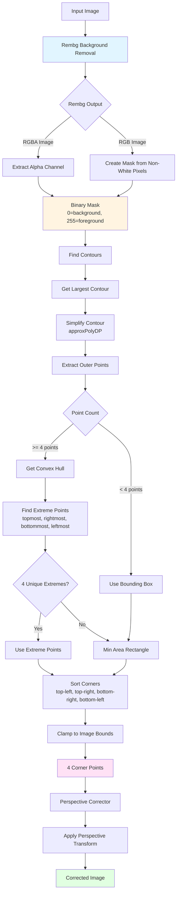

# Perspective Correction Process - Current Architecture

## Process Flow Diagram

## Current Components

### 1. Rembg Background Removal
- **Input**: Original image (BGR)
- **Output**: RGBA image with alpha channel (mask)
- **Process**:
  - Convert to PIL Image
  - Resize if needed (max_size)
  - Run rembg.remove()
  - Composite on white background

### 2. Mask Extraction
- **Input**: Rembg RGBA output
- **Output**: Binary mask (0=background, 255=foreground)
- **Process**:
  - Extract alpha channel from RGBA
  - Convert to binary (threshold > 128)

### 3. Contour Detection
- **Input**: Binary mask
- **Output**: Contour points
- **Process**:
  - `cv2.findContours()` with `RETR_EXTERNAL`
  - Get largest contour by area
  - Simplify with `approxPolyDP` (epsilon = 0.001 * arcLength)

### 4. Quadrilateral Fitting (Current - 4 Points Only)
- **Input**: Contour points
- **Output**: 4 corner points
- **Process**:
  - Get convex hull
  - Find 4 extreme points (topmost, rightmost, bottommost, leftmost)
  - Use extreme points directly OR
  - Fallback to min area rectangle
  - Sort corners: top-left, top-right, bottom-right, bottom-left
  - Clamp to image bounds

### 5. Perspective Correction
- **Input**: Image + 4 corner points
- **Output**: Corrected image
- **Process**:
  - Calculate perspective transform matrix
  - Apply `cv2.warpPerspective()`

## Limitations of Current Approach

1. **Only 4 Points**: Uses only extreme points, doesn't consider edge shape
2. **No Line Fitting**: Doesn't fit lines to multiple edge points
3. **Extreme Points May Be Noisy**: Single points may not represent true document edges
4. **No Edge Sampling**: Doesn't sample multiple points along each edge

## Proposed Improvement

### Multi-Point Edge Detection & Line Fitting

Instead of using only 4 extreme points, we should:

1. **Extract Edge Points from Mask**
   - Use `cv2.Canny()` or contour edge points
   - Sample multiple points along each edge

2. **Group Points by Edge**
   - Divide edge points into 4 groups (top, right, bottom, left)
   - Use angle/direction to group points

3. **Fit Lines to Each Edge**
   - Use RANSAC or least squares to fit lines
   - Each edge gets a line equation

4. **Find Corner Intersections**
   - Intersect the 4 lines to get 4 corners
   - More robust than using extreme points

This approach will be more robust because:
- Uses multiple points per edge (not just extremes)
- Fits lines to actual edge shape
- Handles noise better
- More accurate corner detection

