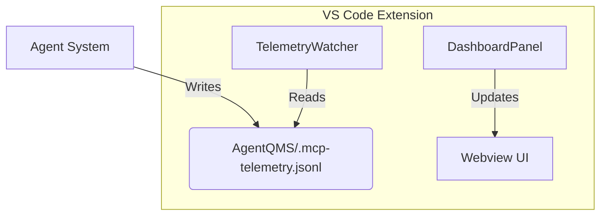

# MCP Visibility Extension - Design Document

## 1. Project Objectives
The MCP Visibility Extension aims to provide a real-time, transparent view into the operations of the Agentic System and the underlying OCR/RecSys project.
-   **Transparency**: visualize tool calls, status, and performance.
-   **Context Awareness**: Browse and understand available context bundles.
-   **Compliance**: Monitor policy violations and errors.
-   **Extensibility**: Future support for project-specific telemetry.

## 2. Architecture
The system consists of three main components:
1.  **vscode-extension**: A VS Code extension that provides the UI container (Webview) and facilitates communication.
2.  **Webview (Dashboard)**: A React-like (vanilla JS + HTML) frontend that renders the dashboard.
3.  **Data Watchers**:
    -   `TelemetryWatcher`: Watches `AgentQMS/.mcp-telemetry.jsonl` (or configured path).
    -   `BundleProvider`: Watches `AgentQMS/.agentqms/plugins/context_bundles`.

## 3. Data Sources & Spec-Driven Development

### 3.1 Configuration Schema (`extension-config-schema.yaml`)
All data paths, formats, and configuration settings are defined in the `extension-config-schema.yaml` file. This file acts as the single source of truth.
-   **Principle**: Code should adapt to the schema, or the schema should be updated to reflect code changes.
-   **Usage**: Developers should consult this file before adding new settings.

### 3.2 Current Datasources
| Source              | Path (Relative)                                     | Format | Usage                                            |
| :------------------ | :-------------------------------------------------- | :----- | :----------------------------------------------- |
| **Agent Telemetry** | `AgentQMS/.mcp-telemetry.jsonl`                     | JSONL  | Tool names, duration, status, policy violations. |
| **Context Bundles** | `AgentQMS/.agentqms/plugins/context_bundles/*.yaml` | YAML   | bundle names, descriptions, file lists.          |

## 4. Design Standards
-   **UI**: "Premium" aesthetic using VS Code theme variables (`var(--vscode-*)`).
-   **Resilience**: Extension must fail gracefully if data sources are missing (as implemented in `extension.ts`).
-   **Handshake**: Webview must signal readiness (`webviewReady`) to avoid race conditions.
