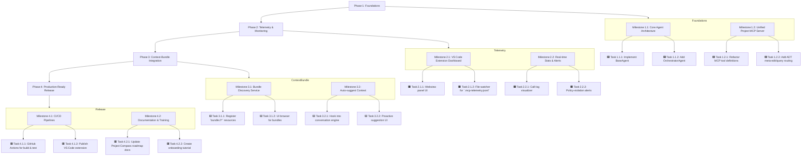

```mermaid
graph TD
    %% Phases
    P1[Phase 1: Foundations] --> P2[Phase 2: Telemetry & Monitoring]
    P2 --> P3[Phase 3: Context‑Bundle Integration]
    P3 --> P4[Phase 4: Production‑Ready Release]

    %% Phase 1 – Foundations
    subgraph Foundations
        M1_1[Milestone 1.1: Core Agent Architecture]
        M1_2[Milestone 1.2: Unified Project MCP Server]
    end
    P1 --> Foundations

    M1_1 --> T1_1_1[🟦 Task 1.1.1: Implement BaseAgent]
    M1_1 --> T1_1_2[🟦 Task 1.1.2: Add OrchestratorAgent]
    M1_2 --> T1_2_1[🟪 Task 1.2.1: Refactor MCP tool definitions]
    M1_2 --> T1_2_2[🟪 Task 1.2.2: Add ADT meta‑edit/query routing]

    %% Phase 2 – Telemetry & Monitoring
    subgraph Telemetry
        M2_1[Milestone 2.1: VS Code Extension Dashboard]
        M2_2[Milestone 2.2: Real‑time Stats & Alerts]
    end
    P2 --> Telemetry

    M2_1 --> T2_1_1[🟧 Task 2.1.1: Webview panel UI]
    M2_1 --> T2_1_2[🟧 Task 2.1.2: File‑watcher for `.mcp‑telemetry.jsonl`]
    M2_2 --> T2_2_1[🟧 Task 2.2.1: Call‑log visualizer]
    M2_2 --> T2_2_2[🟧 Task 2.2.2: Policy‑violation alerts]

    %% Phase 3 – Context‑Bundle Integration
    subgraph ContextBundle
        M3_1[Milestone 3.1: Bundle Discovery Service]
        M3_2[Milestone 3.2: Auto‑suggest Context]
    end
    P3 --> ContextBundle

    M3_1 --> T3_1_1[🟨 Task 3.1.1: Register `bundle://*` resources]
    M3_1 --> T3_1_2[🟨 Task 3.1.2: UI browser for bundles]
    M3_2 --> T3_2_1[🟨 Task 3.2.1: Hook into conversation engine]
    M3_2 --> T3_2_2[🟨 Task 3.2.2: Proactive suggestion UI]

    %% Phase 4 – Production‑Ready Release
    subgraph Release
        M4_1[Milestone 4.1: CI/CD Pipelines]
        M4_2[Milestone 4.2: Documentation & Training]
    end
    P4 --> Release

    M4_1 --> T4_1_1[🟥 Task 4.1.1: GitHub Actions for build & test]
    M4_1 --> T4_1_2[🟥 Task 4.1.2: Publish VS Code extension]
    M4_2 --> T4_2_1[🟥 Task 4.2.1: Update Project Compass roadmap docs]
    M4_2 --> T4_2_2[🟥 Task 4.2.2: Create onboarding tutorial]
```
