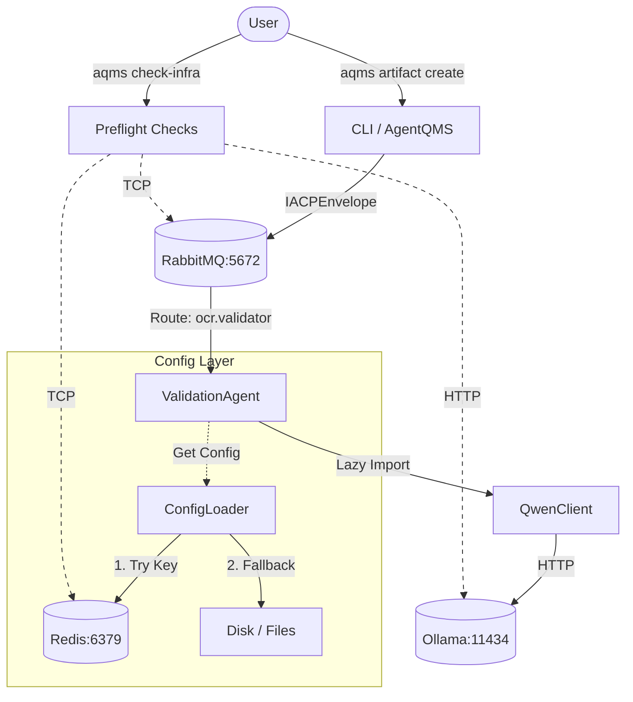

# Walkthrough - Multi-Agent IACP Migration

## Changes Key
- **State Virtualization**: `effective.yaml` is now virtual-only via `generate_virtual_config`.
- **IACP Protocol**:
    - **Schema**: Enforced strict `IACPEnvelope` via Pydantic.
    - **Transport**: `RabbitMQTransport` now validates all ingress/egress messages.
    - **Execution**: Agents (`OCRInferenceAgent`, `ValidationAgent`) updated to handle `IACPEnvelope` objects.
- **Local LLM**:
    - **Client**: `QwenClient` updated to support separate Ollama instance.
    - **Endpoint**: `http://host.docker.internal:11434` (Ollama Native / OpenAI Compatible)
    - **Default Model**: `qwen3:4b-instruct`
    - **Optimization**: Implemented **Lazy Loading** for LLM clients to reduce import overhead.
- **Distributed Caching**:
    - **ConfigLoader**: Now checks Redis (`config:{path}`) before disk. 
    - **Fallback**: Gracefully degrades to memory/disk if Redis is offline.

## Verification Results

### 1. IACP Compliance
Agents now communicate using strictly typed envelopes.

```python
# ValidationAgent handler signature (updated)
def _handle_validate_ocr_result(self, envelope: IACPEnvelope) -> dict[str, Any]:
    payload = envelope.payload
    # ...
```

### 2. Local Inference & Optimization
`QwenClient` now routes to the local RTX 3090 via `host.docker.internal`.
Lazy loading verified via `tests/integration/run_client_only.py`.

```python
# ocr/core/infrastructure/agents/llm/__init__.py
def __getattr__(name: str):
    if name == "QwenClient":
        from .qwen_client import QwenClient
        return QwenClient
```

### 3. Cleanup
`janitor.py` successfully moved stale artifacts to `.archive/`.

### 4. Infrastructure Verification
Verified connectivity to core services using `AgentQMS/bin/verify_infra.py` and `aqms check-infra`.
- **Redis**: ✅ Connected (host: redis, port: 6379)
- **RabbitMQ**: ✅ Connected (host: rabbitmq)

### 5. Redis Config Caching
`ConfigLoader` logic verified via internal test script:
1. First Load: Fetches from disk (IO) → Sets in Redis.
2. Second Load: Fetches from Redis (Cache Hit).

### 6. Integration Testing (IACP Flow)
Verified end-to-end message flow using `tests/integration/run_client_only.py`:
- **Flow**: Client -> RabbitMQ -> ValidationAgent -> QwenClient -> Ollama -> Response.
- **Payload**: `cmd.detect_errors` with sample text.
- **Result**: `ValidationAgent` successfully processed the request and returned LLM-generated errors/suggestions via IACP Envelope.

### 7. Documentation
- **AGENTS.md**: Modernized for `aqms` CLI and IACP context.
- **AgentQMS/CHANGELOG.md**: Added v1.1.0 release notes.

## Architecture & Flow


